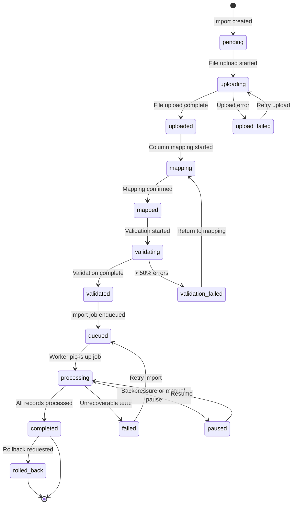

# Migration Progress Tracking — Real-Time Updates & Notification

> Silence during a long import is indistinguishable from failure. This template builds the progress tracking system that keeps customers informed and confident — from first upload to final record.

---

## 1. Progress State Machine

Every import transitions through a defined set of states. The state machine prevents invalid transitions (e.g., completing a failed import) and drives UI rendering, notification triggers, and error handling.



### State Definition

```typescript
// src/migration/state/import-state-machine.ts
type ImportState =
  | 'pending'
  | 'uploading'
  | 'uploaded'
  | 'upload_failed'
  | 'mapping'
  | 'mapped'
  | 'validating'
  | 'validated'
  | 'validation_failed'
  | 'queued'
  | 'processing'
  | 'completed'
  | 'failed'
  | 'paused'
  | 'rolled_back';

const VALID_TRANSITIONS: Record<ImportState, ImportState[]> = {
  pending: ['uploading'],
  uploading: ['uploaded', 'upload_failed'],
  upload_failed: ['uploading'],
  uploaded: ['mapping'],
  mapping: ['mapped'],
  mapped: ['validating'],
  validating: ['validated', 'validation_failed'],
  validation_failed: ['mapping'],
  validated: ['queued'],
  queued: ['processing'],
  processing: ['completed', 'failed', 'paused'],
  paused: ['processing'],
  completed: ['rolled_back'],
  failed: ['queued'],
  rolled_back: [],
};

export async function transitionState(
  importId: string,
  newState: ImportState,
  metadata?: Record<string, any>
): Promise<void> {
  const current = await getCurrentState(importId);

  if (!VALID_TRANSITIONS[current]?.includes(newState)) {
    throw new StateTransitionError(
      `Cannot transition from "${current}" to "${newState}". ` +
      `Valid transitions from "${current}": ${VALID_TRANSITIONS[current]?.join(', ') || 'none'}`
    );
  }

  await db.query(
    `UPDATE imports SET status = $1, updated_at = NOW(), status_metadata = $2 WHERE id = $3`,
    [newState, JSON.stringify(metadata || {}), importId]
  );

  // Record state transition for audit trail
  await db.query(
    `INSERT INTO import_state_history (import_id, from_state, to_state, metadata, created_at)
     VALUES ($1, $2, $3, $4, NOW())`,
    [importId, current, newState, JSON.stringify(metadata || {})]
  );

  // Publish state change event
  await publishEvent(importId, 'state_change', { from: current, to: newState, metadata });

  // Trigger notifications for terminal states
  if (['completed', 'failed'].includes(newState)) {
    await triggerNotification(importId, newState);
  }
}
```

---

## 2. Real-Time Progress Updates (WebSocket / SSE)

### WebSocket Implementation

```typescript
// src/migration/api/routes/import-stream.ts
// WS /api/imports/:importId/stream

import { WebSocketServer } from 'ws';
import Redis from 'ioredis';

export function setupProgressWebSocket(server: any): void {
  const wss = new WebSocketServer({ server, path: '/api/imports/stream' });
  const subscriber = new Redis(process.env.REDIS_URL!);

  wss.on('connection', (ws, req) => {
    const importId = new URL(req.url!, `http://${req.headers.host}`).searchParams.get('importId');
    if (!importId) {
      ws.close(4000, 'Missing importId parameter');
      return;
    }

    // Verify authorization
    const userId = authenticateWebSocket(req);
    if (!userId) {
      ws.close(4001, 'Unauthorized');
      return;
    }

    // Subscribe to progress events for this import
    const channel = `import:${importId}:events`;
    subscriber.subscribe(channel);

    subscriber.on('message', (ch, message) => {
      if (ch === channel && ws.readyState === ws.OPEN) {
        ws.send(message);
      }
    });

    // Send current state immediately on connect
    getProgressSnapshot(importId).then(snapshot => {
      if (ws.readyState === ws.OPEN) {
        ws.send(JSON.stringify({ type: 'snapshot', data: snapshot }));
      }
    });

    ws.on('close', () => {
      subscriber.unsubscribe(channel);
    });

    // Heartbeat to detect disconnected clients
    const heartbeat = setInterval(() => {
      if (ws.readyState === ws.OPEN) {
        ws.ping();
      }
    }, 30000);

    ws.on('close', () => clearInterval(heartbeat));
  });
}
```

### Server-Sent Events (SSE) Fallback

```typescript
// src/migration/api/routes/import-progress-sse.ts
// GET /api/imports/:importId/progress/stream

export async function GET(
  request: Request,
  { params }: { params: { importId: string } }
) {
  const { importId } = params;

  const stream = new ReadableStream({
    async start(controller) {
      const subscriber = new Redis(process.env.REDIS_URL!);
      const channel = `import:${importId}:events`;

      // Send initial snapshot
      const snapshot = await getProgressSnapshot(importId);
      controller.enqueue(`data: ${JSON.stringify({ type: 'snapshot', data: snapshot })}\n\n`);

      // Subscribe to updates
      await subscriber.subscribe(channel);
      subscriber.on('message', (ch, message) => {
        if (ch === channel) {
          controller.enqueue(`data: ${message}\n\n`);
        }
      });

      // Cleanup on disconnect
      request.signal.addEventListener('abort', () => {
        subscriber.unsubscribe(channel);
        subscriber.disconnect();
        controller.close();
      });
    },
  });

  return new Response(stream, {
    headers: {
      'Content-Type': 'text/event-stream',
      'Cache-Control': 'no-cache',
      Connection: 'keep-alive',
    },
  });
}
```

### Client-Side Progress Hook

```typescript
// src/migration/hooks/useImportProgress.ts
import { useEffect, useState, useRef } from 'react';

interface ImportProgress {
  status: ImportState;
  processedCount: number;
  totalCount: number;
  errorCount: number;
  percentComplete: number;
  estimatedCompletionAt: string | null;
  currentEntity: string | null;
  recentErrors: ImportError[];
}

export function useImportProgress(importId: string): ImportProgress {
  const [progress, setProgress] = useState<ImportProgress>({
    status: 'pending',
    processedCount: 0,
    totalCount: 0,
    errorCount: 0,
    percentComplete: 0,
    estimatedCompletionAt: null,
    currentEntity: null,
    recentErrors: [],
  });

  const wsRef = useRef<WebSocket | null>(null);

  useEffect(() => {
    const ws = new WebSocket(
      `${window.location.protocol === 'https:' ? 'wss:' : 'ws:'}//${window.location.host}/api/imports/stream?importId=${importId}`
    );

    ws.onmessage = (event) => {
      const message = JSON.parse(event.data);
      if (message.type === 'snapshot' || message.type === 'progress') {
        setProgress(prev => ({ ...prev, ...message.data }));
      }
      if (message.type === 'state_change') {
        setProgress(prev => ({ ...prev, status: message.data.to }));
      }
      if (message.type === 'error') {
        setProgress(prev => ({
          ...prev,
          recentErrors: [message.data, ...prev.recentErrors].slice(0, 10),
        }));
      }
    };

    ws.onerror = () => {
      // Fallback to SSE
      const eventSource = new EventSource(`/api/imports/${importId}/progress/stream`);
      eventSource.onmessage = (event) => {
        const message = JSON.parse(event.data);
        setProgress(prev => ({ ...prev, ...message.data }));
      };
    };

    wsRef.current = ws;
    return () => { ws.close(); };
  }, [importId]);

  return progress;
}
```

---

## 3. Progress UI Components

### Main Progress Display

```tsx
// src/migration/components/ImportProgressPanel.tsx
function ImportProgressPanel({ importId }: { importId: string }) {
  const progress = useImportProgress(importId);

  return (
    <div className="import-progress-panel" role="region" aria-label="Import progress">
      <ProgressHeader status={progress.status} />

      <ProgressBar
        value={progress.percentComplete}
        label={`${progress.processedCount.toLocaleString()} of ${progress.totalCount.toLocaleString()} records`}
      />

      <ProgressStats
        processed={progress.processedCount}
        errors={progress.errorCount}
        total={progress.totalCount}
        eta={progress.estimatedCompletionAt}
      />

      {progress.status === 'processing' && (
        <div className="progress-actions">
          <button onClick={() => pauseImport(importId)} className="btn-secondary">
            Pause Import
          </button>
          <button onClick={() => enableBackground(importId)} className="btn-tertiary">
            Continue in Background
          </button>
        </div>
      )}

      {progress.recentErrors.length > 0 && (
        <RecentErrorList errors={progress.recentErrors} />
      )}

      <ProgressTimeline importId={importId} />
    </div>
  );
}
```

### Progress Timeline Component

```tsx
// src/migration/components/ProgressTimeline.tsx
interface TimelineEvent {
  timestamp: string;
  event: string;
  details?: string;
  status: 'complete' | 'active' | 'pending' | 'error';
}

function ProgressTimeline({ importId }: { importId: string }) {
  const events = useImportTimeline(importId);

  const milestones: TimelineEvent[] = [
    { timestamp: events.uploadedAt, event: 'File uploaded', status: getStatus('uploaded', events) },
    { timestamp: events.mappedAt, event: 'Columns mapped', details: `${events.mappedColumns} fields mapped`, status: getStatus('mapped', events) },
    { timestamp: events.validatedAt, event: 'Validation complete', details: `${events.validRecords} valid, ${events.errorRecords} errors`, status: getStatus('validated', events) },
    { timestamp: events.processingStartedAt, event: 'Import started', status: getStatus('processing', events) },
    { timestamp: events.completedAt, event: 'Import complete', status: getStatus('completed', events) },
  ];

  return (
    <ol className="progress-timeline" aria-label="Import progress timeline">
      {milestones.map((milestone, index) => (
        <li key={index} className={`timeline-step timeline-step--${milestone.status}`}>
          <div className="timeline-step__indicator">
            {milestone.status === 'complete' && <CheckIcon />}
            {milestone.status === 'active' && <SpinnerIcon />}
            {milestone.status === 'pending' && <CircleIcon />}
            {milestone.status === 'error' && <ErrorIcon />}
          </div>
          <div className="timeline-step__content">
            <span className="timeline-step__event">{milestone.event}</span>
            {milestone.details && <span className="timeline-step__details">{milestone.details}</span>}
            {milestone.timestamp && <time className="timeline-step__time">{formatTime(milestone.timestamp)}</time>}
          </div>
        </li>
      ))}
    </ol>
  );
}
```

---

## 4. ETA Calculation Algorithm

### Exponential Moving Average (EMA) Rate Estimation

```typescript
// src/migration/progress/eta-calculator.ts
export class EtaCalculator {
  private alpha: number = 0.3; // Smoothing factor (0-1, higher = more reactive)
  private emaRate: number | null = null; // Smoothed rows-per-second
  private lastSample: { timestamp: number; processed: number } | null = null;
  private startTime: number;

  constructor() {
    this.startTime = Date.now();
  }

  update(processedCount: number, totalCount: number): EtaResult {
    const now = Date.now();

    if (this.lastSample) {
      const timeDelta = (now - this.lastSample.timestamp) / 1000; // seconds
      const rowDelta = processedCount - this.lastSample.processed;

      if (timeDelta > 0 && rowDelta > 0) {
        const instantRate = rowDelta / timeDelta;

        if (this.emaRate === null) {
          this.emaRate = instantRate;
        } else {
          this.emaRate = this.alpha * instantRate + (1 - this.alpha) * this.emaRate;
        }
      }
    }

    this.lastSample = { timestamp: now, processed: processedCount };

    if (!this.emaRate || this.emaRate <= 0) {
      return { eta: null, rate: 0, confidence: 'low' };
    }

    const remaining = totalCount - processedCount;
    const secondsRemaining = remaining / this.emaRate;
    const eta = new Date(now + secondsRemaining * 1000);

    // Confidence based on how many samples we have
    const elapsed = (now - this.startTime) / 1000;
    const percentComplete = processedCount / totalCount;
    let confidence: 'low' | 'medium' | 'high' = 'low';
    if (percentComplete > 0.3) confidence = 'high';
    else if (percentComplete > 0.1 || elapsed > 60) confidence = 'medium';

    return { eta, rate: this.emaRate, confidence };
  }

  formatEta(result: EtaResult): string {
    if (!result.eta) return 'Calculating...';

    const now = Date.now();
    const msRemaining = result.eta.getTime() - now;

    if (msRemaining < 60000) return 'Less than a minute remaining';
    if (msRemaining < 3600000) return `About ${Math.ceil(msRemaining / 60000)} minutes remaining`;
    if (msRemaining < 86400000) {
      const hours = Math.floor(msRemaining / 3600000);
      const minutes = Math.ceil((msRemaining % 3600000) / 60000);
      return `About ${hours}h ${minutes}m remaining`;
    }
    return `Estimated completion: ${result.eta.toLocaleDateString()} ${result.eta.toLocaleTimeString()}`;
  }
}
```

---

## 5. Notification Strategy

### Notification Events

| Event | {{IMPORT_NOTIFICATION_CHANNEL}} = email | {{IMPORT_NOTIFICATION_CHANNEL}} = in-app | {{IMPORT_NOTIFICATION_CHANNEL}} = both |
|-------|-------|--------|------|
| Import started | No | Toast notification | Toast only |
| 50% complete | No | No | No (too noisy) |
| Import completed | Email with summary | Banner + toast | Both |
| Import failed | Email with error details | Banner (persistent) | Both |
| Validation warnings | No | Toast | Toast only |
| Rollback completed | Email confirmation | Banner | Both |
| Rollback window expiring | Email (24h before) | No | Email only |

### Email Notification Templates

```typescript
// src/migration/notifications/email-templates.ts
export function buildCompletionEmail(
  userName: string,
  importResult: ImportResult
): EmailTemplate {
  return {
    subject: `Your data import is complete — ${importResult.importedCount.toLocaleString()} records imported`,
    body: `
      Hi ${userName},

      Your import has finished processing. Here is the summary:

      Imported: ${importResult.importedCount.toLocaleString()} records
      Skipped: ${importResult.skippedCount.toLocaleString()} records
      Errors: ${importResult.errorCount.toLocaleString()} records

      ${importResult.errorCount > 0
        ? `Download your error report to review and fix the ${importResult.errorCount} records that could not be imported: ${importResult.errorReportUrl}`
        : 'All records imported successfully — no errors.'
      }

      View your imported data: ${importResult.dashboardUrl}

      You can undo this import within the next ${{{ROLLBACK_WINDOW_HOURS}}} hours if needed.

      Best,
      The {{PROJECT_NAME}} Team
    `,
  };
}

export function buildFailureEmail(
  userName: string,
  importId: string,
  error: string
): EmailTemplate {
  return {
    subject: `Your data import encountered an error`,
    body: `
      Hi ${userName},

      Your import (ID: ${importId}) was unable to complete due to an error:

      "${error}"

      What you can do:
      1. Retry the import: ${retryUrl}
      2. Contact our support team: ${supportUrl}

      If you were importing a large file, try splitting it into smaller batches.

      No data was partially imported — your account is in the same state as before the import attempt.

      Best,
      The {{PROJECT_NAME}} Team
    `,
  };
}
```

---

## 6. Migration History Dashboard

### Dashboard Layout

```
┌─────────────────────────────────────────────────────────────┐
│  Migration History                                [New Import]│
├─────────────────────────────────────────────────────────────┤
│  Filter: [All ▼] [Last 30 days ▼] [Search...]              │
├─────┬──────────┬────────┬─────────┬────────┬────────┬──────┤
│ ID  │ Date     │ Source │ Records │ Errors │ Status │ Act. │
├─────┼──────────┼────────┼─────────┼────────┼────────┼──────┤
│ 142 │ Mar 15   │ CSV    │ 10,234  │ 12     │ ✓ Done │ ↩ ⬇ │
│ 141 │ Mar 10   │ API    │ 5,100   │ 0      │ ✓ Done │ — ⬇ │
│ 140 │ Mar 08   │ CSV    │ 500     │ 250    │ ⚠ Part │ ↩ ⬇ │
│ 139 │ Feb 28   │ CSV    │ 0       │ —      │ ✗ Fail │ ↻ ⬇ │
├─────┴──────────┴────────┴─────────┴────────┴────────┴──────┤
│  Showing 4 of 12 imports  │ ◀ 1 2 3 ▶                      │
└─────────────────────────────────────────────────────────────┘

Actions: ↩ = Rollback, ⬇ = Download report, ↻ = Retry
```

---

## 7. Audit Trail

### Audit Events

| Event | Data Captured | Retention |
|-------|-------------|-----------|
| Import created | User ID, file name, file size, format | Permanent |
| File uploaded | Storage key, hash, encoding detected | Permanent |
| Mapping configured | Mapping JSON, auto-match count, manual count | Permanent |
| Validation completed | Valid/warning/error counts, validation duration | Permanent |
| Processing started | Worker ID, queue position, job ID | Permanent |
| Batch processed | Batch index, records, errors, duration | 90 days |
| Processing completed | Total imported/skipped/errors, duration | Permanent |
| Error occurred | Error type, message, affected records | 90 days |
| Rollback requested | Requesting user, reason (if provided) | Permanent |
| Rollback completed | Records deleted, files removed, duration | Permanent |

### Audit Schema

```sql
-- src/migration/database/schema/audit-trail.sql
CREATE TABLE import_audit_log (
  id UUID PRIMARY KEY DEFAULT gen_random_uuid(),
  import_id UUID NOT NULL REFERENCES imports(id),
  event_type VARCHAR(50) NOT NULL,
  actor_id UUID REFERENCES users(id),
  actor_type VARCHAR(20) DEFAULT 'user', -- 'user', 'system', 'worker'
  event_data JSONB DEFAULT '{}',
  ip_address INET,
  user_agent TEXT,
  created_at TIMESTAMPTZ NOT NULL DEFAULT NOW()
);

CREATE INDEX idx_audit_import_id ON import_audit_log(import_id);
CREATE INDEX idx_audit_event_type ON import_audit_log(event_type);
CREATE INDEX idx_audit_created_at ON import_audit_log(created_at);
```
