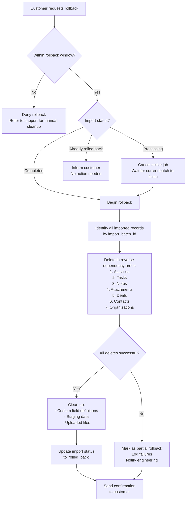

# Migration Validation & Rollback — Safety Net Architecture

> Hope is not a migration strategy. This template builds the validation checks that catch errors before they corrupt your database and the rollback procedures that recover from errors that slip through.

---

## 1. Pre-Migration Validation (Source Data Quality)

Pre-migration validation runs against the source data before any records are written to the target database. Its purpose is to surface problems early — during the preview step of the import wizard — when fixing them is cheap.

### Validation Layers

```
┌───────────────────────────────────────────────┐
│  Layer 1: Structural Validation               │
│  - File readable and parseable                │
│  - Header row present                         │
│  - Consistent column count across rows        │
│  - No completely empty rows                   │
└──────────────────┬────────────────────────────┘
                   ▼
┌───────────────────────────────────────────────┐
│  Layer 2: Schema Validation                   │
│  - Required columns mapped                   │
│  - Data types match target schema             │
│  - Enum values are valid                      │
│  - String lengths within bounds               │
└──────────────────┬────────────────────────────┘
                   ▼
┌───────────────────────────────────────────────┐
│  Layer 3: Referential Validation              │
│  - Foreign key references are resolvable      │
│  - Parent records exist for child records     │
│  - No orphaned references                     │
└──────────────────┬────────────────────────────┘
                   ▼
┌───────────────────────────────────────────────┐
│  Layer 4: Business Rule Validation            │
│  - Domain-specific constraints                │
│  - Cross-field consistency (e.g., start < end)│
│  - Uniqueness constraints                     │
│  - Data freshness (dates not in far future)   │
└───────────────────────────────────────────────┘
```

### Validation Implementation

```typescript
// src/migration/validation/pre-migration-validator.ts
interface PreMigrationReport {
  totalRecords: number;
  validRecords: number;
  warningRecords: number;
  errorRecords: number;
  layerResults: LayerResult[];
  canProceed: boolean;
  recommendations: string[];
}

export async function runPreMigrationValidation(
  importId: string,
  parsedRows: ParsedRow[],
  mappings: FieldMapping[],
  schema: TargetSchema
): Promise<PreMigrationReport> {
  const report: PreMigrationReport = {
    totalRecords: parsedRows.length,
    validRecords: 0,
    warningRecords: 0,
    errorRecords: 0,
    layerResults: [],
    canProceed: false,
    recommendations: [],
  };

  // Layer 1: Structural
  const structural = validateStructure(parsedRows);
  report.layerResults.push(structural);

  // Layer 2: Schema
  const schemaResult = validateSchema(parsedRows, mappings, schema);
  report.layerResults.push(schemaResult);

  // Layer 3: Referential
  const referential = validateReferences(parsedRows, mappings);
  report.layerResults.push(referential);

  // Layer 4: Business rules
  const business = validateBusinessRules(parsedRows, schema);
  report.layerResults.push(business);

  // Aggregate
  const allErrors = report.layerResults.flatMap(l => l.errors);
  const errorRows = new Set(allErrors.filter(e => e.severity === 'error').map(e => e.rowNumber));
  const warningRows = new Set(allErrors.filter(e => e.severity === 'warning').map(e => e.rowNumber));

  report.errorRecords = errorRows.size;
  report.warningRecords = warningRows.size - errorRows.size; // Warnings not already errors
  report.validRecords = report.totalRecords - errorRows.size;

  // Proceed if error rate is below threshold
  const errorRate = report.errorRecords / report.totalRecords;
  report.canProceed = errorRate < 0.5; // Block if >50% errors

  if (errorRate > 0.3) {
    report.recommendations.push(
      'More than 30% of records have errors. Consider re-exporting your data ' +
      'or checking that the file format matches what we expect.'
    );
  }
  if (errorRate > 0 && errorRate <= 0.05) {
    report.recommendations.push(
      'A small number of records have errors. You can import the valid records now ' +
      'and fix the errors in a second pass using the error report.'
    );
  }

  return report;
}
```

### Structural Validation Checks

| Check | What It Catches | Example |
|-------|----------------|---------|
| File parseable | Corrupted files, binary files disguised as CSV | File uploaded as .csv but is actually .xlsx |
| Header row present | Files without column names | Data starts on row 1 with no headers |
| Consistent column count | Unescaped delimiters, broken rows | Row 47 has 8 columns, header has 10 |
| No empty rows | Blank lines in middle of data | Rows 100-105 are completely empty |
| Encoding valid | Garbled characters from wrong encoding | `ä` instead of `ä` |
| File not truncated | Incomplete upload, export timeout | Last row ends mid-field |

---

## 2. Post-Migration Validation (Data Integrity)

Post-migration validation runs after all records have been loaded. It compares source and target to verify that the migration was faithful.

### Record Count Verification

```sql
-- src/migration/validation/queries/record-count-verification.sql

-- Compare record counts between source manifest and target database
SELECT
  'organizations' AS entity_type,
  (SELECT count FROM import_manifest WHERE import_id = $1 AND entity = 'organizations') AS source_count,
  (SELECT COUNT(*) FROM organizations WHERE import_batch_id = $1) AS target_count,
  (SELECT count FROM import_manifest WHERE import_id = $1 AND entity = 'organizations') -
    (SELECT COUNT(*) FROM organizations WHERE import_batch_id = $1) AS difference

UNION ALL

SELECT
  'contacts' AS entity_type,
  (SELECT count FROM import_manifest WHERE import_id = $1 AND entity = 'contacts') AS source_count,
  (SELECT COUNT(*) FROM contacts WHERE import_batch_id = $1) AS target_count,
  (SELECT count FROM import_manifest WHERE import_id = $1 AND entity = 'contacts') -
    (SELECT COUNT(*) FROM contacts WHERE import_batch_id = $1) AS difference

UNION ALL

SELECT
  'deals' AS entity_type,
  (SELECT count FROM import_manifest WHERE import_id = $1 AND entity = 'deals') AS source_count,
  (SELECT COUNT(*) FROM deals WHERE import_batch_id = $1) AS target_count,
  (SELECT count FROM import_manifest WHERE import_id = $1 AND entity = 'deals') -
    (SELECT COUNT(*) FROM deals WHERE import_batch_id = $1) AS difference;
```

### Referential Integrity Verification

```sql
-- src/migration/validation/queries/referential-integrity.sql

-- Find contacts that reference non-existent organizations
SELECT
  c.id AS contact_id,
  c.external_id AS contact_external_id,
  c.organization_id AS orphaned_org_reference
FROM contacts c
WHERE c.import_batch_id = $1
  AND c.organization_id IS NOT NULL
  AND c.organization_id NOT IN (
    SELECT id FROM organizations WHERE import_batch_id = $1
  )
  AND c.organization_id NOT IN (
    SELECT id FROM organizations WHERE import_batch_id != $1
  );

-- Find deals that reference non-existent contacts
SELECT
  d.id AS deal_id,
  d.external_id AS deal_external_id,
  d.contact_id AS orphaned_contact_reference
FROM deals d
WHERE d.import_batch_id = $1
  AND d.contact_id IS NOT NULL
  AND d.contact_id NOT IN (
    SELECT id FROM contacts
  );

-- Find activities with no parent record
SELECT
  a.id AS activity_id,
  a.entity_type AS parent_type,
  a.entity_id AS orphaned_parent_reference
FROM activities a
WHERE a.import_batch_id = $1
  AND a.entity_id NOT IN (
    SELECT id FROM contacts WHERE import_batch_id = $1
    UNION
    SELECT id FROM deals WHERE import_batch_id = $1
  );
```

### Data Sampling Verification

```typescript
// src/migration/validation/data-sampler.ts
interface SamplingResult {
  sampleSize: number;
  matchedExactly: number;
  matchedWithTransform: number;
  mismatched: number;
  mismatches: SampleMismatch[];
}

export async function verifySample(
  importId: string,
  sampleSize: number = 100
): Promise<SamplingResult> {
  // Select random sample of imported records
  const sample = await db.query(
    `SELECT id, external_id FROM contacts
     WHERE import_batch_id = $1
     ORDER BY RANDOM()
     LIMIT $2`,
    [importId, sampleSize]
  );

  const result: SamplingResult = {
    sampleSize: sample.rows.length,
    matchedExactly: 0,
    matchedWithTransform: 0,
    mismatched: 0,
    mismatches: [],
  };

  for (const record of sample.rows) {
    // Fetch the original source row from staging
    const sourceRow = await db.query(
      `SELECT data FROM import_staging
       WHERE import_id = $1 AND external_id = $2`,
      [importId, record.external_id]
    );

    if (sourceRow.rows.length === 0) {
      result.mismatched++;
      result.mismatches.push({
        recordId: record.id,
        field: '*',
        expected: 'Source record exists',
        actual: 'Source record not found in staging',
      });
      continue;
    }

    // Compare key fields
    const targetRecord = await db.query(
      `SELECT * FROM contacts WHERE id = $1`,
      [record.id]
    );
    const source = sourceRow.rows[0].data;
    const target = targetRecord.rows[0];

    const comparison = compareRecords(source, target, getMappings(importId));
    if (comparison.exactMatch) {
      result.matchedExactly++;
    } else if (comparison.transformMatch) {
      result.matchedWithTransform++;
    } else {
      result.mismatched++;
      result.mismatches.push(...comparison.mismatches);
    }
  }

  return result;
}
```

---

## 3. Automated Comparison Report

The comparison report is generated automatically after every migration and stored as a downloadable artifact.

### Report Structure

```typescript
// src/migration/validation/comparison-report.ts
interface MigrationComparisonReport {
  importId: string;
  generatedAt: string;
  summary: {
    overallStatus: 'pass' | 'warning' | 'fail';
    recordCountMatch: boolean;
    referentialIntegrityPass: boolean;
    dataSamplingPassRate: number;
    totalEntitiesChecked: number;
  };
  recordCounts: EntityCountComparison[];
  referentialIntegrity: ReferentialIntegrityResult[];
  dataSampling: SamplingResult;
  recommendations: string[];
}

export async function generateComparisonReport(
  importId: string
): Promise<MigrationComparisonReport> {
  const [counts, integrity, sampling] = await Promise.all([
    verifyRecordCounts(importId),
    verifyReferentialIntegrity(importId),
    verifySample(importId, 100),
  ]);

  const overallStatus = determineOverallStatus(counts, integrity, sampling);

  return {
    importId,
    generatedAt: new Date().toISOString(),
    summary: {
      overallStatus,
      recordCountMatch: counts.every(c => c.difference === 0),
      referentialIntegrityPass: integrity.every(r => r.orphanedCount === 0),
      dataSamplingPassRate: (sampling.matchedExactly + sampling.matchedWithTransform) / sampling.sampleSize,
      totalEntitiesChecked: counts.length,
    },
    recordCounts: counts,
    referentialIntegrity: integrity,
    dataSampling: sampling,
    recommendations: generateRecommendations(overallStatus, counts, integrity, sampling),
  };
}
```

---

## 4. Rollback Procedure

### Rollback Architecture

Every import creates a rollback manifest that enables full reversal within the `{{ROLLBACK_WINDOW_HOURS}}`-hour rollback window.

```
┌──────────────────────────────────────────────────────────────┐
│                     ROLLBACK PROCEDURE                       │
│                                                              │
│  1. Pause active processing          (immediate)             │
│  2. Identify affected records        (import_batch_id)       │
│  3. Reverse in dependency order      (children before parents)│
│  4. Delete imported records          (cascading)             │
│  5. Remove custom field definitions  (if created by import)  │
│  6. Clean up file storage            (uploaded attachments)  │
│  7. Update import status             (status = 'rolled_back')│
│  8. Notify customer                  (confirmation email)    │
│                                                              │
└──────────────────────────────────────────────────────────────┘
```

### Rollback Implementation

```typescript
// src/migration/rollback/rollback-service.ts
interface RollbackResult {
  importId: string;
  status: 'completed' | 'partial' | 'failed';
  deletedRecords: Record<string, number>;
  deletedFiles: number;
  deletedCustomFields: number;
  errors: RollbackError[];
  duration: number;
}

export async function rollbackImport(importId: string): Promise<RollbackResult> {
  const startTime = Date.now();
  const result: RollbackResult = {
    importId,
    status: 'completed',
    deletedRecords: {},
    deletedFiles: 0,
    deletedCustomFields: 0,
    errors: [],
    duration: 0,
  };

  // Verify rollback window
  const migration = await getMigration(importId);
  const hoursElapsed = (Date.now() - new Date(migration.completedAt).getTime()) / 3600000;
  if (hoursElapsed > {{ROLLBACK_WINDOW_HOURS}}) {
    throw new RollbackError(
      `Rollback window has expired. Migration completed ${Math.round(hoursElapsed)} hours ago. ` +
      `Rollback is available for ${{{ROLLBACK_WINDOW_HOURS}}} hours after completion. ` +
      `Contact support for manual data removal.`
    );
  }

  // Get import manifest for dependency-ordered deletion
  const manifest = await getImportManifest(importId);
  const deleteOrder = getImportOrder(manifest.entities).reverse(); // Reverse = children first

  await db.transaction(async (tx) => {
    for (const entity of deleteOrder) {
      try {
        const deleteResult = await tx.query(
          `DELETE FROM ${entity} WHERE import_batch_id = $1 RETURNING id`,
          [importId]
        );
        result.deletedRecords[entity] = deleteResult.rowCount;
      } catch (error) {
        result.errors.push({
          entity,
          error: (error as Error).message,
          recordsAffected: 0,
        });
        result.status = 'partial';
      }
    }

    // Delete custom field definitions created by this import
    const customFieldResult = await tx.query(
      `DELETE FROM custom_field_definitions
       WHERE created_by = 'migration' AND created_at >= $1
       RETURNING id`,
      [migration.startedAt]
    );
    result.deletedCustomFields = customFieldResult.rowCount;

    // Update import status
    await tx.query(
      `UPDATE imports SET status = 'rolled_back', rolled_back_at = NOW() WHERE id = $1`,
      [importId]
    );
  });

  // Clean up uploaded files (outside transaction — file storage is separate)
  try {
    const files = await getImportedFiles(importId);
    for (const file of files) {
      await deleteFile(file.storageKey);
      result.deletedFiles++;
    }
  } catch (error) {
    result.errors.push({
      entity: 'files',
      error: (error as Error).message,
      recordsAffected: 0,
    });
  }

  // Clean up staging data
  await db.query(`DELETE FROM import_staging WHERE import_id = $1`, [importId]);
  await db.query(`DELETE FROM import_hashes WHERE import_id = $1`, [importId]);

  result.duration = Date.now() - startTime;
  return result;
}
```

---

## 5. Rollback Window Policy

| Tier | Rollback Window | Rationale |
|------|----------------|-----------|
| Free | 24 hours | Minimal storage cost for rollback data |
| Pro | {{ROLLBACK_WINDOW_HOURS}} hours | Standard window for production use |
| Enterprise | 168 hours (7 days) | Extended window for complex migrations |
| Custom | Negotiable | Enterprise contracts may require longer |

### Rollback Data Retention

During the rollback window, the following data is retained:

| Data | Storage Location | Size Estimate | Cleanup Trigger |
|------|-----------------|---------------|-----------------|
| Import staging rows | `import_staging` table | ~2x source file size | Rollback window expiry |
| Content hashes | `import_hashes` table | ~50 bytes per record | Rollback window expiry |
| Import manifest | `import_manifests` table | ~1KB per import | Never (audit trail) |
| Source file | File storage (S3/GCS) | Original file size | Rollback window expiry |
| Error report | File storage (S3/GCS) | ~10KB-1MB | 90 days |

```typescript
// src/migration/rollback/cleanup-job.ts
// Runs daily to clean up expired rollback data

export async function cleanupExpiredRollbackData(): Promise<CleanupResult> {
  const cutoff = new Date(Date.now() - {{ROLLBACK_WINDOW_HOURS}} * 3600000);

  // Delete staging data for imports completed before cutoff
  const stagingResult = await db.query(
    `DELETE FROM import_staging
     WHERE import_id IN (
       SELECT id FROM imports
       WHERE status = 'completed' AND completed_at < $1
     )`,
    [cutoff]
  );

  // Delete hash data
  const hashResult = await db.query(
    `DELETE FROM import_hashes
     WHERE import_id IN (
       SELECT id FROM imports
       WHERE status = 'completed' AND completed_at < $1
     )`,
    [cutoff]
  );

  // Delete source files from storage
  const files = await db.query(
    `SELECT source_file_key FROM imports
     WHERE status = 'completed' AND completed_at < $1 AND source_file_key IS NOT NULL`,
    [cutoff]
  );
  for (const file of files.rows) {
    await deleteFile(file.source_file_key);
  }

  return {
    stagingRowsDeleted: stagingResult.rowCount,
    hashesDeleted: hashResult.rowCount,
    filesDeleted: files.rows.length,
  };
}
```

---

## 6. Data Integrity Verification Queries

### Comprehensive Verification Suite

```sql
-- src/migration/validation/queries/full-verification.sql

-- 1. Record count by entity type
SELECT
  'Record Counts' AS check_name,
  entity_type,
  source_count,
  target_count,
  CASE WHEN source_count = target_count THEN 'PASS' ELSE 'FAIL' END AS status
FROM (
  SELECT
    m.entity AS entity_type,
    m.count AS source_count,
    CASE m.entity
      WHEN 'contacts' THEN (SELECT COUNT(*) FROM contacts WHERE import_batch_id = $1)
      WHEN 'organizations' THEN (SELECT COUNT(*) FROM organizations WHERE import_batch_id = $1)
      WHEN 'deals' THEN (SELECT COUNT(*) FROM deals WHERE import_batch_id = $1)
    END AS target_count
  FROM import_manifest m
  WHERE m.import_id = $1
) counts;

-- 2. Null check on required fields
SELECT
  'Required Field Nulls' AS check_name,
  'contacts.email' AS field,
  COUNT(*) AS null_count,
  CASE WHEN COUNT(*) = 0 THEN 'PASS' ELSE 'FAIL' END AS status
FROM contacts
WHERE import_batch_id = $1 AND email IS NULL

UNION ALL

SELECT
  'Required Field Nulls',
  'contacts.first_name',
  COUNT(*),
  CASE WHEN COUNT(*) = 0 THEN 'PASS' ELSE 'FAIL' END
FROM contacts
WHERE import_batch_id = $1 AND first_name IS NULL;

-- 3. Duplicate detection post-import
SELECT
  'Duplicate Check' AS check_name,
  email,
  COUNT(*) AS duplicate_count
FROM contacts
WHERE import_batch_id = $1
GROUP BY email
HAVING COUNT(*) > 1
ORDER BY duplicate_count DESC
LIMIT 20;

-- 4. Data range validation
SELECT
  'Date Range Check' AS check_name,
  MIN(created_at) AS earliest_date,
  MAX(created_at) AS latest_date,
  CASE
    WHEN MIN(created_at) < '1990-01-01' THEN 'WARNING: suspiciously old dates'
    WHEN MAX(created_at) > NOW() + INTERVAL '1 day' THEN 'WARNING: future dates detected'
    ELSE 'PASS'
  END AS status
FROM contacts
WHERE import_batch_id = $1;

-- 5. Enum value validation
SELECT
  'Enum Validation' AS check_name,
  status,
  COUNT(*) AS record_count,
  CASE
    WHEN status IN ('active', 'inactive', 'archived', 'pending') THEN 'PASS'
    ELSE 'FAIL: unexpected status value'
  END AS status_check
FROM contacts
WHERE import_batch_id = $1
GROUP BY status;

-- 6. Amount/currency sanity check
SELECT
  'Amount Sanity' AS check_name,
  COUNT(*) AS total_deals,
  COUNT(CASE WHEN amount_cents < 0 THEN 1 END) AS negative_amounts,
  COUNT(CASE WHEN amount_cents > 100000000 THEN 1 END) AS suspiciously_large,
  AVG(amount_cents) / 100 AS average_amount,
  MAX(amount_cents) / 100 AS max_amount
FROM deals
WHERE import_batch_id = $1;
```

### Rollback Procedure Flowchart


