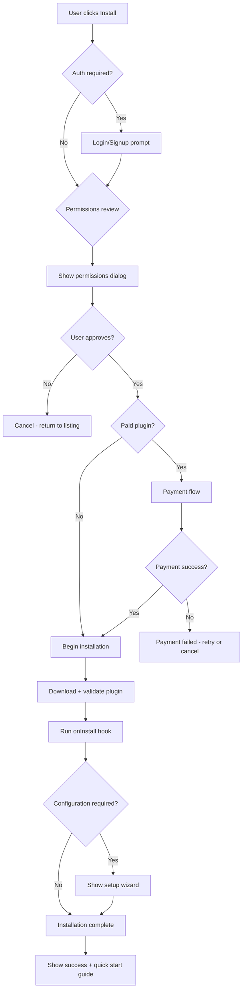

# App Store UX — {{PROJECT_NAME}}

> Designs the marketplace discovery experience, listing pages, search and filtering, install/uninstall flows, ratings and reviews system, user plugin management, and responsive layout for the {{PROJECT_NAME}} marketplace.

---

## 1. Discovery

### 1.1 Homepage Layout

The marketplace homepage is the storefront. Its job is to surface high-quality plugins to users who do not know what they are looking for.

```
┌─────────────────────────────────────────────────────────────┐
│  HERO BANNER — Featured / Staff Pick / Seasonal Spotlight   │
│  [Plugin Icon] [Title] [Tagline] [Install CTA]             │
├─────────────────────────────────────────────────────────────┤
│  CATEGORY NAVIGATION                                        │
│  [All] [Productivity] [Analytics] [Integrations] [Design]  │
│  [Communication] [Security] [Developer Tools] [More ▾]     │
├─────────────────────────────────────────────────────────────┤
│  TRENDING THIS WEEK                    RECENTLY UPDATED     │
│  ┌──────┐ ┌──────┐ ┌──────┐           ┌──────┐ ┌──────┐   │
│  │Plugin│ │Plugin│ │Plugin│           │Plugin│ │Plugin│   │
│  │ Icon │ │ Icon │ │ Icon │           │ Icon │ │ Icon │   │
│  │ Name │ │ Name │ │ Name │           │ Name │ │ Name │   │
│  │ ★4.8 │ │ ★4.6 │ │ ★4.9 │           │ ★4.5 │ │ ★4.7 │   │
│  └──────┘ └──────┘ └──────┘           └──────┘ └──────┘   │
├─────────────────────────────────────────────────────────────┤
│  POPULAR IN YOUR INDUSTRY              NEW ARRIVALS         │
│  (personalized based on org metadata)  (last 30 days)       │
├─────────────────────────────────────────────────────────────┤
│  COLLECTIONS                                                │
│  [Remote Work Essentials] [Analytics Stack] [Security Kit]  │
│  [Getting Started Bundle] [Enterprise Must-Haves]           │
└─────────────────────────────────────────────────────────────┘
```

### 1.2 Discovery Algorithms

| Algorithm | Signal | Weight | Description |
|---|---|---|---|
| Trending | Install velocity over 7 days | 30% | Plugins with accelerating installs |
| Popular | Total active installs | 20% | All-time most-used plugins |
| Highly Rated | Avg rating × review count | 20% | Quality-weighted popularity |
| Personalized | Org industry, size, usage patterns | 15% | ML-based collaborative filtering |
| Editorial | Staff picks, curated collections | 10% | Human-curated quality signal |
| Recency | Published/updated date | 5% | Fresh content boost |

### 1.3 Personalization Signals

| Signal | Source | Usage |
|---|---|---|
| Organization industry | Org profile | Surface industry-specific plugins |
| Organization size | Org profile | Filter by enterprise vs. SMB fit |
| Installed plugins | Install history | "Users who installed X also installed Y" |
| Feature usage patterns | Analytics | Recommend plugins for heavily-used features |
| Role/persona | User profile | Surface role-specific tools |
| Search history | Marketplace logs | Improve search ranking for this user |

---

## 2. Listing Page

### 2.1 Plugin Listing Layout

```
┌─────────────────────────────────────────────────────────────┐
│  ┌─────┐  Plugin Name                          [Install]   │
│  │Icon │  by Developer Name (Verified ✓)        Free / $X  │
│  │64x64│  ★★★★☆ 4.3 (1,247 reviews) · 45K installs        │
│  └─────┘  Category: Productivity · Updated: 2 weeks ago    │
├─────────────────────────────────────────────────────────────┤
│  [Overview] [Screenshots] [Reviews] [Changelog] [Support]  │
├─────────────────────────────────────────────────────────────┤
│                                                             │
│  OVERVIEW                                                   │
│  Long description with rich text formatting.                │
│  Feature highlights, use cases, and value proposition.      │
│                                                             │
│  KEY FEATURES                                               │
│  ✓ Feature one          ✓ Feature two                       │
│  ✓ Feature three        ✓ Feature four                      │
│                                                             │
│  SCREENSHOTS / VIDEO                                        │
│  ┌──────────┐ ┌──────────┐ ┌──────────┐ ┌──────────┐      │
│  │Screenshot│ │Screenshot│ │Screenshot│ │  Video   │      │
│  │    1     │ │    2     │ │    3     │ │ Thumb    │      │
│  └──────────┘ └──────────┘ └──────────┘ └──────────┘      │
│                                                             │
├─────────────────────────────────────────────────────────────┤
│  SIDEBAR                                                    │
│  ┌─────────────────────────┐                                │
│  │ Permissions Required    │                                │
│  │ • Read projects         │                                │
│  │ • Write projects        │                                │
│  │ • Access user info      │                                │
│  ├─────────────────────────┤                                │
│  │ Requirements            │                                │
│  │ • Plan: Pro or higher   │                                │
│  │ • Platform: v2.0+       │                                │
│  ├─────────────────────────┤                                │
│  │ Links                   │                                │
│  │ • Documentation         │                                │
│  │ • Privacy Policy        │                                │
│  │ • Support               │                                │
│  │ • Source Code            │                                │
│  ├─────────────────────────┤                                │
│  │ Stats                   │                                │
│  │ • 45,230 installs       │                                │
│  │ • 98.5% uptime          │                                │
│  │ • Avg response: 120ms   │                                │
│  │ • Last updated: Mar 5   │                                │
│  └─────────────────────────┘                                │
└─────────────────────────────────────────────────────────────┘
```

### 2.2 Listing Data Model

```typescript
// src/marketplace/listing.ts

interface PluginListing {
  /** Plugin identity */
  id: string;
  name: string;
  slug: string;
  version: string;
  apiVersion: string; // {{PLUGIN_API_VERSION}}

  /** Developer info */
  developer: {
    id: string;
    name: string;
    verified: boolean;
    memberSince: string;
    pluginCount: number;
    avatarUrl: string;
  };

  /** Content */
  shortDescription: string; // max 120 chars
  longDescription: string; // markdown, max 10,000 chars
  iconUrl: string;
  screenshots: ScreenshotEntry[];
  videoUrl?: string;
  features: string[]; // bullet-point features
  categories: string[];
  tags: string[];

  /** Metrics */
  metrics: {
    totalInstalls: number;
    activeInstalls: number;
    averageRating: number;
    reviewCount: number;
    uptimePercent: number;
    avgResponseMs: number;
    weeklyActiveUsers: number;
  };

  /** Pricing */
  pricing: PricingInfo;

  /** Permissions */
  permissions: PermissionDisplay[];

  /** Compatibility */
  compatibility: {
    minPlatformVersion: string;
    requiredPlan: string;
    supportedBrowsers: string[];
  };

  /** Metadata */
  publishedAt: string;
  updatedAt: string;
  changelogUrl: string;
  documentationUrl: string;
  supportUrl: string;
  privacyPolicyUrl: string;
  sourceCodeUrl?: string;
}

interface ScreenshotEntry {
  url: string;
  caption: string;
  order: number;
  deviceType: 'desktop' | 'tablet' | 'mobile';
}

interface PermissionDisplay {
  id: string;
  label: string;
  description: string;
  severity: 'low' | 'medium' | 'high';
  icon: string;
}
```

---

## 3. Search & Filtering

### 3.1 Search Architecture

```typescript
// src/marketplace/search.ts

interface MarketplaceSearchParams {
  /** Full-text search query */
  query?: string;

  /** Category filter */
  category?: string;

  /** Tag filters (AND logic) */
  tags?: string[];

  /** Minimum rating */
  minRating?: number; // 1-5

  /** Pricing filter */
  pricing?: 'free' | 'paid' | 'freemium';

  /** Sort order */
  sort?: 'relevance' | 'popular' | 'rating' | 'recent' | 'name';

  /** Compatibility filters */
  platformVersion?: string;
  plan?: string;

  /** Pagination */
  page?: number;
  pageSize?: number; // max 50

  /** Developer filter */
  developerId?: string;
  verified?: boolean;
}

interface MarketplaceSearchResult {
  plugins: PluginListingSummary[];
  total: number;
  page: number;
  pageSize: number;
  facets: SearchFacets;
  suggestions: string[]; // "Did you mean..."
}

interface SearchFacets {
  categories: FacetCount[];
  tags: FacetCount[];
  pricing: FacetCount[];
  ratings: FacetCount[];
}

interface FacetCount {
  value: string;
  count: number;
}
```

### 3.2 Search Ranking

| Factor | Weight | Description |
|---|---|---|
| Text relevance | 35% | BM25 score against name, description, tags |
| Install count | 20% | Log-scaled active installs |
| Rating quality | 15% | Bayesian average rating |
| Recency | 10% | Freshness boost for recently updated plugins |
| Developer reputation | 10% | Verified status, total portfolio quality |
| Personalization | 10% | User/org signal matching |

### 3.3 Search UX Patterns

| Pattern | Implementation |
|---|---|
| Autocomplete | Typeahead with top 5 suggestions, debounced 200ms |
| Instant results | Results update as user types (after 3+ characters) |
| Spell correction | "Did you mean..." for misspelled queries |
| Zero-results | Show related categories, popular plugins, "Request an integration" CTA |
| Filter persistence | Filters persist in URL query params for shareability |
| Recent searches | Show last 5 searches in dropdown |

---

## 4. Install Flow

### 4.1 Installation Workflow



### 4.2 Permission Consent Dialog

```
┌─────────────────────────────────────────────┐
│  Install "Plugin Name"?                      │
│                                              │
│  This plugin will be able to:                │
│                                              │
│  🟢 Read your projects                       │
│     Access project names, descriptions,      │
│     and metadata                             │
│                                              │
│  🟡 Modify your projects                     │
│     Create, update, and delete project       │
│     data on your behalf                      │
│                                              │
│  🟢 Access your profile                      │
│     Read your name and email address         │
│                                              │
│  ⚠️  This plugin requires {{N}} of           │
│     {{MAX_PLUGIN_PERMISSIONS}} max           │
│     permissions                              │
│                                              │
│  By installing, you agree to the plugin's    │
│  [Privacy Policy] and [Terms of Service]     │
│                                              │
│  [Cancel]              [Install Plugin]      │
└─────────────────────────────────────────────┘
```

### 4.3 Post-Install Onboarding

| Step | Content | Purpose |
|---|---|---|
| Success toast | "Plugin Name installed successfully" | Confirmation |
| Quick start card | 3-step getting started guide | Reduce time-to-value |
| Configuration wizard | Required settings (API keys, preferences) | Initial setup |
| Feature tour | Highlight where plugin UI appears | Discoverability |
| Documentation link | Link to plugin docs | Self-serve help |

---

## 5. Ratings & Reviews

### 5.1 Review System Design

```typescript
// src/marketplace/reviews.ts

interface PluginReview {
  id: string;
  pluginId: string;
  pluginVersion: string; // version at time of review
  userId: string;
  userName: string;
  userAvatar: string;
  organizationSize: 'small' | 'medium' | 'large' | 'enterprise';

  rating: number; // 1-5
  title: string; // max 100 chars
  body: string; // max 5,000 chars

  /** Structured feedback */
  aspects: {
    easeOfUse: number; // 1-5
    reliability: number; // 1-5
    support: number; // 1-5
    valueForMoney: number; // 1-5
  };

  /** Helpfulness voting */
  helpfulCount: number;
  unhelpfulCount: number;

  /** Developer response */
  developerResponse?: {
    body: string;
    respondedAt: string;
  };

  /** Moderation */
  status: 'published' | 'flagged' | 'removed';
  flagReasons?: string[];

  createdAt: string;
  updatedAt: string;
}
```

### 5.2 Rating Display

```
Overall Rating: ★★★★☆ 4.3 out of 5
Based on 1,247 reviews

5 ★ ████████████████████░░  68%  (848)
4 ★ ██████░░░░░░░░░░░░░░░░  18%  (225)
3 ★ ███░░░░░░░░░░░░░░░░░░░   8%  (100)
2 ★ █░░░░░░░░░░░░░░░░░░░░░   3%   (37)
1 ★ █░░░░░░░░░░░░░░░░░░░░░   3%   (37)

Aspect Ratings:
Ease of Use     ★★★★☆ 4.5
Reliability     ★★★★☆ 4.2
Support         ★★★★☆ 4.0
Value for Money ★★★★☆ 4.4
```

### 5.3 Anti-Abuse Measures

| Measure | Implementation |
|---|---|
| One review per user per plugin | Enforced at DB level |
| Minimum usage requirement | Must have plugin installed for 7+ days |
| Review gating | Cannot review until 10+ interactions with plugin |
| Spam detection | ML classifier for fake/incentivized reviews |
| Developer self-review prevention | Cannot review own plugins |
| Review velocity monitoring | Flag plugins with suspicious review spikes |
| Verified purchase badge | Show "Verified User" for paying customers |

---

## 6. User Plugin Management

### 6.1 Installed Plugins Dashboard

```
┌─────────────────────────────────────────────────────────────┐
│  My Plugins (8 installed)                    [Browse More]  │
├─────────────────────────────────────────────────────────────┤
│  ACTIVE (6)                                                 │
│  ┌────────────────────────────────────────────────────────┐ │
│  │ [Icon] Analytics Pro v2.3.1     ★4.8   [Settings] [⋯] │ │
│  │        Last used: 2 hours ago   Status: Active         │ │
│  ├────────────────────────────────────────────────────────┤ │
│  │ [Icon] Slack Integration v1.8.0 ★4.6   [Settings] [⋯] │ │
│  │        Last used: 1 day ago     Status: Active         │ │
│  │        ⚠️ Update available: v1.9.0                     │ │
│  ├────────────────────────────────────────────────────────┤ │
│  │ [Icon] Theme: Midnight Dark v3.0 ★4.9  [Settings] [⋯] │ │
│  │        Applied to: All workspaces Status: Active       │ │
│  └────────────────────────────────────────────────────────┘ │
│                                                             │
│  INACTIVE (2)                                               │
│  ┌────────────────────────────────────────────────────────┐ │
│  │ [Icon] CSV Exporter v1.2.0      ★4.1   [Enable] [⋯]  │ │
│  │        Disabled on: Jan 15      Reason: Manual         │ │
│  ├────────────────────────────────────────────────────────┤ │
│  │ [Icon] Legacy Reporter v0.9.0   ★3.2   [Enable] [⋯]  │ │
│  │        Disabled on: Dec 1       Reason: Deprecated     │ │
│  └────────────────────────────────────────────────────────┘ │
└─────────────────────────────────────────────────────────────┘
```

### 6.2 Plugin Management Actions

| Action | Confirmation | Side Effect |
|---|---|---|
| Enable | None | Runs `onActivate` hook |
| Disable | "Plugin will stop functioning" | Runs `onDeactivate` hook |
| Uninstall | "All plugin data will be deleted" | Runs `onUninstall` hook, deletes storage |
| Update | Show changelog diff | Runs `onUpgrade` hook |
| Configure | None | Opens plugin settings page |
| Report | Select issue category | Flags for review team |
| View permissions | None | Shows current permission grants |
| Revoke permission | "Plugin may stop working" | Removes specific permission |

### 6.3 Update Management

| Strategy | Description | User Control |
|---|---|---|
| Auto-update (patch) | Patch versions install automatically | Opt-out per plugin |
| Notify (minor) | Badge + notification for minor updates | User triggers install |
| Prompt (major) | Modal explaining breaking changes | User reviews changelog first |
| Admin-controlled | Org admin approves updates for all users | Enterprise feature |

---

## 7. Responsive Design

### 7.1 Breakpoint Strategy

| Breakpoint | Width | Layout Adaptation |
|---|---|---|
| Desktop | >= 1200px | Full grid layout, sidebar visible, multi-column cards |
| Tablet | 768–1199px | 2-column grid, sidebar collapses to tabs |
| Mobile | < 768px | Single column, bottom sheet for filters, stacked cards |

### 7.2 Mobile-Specific Patterns

| Pattern | Desktop | Mobile |
|---|---|---|
| Search | Full search bar with filters | Collapsible search with filter sheet |
| Plugin cards | Horizontal with screenshot preview | Vertical card, tap to expand |
| Install flow | Inline permission dialog | Full-screen permission sheet |
| Plugin management | Table view | Card list with swipe actions |
| Screenshots | Horizontal carousel | Swipeable full-width gallery |
| Reviews | Full reviews with sidebar | Stacked reviews, sticky rating summary |

### 7.3 Performance Targets

| Metric | Target | Measurement |
|---|---|---|
| First Contentful Paint | < 1.5s | Lighthouse |
| Largest Contentful Paint | < 2.5s | Lighthouse |
| Cumulative Layout Shift | < 0.1 | Lighthouse |
| Time to Interactive | < 3.0s | Lighthouse |
| Search response time | < 200ms | Server-side P95 |
| Plugin card render | < 50ms | Client-side per card |
| Image lazy loading | Viewport + 1 screen | IntersectionObserver |

---

## App Store UX Checklist

- [ ] Homepage layout designed with hero, categories, trending, and personalized sections
- [ ] Discovery algorithms implemented — trending, popular, personalized, editorial
- [ ] Plugin listing page complete with overview, screenshots, reviews, changelog tabs
- [ ] Search with autocomplete, faceted filtering, and zero-results handling
- [ ] Install flow includes permission consent, payment (if paid), and onboarding
- [ ] Rating system with structured aspects, anti-abuse measures, and developer responses
- [ ] User plugin management dashboard with enable/disable/uninstall/update actions
- [ ] Responsive design verified across desktop, tablet, and mobile breakpoints
- [ ] Performance targets met for all Core Web Vitals
- [ ] Accessibility audit passed (WCAG 2.1 AA)
- [ ] Analytics tracking on all marketplace interactions (search, view, install, uninstall)
