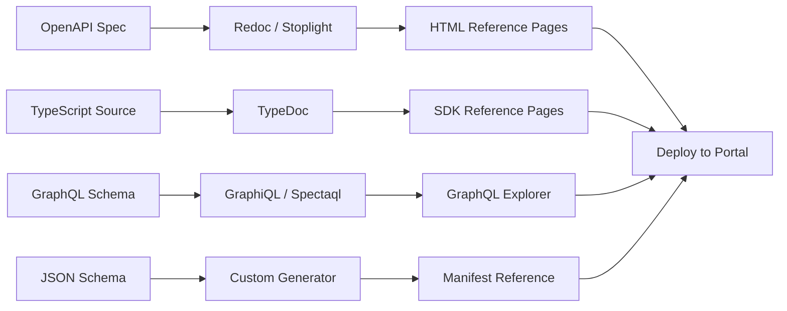
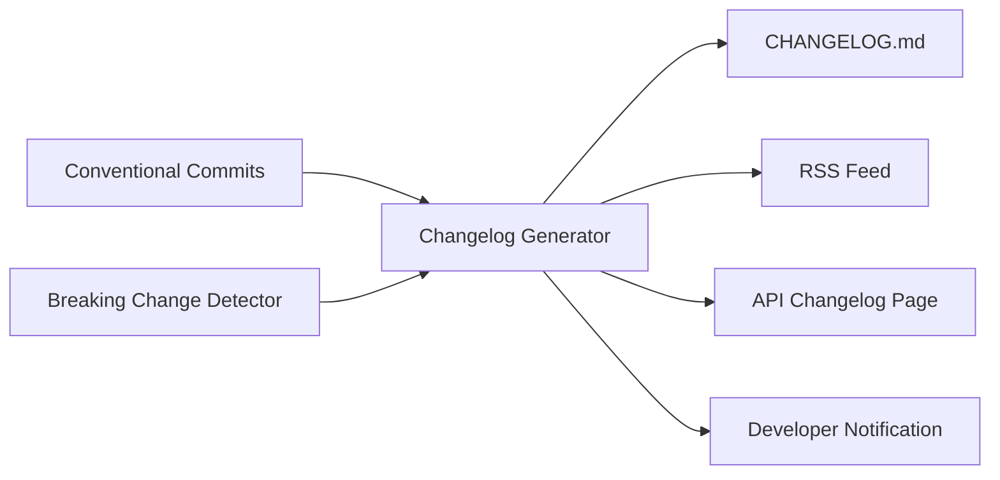

# Developer Documentation Generation — {{PROJECT_NAME}}

> Defines the OpenAPI specification management, auto-generated API reference, interactive playground, multi-language code samples, changelog automation, webhook documentation, and SDK reference generation for the {{PROJECT_NAME}} developer portal.

---

## 1. OpenAPI Specification

### 1.1 OpenAPI Specification Management

The Plugin API is documented using OpenAPI 3.1 as the single source of truth. All downstream documentation is generated from this spec.

```yaml
# openapi/plugin-api.yaml
openapi: "3.1.0"
info:
  title: "{{PROJECT_NAME}} Plugin API"
  version: "{{PLUGIN_API_VERSION}}"
  description: "API for {{PROJECT_NAME}} plugins to interact with the platform."
  contact:
    name: "{{PROJECT_NAME}} Developer Support"
    url: "{{DEVELOPER_PORTAL_URL}}/support"
    email: "developers@{{PROJECT_NAME}}.com"
  license:
    name: "Proprietary"
    url: "{{DEVELOPER_PORTAL_URL}}/legal/api-terms"

servers:
  - url: "https://api.{{PROJECT_NAME}}.com/plugins/{{PLUGIN_API_VERSION}}"
    description: "Production"
  - url: "{{DEVELOPER_SANDBOX_URL}}/api/plugins/{{PLUGIN_API_VERSION}}"
    description: "Sandbox"

security:
  - pluginApiKey: []
  - pluginOAuth: ["data:read", "data:write"]

paths:
  /data/{collection}:
    get:
      operationId: queryCollection
      summary: "Query a data collection"
      description: "Retrieve records from a data collection with filtering, sorting, and pagination."
      tags: ["Data"]
      parameters:
        - name: collection
          in: path
          required: true
          schema:
            type: string
          description: "Collection name (e.g., 'projects', 'tasks')"
        - name: filter
          in: query
          schema:
            type: object
          description: "Filter criteria as JSON object"
        - name: sort
          in: query
          schema:
            type: string
          description: "Sort field and order (e.g., 'name:asc', 'updatedAt:desc')"
        - name: page
          in: query
          schema:
            type: integer
            default: 1
            minimum: 1
        - name: pageSize
          in: query
          schema:
            type: integer
            default: 20
            minimum: 1
            maximum: 100
      responses:
        "200":
          description: "Successful query"
          content:
            application/json:
              schema:
                $ref: "#/components/schemas/PaginatedResult"
        "401":
          $ref: "#/components/responses/Unauthorized"
        "403":
          $ref: "#/components/responses/PermissionDenied"
        "429":
          $ref: "#/components/responses/RateLimited"

components:
  securitySchemes:
    pluginApiKey:
      type: apiKey
      in: header
      name: X-Plugin-API-Key
    pluginOAuth:
      type: oauth2
      flows:
        authorizationCode:
          authorizationUrl: "{{DEVELOPER_PORTAL_URL}}/oauth/authorize"
          tokenUrl: "{{DEVELOPER_PORTAL_URL}}/oauth/token"
          refreshUrl: "{{DEVELOPER_PORTAL_URL}}/oauth/refresh"
          scopes:
            "data:read": "Read platform data"
            "data:write": "Write platform data"
            "events:subscribe": "Subscribe to events"
            "storage:read-write": "Plugin storage access"

  schemas:
    PaginatedResult:
      type: object
      properties:
        items:
          type: array
          items: {}
        total:
          type: integer
        page:
          type: integer
        pageSize:
          type: integer
        hasNextPage:
          type: boolean

  responses:
    Unauthorized:
      description: "Authentication required"
      content:
        application/json:
          schema:
            $ref: "#/components/schemas/Error"
    PermissionDenied:
      description: "Insufficient permissions"
      content:
        application/json:
          schema:
            $ref: "#/components/schemas/Error"
    RateLimited:
      description: "Rate limit exceeded"
      headers:
        X-RateLimit-Limit:
          schema:
            type: integer
        X-RateLimit-Remaining:
          schema:
            type: integer
        X-RateLimit-Reset:
          schema:
            type: integer
        Retry-After:
          schema:
            type: integer
      content:
        application/json:
          schema:
            $ref: "#/components/schemas/Error"
```

### 1.2 Spec Validation Pipeline

| Step | Tool | When |
|---|---|---|
| Schema validation | `@redocly/cli lint` | Every commit |
| Breaking change detection | `oasdiff` | Every PR |
| Example validation | `@redocly/cli validate` | Every commit |
| Contract testing | `dredd` / `schemathesis` | Nightly against sandbox |
| Spec preview | `@redocly/cli preview-docs` | PR preview deploy |

```bash
# Validate OpenAPI spec
npx @redocly/cli lint openapi/plugin-api.yaml

# Detect breaking changes between versions
oasdiff breaking openapi/plugin-api-v1.yaml openapi/plugin-api-v2.yaml

# Run contract tests against sandbox
schemathesis run openapi/plugin-api.yaml --base-url={{DEVELOPER_SANDBOX_URL}}/api
```

---

## 2. Auto-Generated Reference

### 2.1 Reference Generation Pipeline



### 2.2 Reference Page Template

Each API endpoint generates a page with this structure:

```markdown
# Query Collection

`GET /data/{collection}`

Retrieve records from a data collection with filtering, sorting, and pagination.

## Authentication
- API Key (`X-Plugin-API-Key` header)
- OAuth 2.0 (`data:read` scope)

## Parameters

| Name | In | Type | Required | Description |
|---|---|---|---|---|
| `collection` | path | string | Yes | Collection name |
| `filter` | query | object | No | Filter criteria |
| `sort` | query | string | No | Sort field and order |
| `page` | query | integer | No | Page number (default: 1) |
| `pageSize` | query | integer | No | Items per page (default: 20, max: 100) |

## Response (200)
[Interactive schema viewer]

## Code Examples
[Tabs: cURL | TypeScript SDK | Python | Go]

## Try It
[Interactive request builder with sandbox authentication]

## Errors
| Status | Code | Description |
|---|---|---|
| 401 | `UNAUTHORIZED` | Missing or invalid API key |
| 403 | `PERMISSION_DENIED` | Plugin lacks `data:read:{collection}` permission |
| 429 | `RATE_LIMITED` | Rate limit exceeded |

## Changelog
- **v1.2** — Added `filter` parameter support for nested fields
- **v1.0** — Initial release
```

### 2.3 Generation Configuration

```typescript
// docs/config/reference-generator.ts

interface ReferenceGeneratorConfig {
  /** OpenAPI spec file path */
  specPath: string;

  /** Output directory for generated pages */
  outputDir: string;

  /** Template for reference pages */
  template: 'redoc' | 'stoplight' | 'custom';

  /** Languages for code examples */
  codeExampleLanguages: string[]; // ['curl', 'typescript', 'python', 'go']

  /** Include "Try It" interactive panel */
  interactivePlayground: boolean;

  /** Sandbox URL for interactive requests */
  sandboxUrl: string; // {{DEVELOPER_SANDBOX_URL}}

  /** Group endpoints by tags */
  groupByTags: boolean;

  /** Include deprecated endpoints */
  includeDeprecated: boolean;

  /** Custom CSS for branding */
  customCssPath?: string;

  /** Navigation structure */
  navigation: {
    sidebarDepth: number; // 2 = show endpoints under tags
    searchEnabled: boolean;
    versionSelector: boolean;
  };
}
```

---

## 3. Interactive Playground

### 3.1 Playground Features

| Feature | Description |
|---|---|
| **Request Builder** | Visual form for constructing API requests (method, path, params, body, headers) |
| **Authentication** | Auto-inject sandbox API key or OAuth token |
| **Live Execution** | Send requests to sandbox and display response |
| **Response Viewer** | Formatted JSON/XML response with syntax highlighting |
| **History** | Last 50 requests saved in local storage |
| **Collections** | Save and organize frequently-used request sequences |
| **Environment Variables** | Define variables (API key, base URL) for reuse |
| **Code Generation** | Generate code from request in multiple languages |
| **WebSocket Testing** | Connect to real-time event streams |
| **Diff View** | Compare responses between two requests |

### 3.2 Playground Architecture

```typescript
// src/marketplace/docs/playground.ts

interface PlaygroundConfig {
  /** Base URL for API requests */
  baseUrl: string; // {{DEVELOPER_SANDBOX_URL}}/api

  /** Pre-configured authentication */
  auth: {
    type: 'api-key' | 'oauth';
    apiKey?: string; // auto-populated from developer session
    oauthConfig?: OAuthPlaygroundConfig;
  };

  /** Available endpoints (from OpenAPI spec) */
  endpoints: PlaygroundEndpoint[];

  /** Pre-built example requests */
  examples: PlaygroundExample[];

  /** CORS proxy for browser-based requests */
  corsProxy?: string;
}

interface PlaygroundEndpoint {
  method: 'GET' | 'POST' | 'PUT' | 'PATCH' | 'DELETE';
  path: string;
  summary: string;
  parameters: PlaygroundParameter[];
  requestBody?: PlaygroundRequestBody;
  responses: PlaygroundResponse[];
}

interface PlaygroundExample {
  name: string;
  description: string;
  endpoint: string;
  method: string;
  params?: Record<string, string>;
  body?: unknown;
  expectedStatus: number;
}
```

### 3.3 Playground UX

```
┌─────────────────────────────────────────────────────────────┐
│  API Playground                    [Environment: Sandbox ▾] │
├──────────────────────┬──────────────────────────────────────┤
│  ENDPOINTS           │  REQUEST                             │
│                      │  ┌────────────────────────────────┐  │
│  ▸ Data              │  │ GET ▾ │ /data/projects         │  │
│    GET /data/{col}   │  └────────────────────────────────┘  │
│    POST /data/{col}  │                                      │
│    PUT /data/{col}/id│  Headers                             │
│    DELETE ...        │  X-Plugin-API-Key: pk_test_***       │
│                      │                                      │
│  ▸ Storage           │  Query Parameters                    │
│  ▸ Events            │  filter: {"status": "active"}        │
│  ▸ Auth              │  sort: updatedAt:desc                │
│  ▸ UI                │  page: 1                             │
│                      │  pageSize: 20                        │
│  HISTORY             │                                      │
│  • GET /data/proj... │  [Send Request]                      │
│  • POST /data/ta... │                                      │
│  • GET /storage/... │  ──────────────────────────────────  │
│                      │  RESPONSE  200 OK  142ms             │
│  COLLECTIONS         │  ┌────────────────────────────────┐  │
│  • My Test Suite     │  │ {                              │  │
│  • Auth Flows        │  │   "items": [                   │  │
│                      │  │     { "id": "proj-1", ... },   │  │
│                      │  │     { "id": "proj-2", ... }    │  │
│                      │  │   ],                           │  │
│                      │  │   "total": 42,                 │  │
│                      │  │   "page": 1                    │  │
│                      │  │ }                              │  │
│                      │  └────────────────────────────────┘  │
│                      │  [Copy] [Generate Code ▾] [Save]     │
└──────────────────────┴──────────────────────────────────────┘
```

---

## 4. Code Samples

### 4.1 Multi-Language Code Generation

Every API endpoint includes code samples in all supported languages:

#### cURL

```bash
curl -X GET "https://api.{{PROJECT_NAME}}.com/plugins/{{PLUGIN_API_VERSION}}/data/projects?filter=%7B%22status%22%3A%22active%22%7D&sort=updatedAt%3Adesc&page=1&pageSize=20" \
  -H "X-Plugin-API-Key: pk_live_your_api_key" \
  -H "Accept: application/json"
```

#### TypeScript SDK

```typescript
// Using @{{PROJECT_NAME}}/plugin-sdk
import { PluginSDK } from '@{{PROJECT_NAME}}/plugin-sdk';

const sdk = new PluginSDK({ manifest: require('./plugin.json') });

sdk.onActivate(async (api) => {
  const result = await api.data.query('projects', {
    filter: { status: 'active' },
    sort: { field: 'updatedAt', order: 'desc' },
    page: 1,
    pageSize: 20,
  });

  console.log(`Found ${result.total} projects`);
  result.items.forEach(project => {
    console.log(`- ${project.name} (${project.id})`);
  });
});
```

#### Python

```python
# Using requests
import requests

response = requests.get(
    f"https://api.{{PROJECT_NAME}}.com/plugins/{{PLUGIN_API_VERSION}}/data/projects",
    headers={
        "X-Plugin-API-Key": "pk_live_your_api_key",
        "Accept": "application/json",
    },
    params={
        "filter": '{"status": "active"}',
        "sort": "updatedAt:desc",
        "page": 1,
        "pageSize": 20,
    },
)

data = response.json()
print(f"Found {data['total']} projects")
for project in data["items"]:
    print(f"- {project['name']} ({project['id']})")
```

#### Go

```go
// Using net/http
package main

import (
    "encoding/json"
    "fmt"
    "net/http"
    "net/url"
)

func queryProjects() error {
    baseURL := "https://api.{{PROJECT_NAME}}.com/plugins/{{PLUGIN_API_VERSION}}/data/projects"
    params := url.Values{}
    params.Set("filter", `{"status": "active"}`)
    params.Set("sort", "updatedAt:desc")
    params.Set("page", "1")
    params.Set("pageSize", "20")

    req, err := http.NewRequest("GET", baseURL+"?"+params.Encode(), nil)
    if err != nil {
        return err
    }

    req.Header.Set("X-Plugin-API-Key", "pk_live_your_api_key")
    req.Header.Set("Accept", "application/json")

    resp, err := http.DefaultClient.Do(req)
    if err != nil {
        return err
    }
    defer resp.Body.Close()

    var result PaginatedResult
    json.NewDecoder(resp.Body).Decode(&result)
    fmt.Printf("Found %d projects\n", result.Total)
    return nil
}
```

### 4.2 Code Sample Generation Pipeline

```typescript
// docs/config/code-sample-generator.ts

interface CodeSampleGeneratorConfig {
  /** Source OpenAPI spec */
  specPath: string;

  /** Languages to generate */
  languages: CodeSampleLanguage[];

  /** Output directory */
  outputDir: string;

  /** Template directory for language-specific templates */
  templateDir: string;

  /** Validate generated samples compile/run */
  validateSamples: boolean;
}

interface CodeSampleLanguage {
  id: string;        // 'typescript', 'python', 'go', 'curl'
  name: string;      // 'TypeScript SDK', 'Python', 'Go', 'cURL'
  template: string;  // Handlebars template file
  validator?: string; // Command to validate (e.g., 'tsc --noEmit')
}
```

---

## 5. Changelog

### 5.1 Changelog Automation



### 5.2 Changelog Entry Types

| Type | Prefix | Description | Notification |
|---|---|---|---|
| **Breaking** | `BREAKING CHANGE:` | Incompatible API changes | Email + banner |
| **Added** | `feat:` | New endpoints, parameters, features | In-app notification |
| **Changed** | `refactor:` | Modified behavior (non-breaking) | Changelog page |
| **Deprecated** | `deprecate:` | Features scheduled for removal | Email + dashboard warning |
| **Fixed** | `fix:` | Bug fixes | Changelog page |
| **Security** | `security:` | Security-related changes | Email |
| **Performance** | `perf:` | Performance improvements | Changelog page |

### 5.3 Changelog Format

```markdown
# API Changelog

## {{PLUGIN_API_VERSION}} — 2024-03-15

### Breaking Changes
- **`POST /data/{collection}`** — `createdBy` field is now required in request body.
  **Migration:** Add `createdBy` field with the current user ID.

### Added
- **`GET /data/{collection}`** — New `filter` parameter supports nested field queries
  (e.g., `filter={"metadata.priority": "high"}`).
- **`POST /events/batch`** — New endpoint for emitting multiple events in a single request.
- **Webhook** — New `plugin.health.degraded` event for monitoring plugin health.

### Deprecated
- **`GET /data/{collection}/all`** — Use `GET /data/{collection}?pageSize=100` instead.
  Will be removed in next API version.

### Fixed
- **`PUT /storage/{key}`** — Fixed race condition when concurrent writes to the same key.
- **OAuth** — Token refresh now correctly extends session lifetime.

### Performance
- **`GET /data/{collection}`** — Query response time reduced by 40% for large collections.
```

### 5.4 Changelog Subscription

| Channel | Content | Frequency |
|---|---|---|
| RSS/Atom feed | All changelog entries | Real-time |
| Email digest | Breaking + Security + Deprecated | Weekly |
| In-app banner | Breaking changes only | On login |
| Developer dashboard | Full changelog with diff links | Always visible |
| Webhook | Machine-readable changelog events | Real-time |

---

## 6. Webhook Documentation

### 6.1 Webhook Event Catalog

| Event | Payload Schema | Trigger | Retry Policy |
|---|---|---|---|
| `project.created` | `ProjectCreatedPayload` | New project created | 3 retries, exponential backoff |
| `project.updated` | `ProjectUpdatedPayload` | Project fields modified | 3 retries |
| `project.deleted` | `ProjectDeletedPayload` | Project deleted | 3 retries |
| `task.completed` | `TaskCompletedPayload` | Task marked complete | 3 retries |
| `user.joined` | `UserJoinedPayload` | New user joins org | 3 retries |
| `plugin.installed` | `PluginInstalledPayload` | Plugin installed in org | 3 retries |
| `plugin.uninstalled` | `PluginUninstalledPayload` | Plugin removed from org | 3 retries |
| `payment.completed` | `PaymentCompletedPayload` | Subscription payment processed | 5 retries |

### 6.2 Webhook Payload Format

```json
{
  "id": "evt_abc123def456",
  "type": "project.created",
  "apiVersion": "{{PLUGIN_API_VERSION}}",
  "timestamp": "2024-03-15T10:30:00Z",
  "data": {
    "project": {
      "id": "proj_xyz789",
      "name": "New Project",
      "createdBy": "user_abc123",
      "orgId": "org_def456"
    }
  },
  "metadata": {
    "deliveryAttempt": 1,
    "maxAttempts": 3,
    "subscriptionId": "sub_ghi789"
  }
}
```

### 6.3 Webhook Security

```typescript
// docs/examples/webhook-verification.ts

import crypto from 'crypto';

/**
 * Verify webhook signature to ensure the request is from {{PROJECT_NAME}}.
 *
 * The platform signs every webhook with HMAC-SHA256 using your webhook secret.
 * Always verify the signature before processing the payload.
 */
function verifyWebhookSignature(
  payload: string,
  signature: string,
  secret: string,
): boolean {
  const expected = crypto
    .createHmac('sha256', secret)
    .update(payload, 'utf8')
    .digest('hex');

  return crypto.timingSafeEqual(
    Buffer.from(signature),
    Buffer.from(`sha256=${expected}`),
  );
}

// Express middleware example
app.post('/webhooks/{{PROJECT_NAME}}', (req, res) => {
  const signature = req.headers['x-webhook-signature'] as string;
  const isValid = verifyWebhookSignature(
    JSON.stringify(req.body),
    signature,
    process.env.WEBHOOK_SECRET!,
  );

  if (!isValid) {
    return res.status(401).json({ error: 'Invalid signature' });
  }

  // Process webhook...
  handleWebhookEvent(req.body);
  res.status(200).json({ received: true });
});
```

---

## 7. SDK Reference

### 7.1 SDK Reference Generation

```typescript
// docs/config/sdk-reference.ts

interface SDKReferenceConfig {
  /** TypeScript source directory */
  srcDir: string;

  /** Output directory for generated reference */
  outputDir: string;

  /** TypeDoc configuration */
  typedoc: {
    entryPoints: string[];
    excludePrivate: boolean;
    excludeInternal: boolean;
    theme: 'default' | 'custom';
    includeVersion: boolean;
    categorizeByGroup: boolean;
    navigation: {
      includeCategories: boolean;
      includeGroups: boolean;
    };
  };

  /** Cross-link to API reference */
  apiReferenceBaseUrl: string;

  /** Cross-link to guides */
  guidesBaseUrl: string;
}
```

### 7.2 SDK Reference Structure

```
SDK Reference
├── Classes
│   ├── PluginSDK
│   ├── UIModule
│   ├── DataModule
│   ├── EventsModule
│   ├── StorageModule
│   ├── AuthModule
│   ├── HTTPModule
│   ├── AnalyticsModule
│   └── SDKError
├── Interfaces
│   ├── PluginAPI
│   ├── PluginManifest
│   ├── PanelConfig
│   ├── ToolbarActionConfig
│   ├── QueryParams
│   ├── PaginatedResult
│   ├── EventPayload
│   ├── ThemeTokens
│   └── ... (all exported interfaces)
├── Type Aliases
│   ├── EventHandler
│   ├── Unsubscribe
│   └── ... (all exported types)
├── Enums
│   └── ErrorCode
└── Functions
    └── createMockAPI (from testing package)
```

### 7.3 SDK Reference Page Format

Each class/interface page follows this format:

| Section | Content |
|---|---|
| **Title** | Class/interface name with brief description |
| **Import** | How to import this class |
| **Constructor** | Parameters and options (for classes) |
| **Properties** | Public properties with types and descriptions |
| **Methods** | Method signatures with parameters, return types, examples |
| **Events** | Events emitted by this class (if applicable) |
| **Examples** | 2–3 usage examples from simple to advanced |
| **See Also** | Links to related classes, guides, and API endpoints |
| **Since** | Version when this was introduced |

---

## Documentation Generation Checklist

- [ ] OpenAPI 3.1 spec maintained as single source of truth
- [ ] Spec validation runs on every commit (lint + breaking change detection)
- [ ] Contract tests run nightly against sandbox
- [ ] API reference auto-generated from OpenAPI spec
- [ ] Interactive playground deployed with sandbox authentication
- [ ] Code samples generated in all supported languages ({{SDK_LANGUAGES}})
- [ ] Code samples validated (compile/lint check) in CI
- [ ] Changelog automated from conventional commits
- [ ] Breaking changes trigger email notifications to all developers
- [ ] Webhook event catalog documents all events with payload schemas
- [ ] Webhook signature verification example provided in all languages
- [ ] SDK reference auto-generated from TypeDoc
- [ ] All documentation versioned and accessible via version selector
- [ ] Search index updated on every documentation deploy
- [ ] Documentation build integrated into CI/CD pipeline
