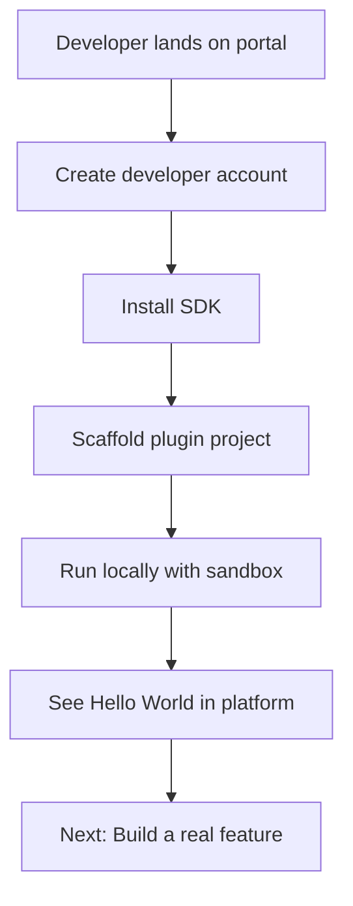
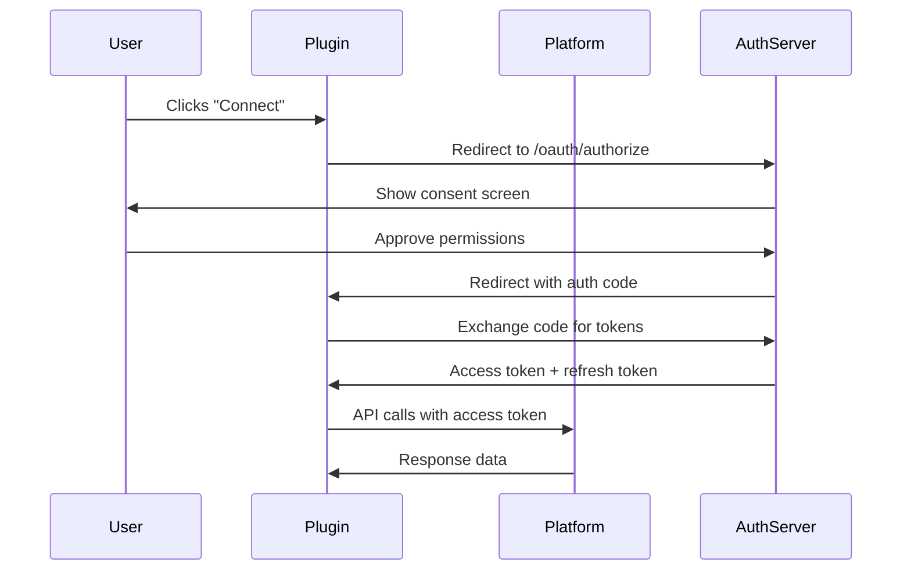
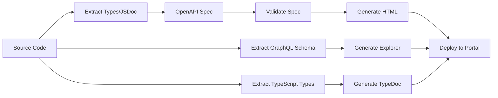

# Developer Portal — {{PROJECT_NAME}}

> Defines the information architecture, getting-started experience, authentication flows, API reference generation, code examples, community infrastructure, and developer dashboard for the {{PROJECT_NAME}} developer portal at {{DEVELOPER_PORTAL_URL}}.

---

## 1. Portal Information Architecture

### 1.1 Site Map

```
{{DEVELOPER_PORTAL_URL}}/
├── / (Homepage — value prop, quick start, ecosystem stats)
├── /getting-started/
│   ├── /quickstart/          (5-minute hello-world)
│   ├── /environment-setup/   (SDK install, dev tools)
│   ├── /first-plugin/        (Step-by-step tutorial)
│   ├── /testing/             (Sandbox, test data, debugging)
│   └── /publishing/          (Submission, review, launch)
├── /guides/
│   ├── /extension-points/    (All extension points with examples)
│   ├── /ui-extensions/       (Building plugin UIs)
│   ├── /data-access/         (Reading/writing platform data)
│   ├── /events/              (Subscribing to events)
│   ├── /background-tasks/    (Cron jobs, webhooks, queues)
│   ├── /storage/             (Plugin state management)
│   ├── /authentication/      (OAuth, API keys, user context)
│   ├── /monetization/        (Pricing, billing, revenue share)
│   ├── /security/            (Permissions, sandboxing, best practices)
│   ├── /performance/         (Optimization, caching, lazy loading)
│   └── /migration/           (Upgrading between API versions)
├── /api-reference/
│   ├── /rest/                (REST API endpoints)
│   ├── /graphql/             (GraphQL schema explorer)
│   ├── /sdk/                 (SDK class/method reference)
│   ├── /webhooks/            (Webhook event payloads)
│   ├── /manifest/            (plugin.json schema reference)
│   └── /errors/              (Error codes and troubleshooting)
├── /playground/              (Interactive API explorer)
├── /sandbox/                 (Development sandbox — {{DEVELOPER_SANDBOX_URL}})
├── /community/
│   ├── /forum/               (Discussion forum)
│   ├── /showcase/            (Featured plugins, case studies)
│   ├── /changelog/           (Platform changelog)
│   ├── /blog/                (Developer blog)
│   └── /events/              (Hackathons, office hours, conferences)
├── /dashboard/               (Developer dashboard — apps, analytics, payouts)
├── /support/
│   ├── /faq/                 (Frequently asked questions)
│   ├── /status/              (API status page)
│   ├── /contact/             (Support tickets)
│   └── /report-bug/          (Bug reporting)
└── /legal/
    ├── /developer-agreement/ (Developer Terms of Service)
    ├── /marketplace-policy/  (Marketplace content policies)
    └── /privacy/             (Developer data privacy)
```

### 1.2 Homepage Sections

| Section | Content | Purpose |
|---|---|---|
| Hero | "Build on {{PROJECT_NAME}}" + primary CTA | First impression, conversion |
| Quick Start | 3-step preview: Install SDK → Build → Publish | Reduce perceived complexity |
| Ecosystem Stats | Total plugins, developers, installs, revenue paid out | Social proof |
| Featured Plugins | 3–5 showcase plugins with developer testimonials | Inspiration |
| Developer Stories | Case studies of successful plugin businesses | Motivation |
| Latest Updates | Recent changelog entries, new API features | Currency |
| Community | Forum highlights, upcoming events | Engagement |

### 1.3 Navigation Design

| Navigation Element | Behavior |
|---|---|
| Top bar | Logo, Search, Docs, API Ref, Playground, Dashboard, Profile |
| Sidebar (docs) | Tree navigation with expand/collapse, active state indicator |
| Breadcrumbs | Always visible on content pages |
| Version selector | Dropdown to switch API version, default = `{{PLUGIN_API_VERSION}}` |
| Search | Full-text across docs, API ref, guides, forum. Keyboard shortcut: `/` |
| Quick links | Floating "On this page" table of contents on long pages |

---

## 2. Getting Started

### 2.1 Quickstart Flow (Target: 5 minutes to "Hello World")



### 2.2 Step-by-Step Quickstart

#### Step 1 — Create Developer Account

```
Sign up at {{DEVELOPER_PORTAL_URL}}/signup
- GitHub/Google SSO or email+password
- Accept Developer Agreement
- Create developer profile (name, avatar, company)
```

#### Step 2 — Install SDK

```bash
# npm
npm install @{{PROJECT_NAME}}/plugin-sdk@{{PLUGIN_API_VERSION}}

# yarn
yarn add @{{PROJECT_NAME}}/plugin-sdk@{{PLUGIN_API_VERSION}}

# pnpm
pnpm add @{{PROJECT_NAME}}/plugin-sdk@{{PLUGIN_API_VERSION}}
```

#### Step 3 — Scaffold Plugin Project

```bash
npx @{{PROJECT_NAME}}/create-plugin my-first-plugin

# Interactive prompts:
# ? Plugin name: my-first-plugin
# ? Description: My first plugin for {{PROJECT_NAME}}
# ? Extension points: ui.panel, ui.toolbar-action
# ? Language: TypeScript
# ? Template: starter
```

#### Step 4 — Project Structure

```
my-first-plugin/
├── plugin.json              # Plugin manifest
├── src/
│   ├── index.ts             # Main entrypoint
│   ├── panel.tsx            # UI panel component
│   └── toolbar.ts           # Toolbar action handler
├── assets/
│   ├── icon-512.png         # Plugin icon
│   └── screenshot-1.png     # Marketplace screenshot
├── test/
│   ├── panel.test.ts        # Panel tests
│   └── toolbar.test.ts      # Toolbar tests
├── tsconfig.json
├── package.json
└── README.md
```

#### Step 5 — Run in Development Mode

```bash
cd my-first-plugin
npm run dev

# Output:
# ✓ Plugin compiled successfully
# ✓ Connected to sandbox at {{DEVELOPER_SANDBOX_URL}}
# ✓ Plugin "my-first-plugin" loaded in sandbox
# ✓ Open {{DEVELOPER_SANDBOX_URL}} to see your plugin
# ✓ Hot reload enabled — changes reflect instantly
```

### 2.3 Onboarding Metrics

| Metric | Target | Measurement |
|---|---|---|
| Signup to SDK installed | < 3 minutes | Funnel analytics |
| SDK installed to Hello World | < 5 minutes | Funnel analytics |
| Hello World to first submission | < 2 hours | Funnel analytics |
| Quickstart completion rate | > 70% | Step completion tracking |
| Quickstart drop-off points | Identify and fix | Per-step abandonment |

---

## 3. Authentication

### 3.1 Developer Authentication

| Method | Use Case | Implementation |
|---|---|---|
| OAuth 2.0 (GitHub/Google) | Developer portal login | Standard OIDC flow |
| Email + Password | Fallback auth | Bcrypt + email verification |
| API Keys | CLI tools, CI/CD | Scoped keys with rotation |
| Personal Access Tokens | Automated workflows | Expiring tokens with fine-grained scopes |

### 3.2 Plugin OAuth Flow

When a plugin needs to act on behalf of a user, it uses the platform's OAuth 2.0 authorization code flow.

```typescript
// src/marketplace/oauth.ts

interface PluginOAuthConfig {
  /** OAuth client ID (assigned at plugin registration) */
  clientId: string;

  /** OAuth client secret (stored securely, never in client code) */
  clientSecret: string;

  /** Redirect URI registered in plugin manifest */
  redirectUri: string;

  /** Scopes requested (must be subset of manifest permissions) */
  scopes: string[];

  /** Authorization endpoint */
  authorizationUrl: string; // {{DEVELOPER_PORTAL_URL}}/oauth/authorize

  /** Token endpoint */
  tokenUrl: string; // {{DEVELOPER_PORTAL_URL}}/oauth/token

  /** Token refresh endpoint */
  refreshUrl: string; // {{DEVELOPER_PORTAL_URL}}/oauth/refresh
}
```

**OAuth Authorization Flow:**



### 3.3 API Key Management

```typescript
// src/marketplace/api-keys.ts

interface APIKeyConfig {
  /** Key prefix for identification */
  prefix: string; // e.g., 'pk_live_', 'pk_test_'

  /** Scopes this key can access */
  scopes: string[];

  /** Expiration policy */
  expiresAt?: Date;

  /** Rate limit override for this key */
  rateLimit?: {
    requestsPerMinute: number;
    requestsPerHour: number;
    requestsPerDay: number;
  };

  /** IP allowlist (optional) */
  ipAllowlist?: string[];

  /** Environment */
  environment: 'sandbox' | 'production';
}

interface APIKeyResponse {
  id: string;
  key: string; // Only shown once at creation
  keyPrefix: string; // First 8 chars for identification
  scopes: string[];
  environment: string;
  createdAt: string;
  lastUsedAt: string | null;
  expiresAt: string | null;
}
```

---

## 4. API Reference Generation

### 4.1 Auto-Generated Reference

| Source | Output | Tool |
|---|---|---|
| OpenAPI 3.1 spec | REST API reference pages | Redoc / Stoplight |
| GraphQL schema | Schema explorer with query builder | GraphiQL / Apollo Explorer |
| TypeScript types | SDK reference with JSDoc | TypeDoc |
| Webhook payloads | Event payload reference | Custom generator |
| JSON Schema | Manifest reference | Custom generator |

### 4.2 Reference Page Structure

Each API endpoint page includes:

| Section | Content |
|---|---|
| **Endpoint** | Method, path, description |
| **Authentication** | Required auth type and scopes |
| **Parameters** | Path, query, header params with types and constraints |
| **Request body** | Schema with example JSON |
| **Response** | Status codes, response schemas, example payloads |
| **Errors** | Possible error codes with descriptions |
| **Rate limits** | Endpoint-specific rate limits |
| **Code examples** | Curl, SDK (TypeScript, Python), and raw HTTP |
| **Try it** | Interactive "Run" button connected to sandbox |
| **Changelog** | When this endpoint was added/modified |

### 4.3 Reference Generation Pipeline



---

## 5. Code Examples

### 5.1 Example Categories

| Category | Examples | Complexity |
|---|---|---|
| **Hello World** | Minimal panel, toolbar button, notification | Beginner |
| **Data Access** | CRUD operations, queries, pagination | Beginner |
| **UI Extensions** | Custom panels, modals, context menus, settings | Intermediate |
| **Events** | Event subscriptions, webhooks, real-time updates | Intermediate |
| **Authentication** | OAuth flow, API keys, user context | Intermediate |
| **Background Tasks** | Cron jobs, queue processing, long-running tasks | Advanced |
| **Monetization** | Paid features, license checks, usage metering | Advanced |
| **Full Apps** | Complete plugin examples with all features | Advanced |

### 5.2 Example Structure

Each code example follows this format:

```
examples/
└── data-access-crud/
    ├── README.md           # What it does, prerequisites, how to run
    ├── plugin.json          # Complete manifest
    ├── src/
    │   └── index.ts         # Annotated source code
    ├── test/
    │   └── index.test.ts    # Tests proving it works
    └── screenshot.png       # Visual result
```

### 5.3 Example: Data Access Plugin

```typescript
// examples/data-access-crud/src/index.ts

import { PluginAPI } from '@{{PROJECT_NAME}}/plugin-sdk';

export async function activate(api: PluginAPI): Promise<void> {
  // Register a panel that displays project data
  api.ui.registerPanel({
    id: 'project-list',
    title: 'My Projects',
    icon: './assets/icon.svg',
    position: 'right',
    render: async (container) => {
      // Query projects with pagination
      const result = await api.data.query('projects', {
        filter: { status: 'active' },
        sort: { field: 'updatedAt', order: 'desc' },
        page: 1,
        pageSize: 20,
      });

      // Render project list
      container.innerHTML = `
        <div class="project-list">
          <h2>Active Projects (${result.total})</h2>
          ${result.items.map(project => `
            <div class="project-card" data-id="${project.id}">
              <h3>${project.name}</h3>
              <p>${project.description}</p>
              <span class="updated">Updated: ${project.updatedAt}</span>
            </div>
          `).join('')}
        </div>
      `;

      // Handle click events
      container.querySelectorAll('.project-card').forEach(card => {
        card.addEventListener('click', () => {
          const projectId = card.getAttribute('data-id');
          api.ui.navigate(`/projects/${projectId}`);
        });
      });
    },
  });
}
```

---

## 6. Community

### 6.1 Community Infrastructure

| Channel | Purpose | Tool |
|---|---|---|
| Discussion Forum | Q&A, feature requests, show-and-tell | Discourse / GitHub Discussions |
| Discord/Slack | Real-time chat, quick questions | Discord (public) |
| Office Hours | Live Q&A with platform team | Bi-weekly video calls |
| Blog | Tutorials, case studies, announcements | CMS (Ghost, Contentful) |
| Changelog | Platform updates, API changes | Custom changelog page |
| Hackathons | Community plugin development events | Quarterly virtual events |
| Newsletter | Monthly developer updates | Email (Resend, Postmark) |
| Twitter/X | Quick updates, community highlights | Social media |
| Stack Overflow | Searchable Q&A (SEO) | Tag: `{{PROJECT_NAME}}-plugins` |

### 6.2 Community Health Metrics

| Metric | Target | Frequency |
|---|---|---|
| Forum posts per week | 50+ | Weekly |
| Avg response time on forum | < 4 hours | Weekly |
| Discord active members | 500+ | Monthly |
| Office hours attendance | 30+ per session | Bi-weekly |
| Newsletter open rate | > 40% | Monthly |
| Developer NPS | > 50 | Quarterly |
| Community-answered vs. staff-answered | > 60% community | Monthly |

### 6.3 Developer Advocacy Programs

| Program | Description | Scale |
|---|---|---|
| **Champions** | Top community contributors with special access | 10–20 people |
| **Ambassadors** | External developers who speak/write about the platform | 5–10 people |
| **Beta Testers** | Early access to new APIs and features | 50–100 people |
| **Partners** | Commercial plugin developers with rev-share deals | 10–30 companies |

---

## 7. Developer Dashboard

### 7.1 Dashboard Layout

```
┌─────────────────────────────────────────────────────────────┐
│  Developer Dashboard                     [Docs] [Support]  │
├──────────┬──────────────────────────────────────────────────┤
│          │                                                  │
│  NAV     │  OVERVIEW                                        │
│          │  ┌──────────┐ ┌──────────┐ ┌──────────┐        │
│  Overview│  │ Installs │ │ Revenue  │ │  Rating  │        │
│  My Apps │  │  12,450  │ │  $8,230  │ │  ★ 4.7   │        │
│  Analytics│ │  ↑ 12%   │ │  ↑ 8%   │ │  stable  │        │
│  Revenue │  └──────────┘ └──────────┘ └──────────┘        │
│  Reviews │                                                  │
│  API Keys│  RECENT ACTIVITY                                 │
│  Webhooks│  • "Analytics Pro" v2.4.0 approved (2h ago)     │
│  Support │  • New review on "Dashboard Widget" (5h ago)     │
│  Settings│  • Revenue payout of $1,240 processed (1d ago)  │
│          │                                                  │
│          │  MY APPS                                          │
│          │  ┌────────────────────────────────────────┐      │
│          │  │ Analytics Pro  v2.4.0  Published  Edit │      │
│          │  │ 8,200 installs  ★4.8   $5,120/mo      │      │
│          │  ├────────────────────────────────────────┤      │
│          │  │ Dashboard Widget v1.2.0  Published Edit│      │
│          │  │ 4,250 installs  ★4.5   $3,110/mo      │      │
│          │  ├────────────────────────────────────────┤      │
│          │  │ CSV Exporter   v0.8.0  In Review  View│      │
│          │  │ — installs     —       Free            │      │
│          │  └────────────────────────────────────────┘      │
│          │                                                  │
│          │  [+ Create New Plugin]                            │
│          │                                                  │
└──────────┴──────────────────────────────────────────────────┘
```

### 7.2 Dashboard Sections

| Section | Features |
|---|---|
| **Overview** | Summary stats, recent activity, action items |
| **My Apps** | List of all plugins with status, version, quick actions |
| **Analytics** | Install trends, usage metrics, retention, geographic distribution |
| **Revenue** | Earnings, payouts, transaction history, tax documents |
| **Reviews** | All reviews, response management, rating trends |
| **API Keys** | Create, rotate, revoke API keys and tokens |
| **Webhooks** | Configure webhook endpoints, delivery logs, retry status |
| **Support** | Incoming support tickets, response metrics |
| **Settings** | Profile, team members, notification preferences, billing |

### 7.3 Developer Dashboard Data Model

```typescript
// src/marketplace/developer-dashboard.ts

interface DeveloperDashboardData {
  developer: {
    id: string;
    name: string;
    email: string;
    verified: boolean;
    memberSince: string;
    tier: 'free' | 'pro' | 'enterprise';
  };

  summary: {
    totalPlugins: number;
    publishedPlugins: number;
    totalInstalls: number;
    activeInstalls: number;
    averageRating: number;
    totalRevenue: number;
    pendingPayout: number;
    unresolvedReviews: number;
    openSupportTickets: number;
  };

  recentActivity: ActivityItem[];

  plugins: DeveloperPlugin[];

  actionItems: ActionItem[];
}

interface ActionItem {
  type: 'review-response-needed' | 'update-available' | 'payout-ready'
    | 'submission-rejected' | 'deprecation-notice' | 'security-advisory';
  pluginId: string;
  pluginName: string;
  message: string;
  priority: 'low' | 'medium' | 'high' | 'critical';
  actionUrl: string;
  createdAt: string;
}
```

---

## Developer Portal Checklist

- [ ] Site map and information architecture finalized
- [ ] Homepage designed with value prop, quick start, ecosystem stats
- [ ] Getting-started quickstart achieves "Hello World" in under 5 minutes
- [ ] OAuth 2.0 flow implemented for plugin authorization
- [ ] API key management with creation, rotation, revocation, and scoping
- [ ] API reference auto-generated from OpenAPI spec, GraphQL schema, and TypeScript types
- [ ] Code examples covering all complexity levels (beginner → advanced)
- [ ] Community infrastructure deployed (forum, Discord, blog, changelog)
- [ ] Developer dashboard with apps, analytics, revenue, reviews, and settings
- [ ] Search implemented across all documentation with keyboard shortcut
- [ ] Version selector allows switching between API versions
- [ ] Mobile-responsive portal layout
- [ ] Developer onboarding funnel tracked with drop-off analysis
- [ ] Developer NPS survey deployed quarterly
