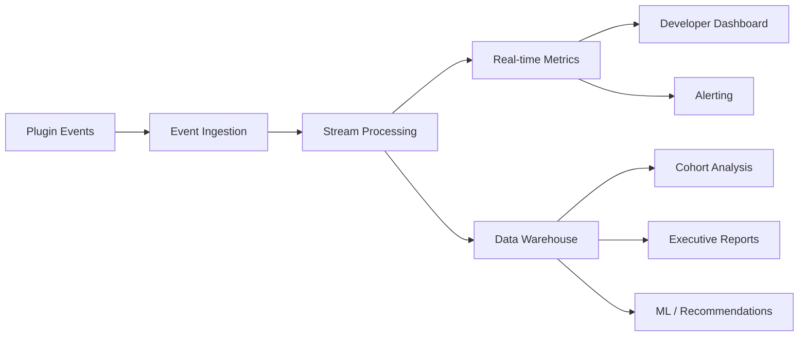

# Marketplace Analytics — {{PROJECT_NAME}}

> Defines the install tracking, usage analytics, developer dashboard metrics, marketplace health indicators, revenue analytics, cohort analysis, and executive reporting for the {{PROJECT_NAME}} marketplace ecosystem.

---

## 1. Install Tracking

### 1.1 Install Funnel

```mermaid
graph TD
    A[Marketplace Visit] --> B[Plugin Listing View]
    B --> C[Install Button Click]
    C --> D[Permission Review]
    D --> E{User Approves?}
    E -->|No| F[Abandoned]
    E -->|Yes| G{Paid Plugin?}
    G -->|Yes| H[Payment Flow]
    G -->|No| I[Installation]
    H --> J{Payment Success?}
    J -->|No| K[Payment Failed]
    J -->|Yes| I
    I --> L[Activation]
    L --> M[First Use]
    M --> N[Retained (7-day)]
    N --> O[Retained (30-day)]
```

### 1.2 Install Events

| Event | Trigger | Properties |
|---|---|---|
| `marketplace.viewed` | User opens marketplace homepage | `referrer`, `source` |
| `listing.viewed` | User opens a plugin listing page | `pluginId`, `referrer`, `searchQuery` |
| `listing.screenshot_viewed` | User clicks on a screenshot | `pluginId`, `screenshotIndex` |
| `install.started` | User clicks "Install" button | `pluginId`, `source`, `pricing` |
| `install.permissions_viewed` | Permission consent dialog shown | `pluginId`, `permissionCount` |
| `install.permissions_approved` | User approves permissions | `pluginId`, `permissions[]` |
| `install.permissions_rejected` | User rejects / cancels | `pluginId`, `permissions[]` |
| `install.payment_started` | Payment flow initiated | `pluginId`, `planId`, `amount` |
| `install.payment_completed` | Payment successful | `pluginId`, `planId`, `amount`, `method` |
| `install.payment_failed` | Payment failed | `pluginId`, `planId`, `failureReason` |
| `install.completed` | Plugin successfully installed | `pluginId`, `version`, `installDurationMs` |
| `install.failed` | Installation failed | `pluginId`, `errorCode`, `errorMessage` |
| `plugin.activated` | Plugin first activated | `pluginId`, `timeSinceInstallMs` |
| `plugin.first_use` | First meaningful interaction | `pluginId`, `action`, `timeSinceInstallMs` |
| `plugin.deactivated` | User deactivates plugin | `pluginId`, `reason`, `activeDurationDays` |
| `plugin.uninstalled` | User uninstalls plugin | `pluginId`, `reason`, `installedDurationDays` |

### 1.3 Install Attribution

| Source | Tracking Method | Attribution Window |
|---|---|---|
| Marketplace search | `?search=query` URL param | Session |
| Category browse | `?category=name` URL param | Session |
| Direct link | `?ref=source` URL param | 7 days (cookie) |
| In-app recommendation | `?rec=algorithm` URL param | Session |
| Developer marketing | `?utm_*` params | 30 days (cookie) |
| Admin recommendation | `?admin=true` flag | Session |
| Embed / widget | `?embed=partnerId` param | 7 days |

### 1.4 Install Tracking Implementation

```typescript
// src/marketplace/analytics/install-tracker.ts

interface InstallTracker {
  /** Track an install funnel event */
  trackEvent(event: InstallEvent): Promise<void>;

  /** Get install funnel metrics for a plugin */
  getFunnelMetrics(pluginId: string, dateRange: DateRange): Promise<FunnelMetrics>;

  /** Get install attribution breakdown */
  getAttribution(pluginId: string, dateRange: DateRange): Promise<AttributionBreakdown>;
}

interface FunnelMetrics {
  listingViews: number;
  installClicks: number;
  permissionApprovals: number;
  paymentAttempts: number;
  paymentSuccesses: number;
  installCompletions: number;
  activations: number;
  firstUse: number;
  retained7Day: number;
  retained30Day: number;

  conversionRates: {
    viewToClick: number;      // installClicks / listingViews
    clickToApprove: number;   // permissionApprovals / installClicks
    approveToInstall: number; // installCompletions / permissionApprovals
    installToActivate: number;// activations / installCompletions
    activateToRetain7: number;// retained7Day / activations
    retain7ToRetain30: number;// retained30Day / retained7Day
    overallConversion: number;// retained30Day / listingViews
  };
}
```

---

## 2. Usage Analytics

### 2.1 Plugin Usage Events

| Event | Description | Properties |
|---|---|---|
| `plugin.api_call` | Plugin makes an API call | `endpoint`, `method`, `statusCode`, `durationMs` |
| `plugin.ui_interaction` | User interacts with plugin UI | `extensionPoint`, `action`, `target` |
| `plugin.feature_used` | User uses a specific plugin feature | `feature`, `context` |
| `plugin.error` | Plugin encounters an error | `errorCode`, `errorMessage`, `stack` |
| `plugin.performance` | Performance measurement | `metric`, `value`, `unit` |
| `plugin.event_received` | Plugin receives a platform event | `eventType`, `processingTimeMs` |
| `plugin.storage_operation` | Plugin reads/writes storage | `operation`, `keyPrefix`, `sizeBytes` |
| `plugin.background_task` | Background task execution | `taskId`, `status`, `durationMs` |

### 2.2 Usage Metrics

| Metric | Definition | Aggregation |
|---|---|---|
| **Daily Active Users (DAU)** | Unique users who interact with the plugin in a day | Per plugin, per day |
| **Weekly Active Users (WAU)** | Unique users in a 7-day window | Per plugin, per week |
| **Monthly Active Users (MAU)** | Unique users in a 30-day window | Per plugin, per month |
| **DAU/MAU Ratio** | Stickiness metric (higher = more sticky) | Per plugin |
| **Sessions per User** | Average sessions per user per day | Per plugin, per day |
| **Session Duration** | Average time spent using the plugin per session | Per plugin |
| **Feature Adoption** | % of users who use each feature | Per feature |
| **API Call Volume** | Total API calls from the plugin | Per plugin, per hour |
| **Error Rate** | Errors / total API calls | Per plugin, per hour |
| **P95 Latency** | 95th percentile API response time | Per plugin, per hour |

### 2.3 Usage Analytics Pipeline



### 2.4 Data Retention

| Data Type | Hot Storage | Warm Storage | Cold Storage | Total Retention |
|---|---|---|---|---|
| Raw events | 7 days | 30 days | 1 year | 1 year |
| Hourly aggregates | 30 days | 1 year | 3 years | 3 years |
| Daily aggregates | 1 year | 3 years | 7 years | 7 years |
| Monthly aggregates | 3 years | 7 years | Forever | Forever |
| User-level events | 90 days (GDPR) | — | — | 90 days |

---

## 3. Developer Dashboard Metrics

### 3.1 Dashboard Overview

```
┌─────────────────────────────────────────────────────────────┐
│  Analytics — Analytics Pro                     [30 Days ▾]  │
├─────────────────────────────────────────────────────────────┤
│                                                             │
│  ┌──────────┐ ┌──────────┐ ┌──────────┐ ┌──────────┐      │
│  │ Installs │ │   MAU    │ │ Revenue  │ │  Rating  │      │
│  │  1,247   │ │  8,340   │ │ $12,450  │ │  ★ 4.7   │      │
│  │  ↑ 15%   │ │  ↑ 8%   │ │  ↑ 22%  │ │  stable  │      │
│  └──────────┘ └──────────┘ └──────────┘ └──────────┘      │
│                                                             │
│  INSTALL TREND (30 days)                                    │
│  ┌──────────────────────────────────────────────────────┐  │
│  │     ╱╲                                               │  │
│  │    ╱  ╲   ╱╲    ╱╲                                  │  │
│  │   ╱    ╲ ╱  ╲  ╱  ╲╱╲    ╱╲                        │  │
│  │  ╱      ╲    ╲╱      ╲  ╱  ╲  ╱╲   ╱╲             │  │
│  │ ╱                      ╲╱    ╲╱  ╲ ╱  ╲            │  │
│  └──────────────────────────────────────────────────────┘  │
│                                                             │
│  TOP FEATURES                    INSTALL SOURCES            │
│  Dashboard view    82%           Search          45%        │
│  Export PDF        67%           Category browse 25%        │
│  Custom themes     43%           Direct link     15%        │
│  API integration   28%           Recommendation  10%        │
│  Batch export      12%           Other            5%        │
│                                                             │
│  USER FEEDBACK (Recent Reviews)                             │
│  ★★★★★ "Amazing plugin!" — 2 hours ago                     │
│  ★★★★☆ "Great, but could use dark mode" — 1 day ago       │
│  ★★★☆☆ "Crashes on large datasets" — 3 days ago           │
│                                                             │
└─────────────────────────────────────────────────────────────┘
```

### 3.2 Developer-Facing Metrics

| Category | Metrics | Visualization |
|---|---|---|
| **Growth** | Installs, uninstalls, net installs, install velocity | Line chart (trend) |
| **Engagement** | DAU, WAU, MAU, DAU/MAU ratio, sessions/user | Line chart + KPI card |
| **Retention** | Day-1, Day-7, Day-30 retention curves | Cohort heatmap |
| **Quality** | Error rate, crash rate, P95 latency, uptime | Line chart + status badge |
| **Revenue** | MRR, ARR, ARPU, churn rate, LTV | Line chart + KPI card |
| **Reviews** | Average rating, review velocity, sentiment trend | Bar chart + feed |
| **Support** | Ticket volume, response time, resolution rate | Bar chart + KPI card |
| **Compatibility** | Platform version distribution, browser distribution | Pie chart |

### 3.3 Alerting for Developers

| Alert | Trigger | Channel |
|---|---|---|
| Error rate spike | Error rate > 5% for 10+ minutes | Email + dashboard badge |
| Install drop | Daily installs drop > 30% vs. 7-day average | Email |
| Review rating drop | Average rating drops > 0.5 in a week | Email + dashboard badge |
| High uninstall rate | Uninstall rate > 10% in a day | Email |
| API deprecation | Used API endpoint marked deprecated | Email + dashboard banner |
| Revenue anomaly | Revenue drops > 20% vs. 30-day average | Email |
| Security advisory | Dependency CVE discovered | Email (urgent) |

---

## 4. Marketplace Health Metrics

### 4.1 Ecosystem Health Dashboard (Platform Team)

| Metric | Definition | Target | Status Indicator |
|---|---|---|---|
| **Total Plugins** | Published plugins in marketplace | Growth | Trend line |
| **Active Plugins** | Plugins with installs in last 30 days | > 80% of total | Gauge |
| **Total Developers** | Registered developer accounts | Growth | Trend line |
| **Active Developers** | Developers with activity in last 30 days | > 50% of total | Gauge |
| **Total Installs** | Cumulative plugin installations | Growth | Counter |
| **Avg Plugins per Org** | Average plugins installed per organization | > 3 | KPI |
| **Marketplace NPS** | Net Promoter Score for marketplace | > 40 | Gauge |
| **Review Queue Depth** | Submissions awaiting review | < 20 | Counter + SLA |
| **Review SLA Compliance** | % reviewed within {{PLUGIN_REVIEW_SLA_DAYS}} days | > 95% | Gauge |
| **Plugin Quality Score** | Average quality score across all plugins | > 4.0 | Gauge |
| **Ecosystem Diversity** | Categories with 5+ plugins | > 80% of categories | Gauge |
| **Developer Satisfaction** | Developer NPS | > 50 | Quarterly survey |

### 4.2 Plugin Health Score

Each plugin gets a composite health score based on multiple signals:

| Signal | Weight | Scoring |
|---|---|---|
| **Uptime** | 20% | 99.9% = 100, 99% = 80, 95% = 50, <95% = 0 |
| **Error Rate** | 20% | <0.1% = 100, <1% = 80, <5% = 50, >5% = 0 |
| **User Rating** | 15% | 5.0 = 100, 4.0 = 80, 3.0 = 50, <3.0 = 0 |
| **Maintenance** | 15% | Updated <30d = 100, <90d = 80, <180d = 50, >180d = 0 |
| **Performance** | 10% | P95 <200ms = 100, <500ms = 80, <1s = 50, >1s = 0 |
| **Support** | 10% | Response <24h = 100, <48h = 80, <7d = 50, >7d = 0 |
| **Security** | 10% | No CVEs = 100, Low CVEs = 80, Medium = 50, High = 0 |

**Health score thresholds:**
- 90–100: Healthy (green badge)
- 70–89: Good (no badge)
- 50–69: Warning (yellow badge, developer notified)
- Below 50: Critical (red badge, review triggered)

---

## 5. Revenue Analytics

### 5.1 Revenue Metrics

| Metric | Definition | Aggregation |
|---|---|---|
| **Gross Revenue** | Total payments collected | Daily, monthly, yearly |
| **Net Revenue** | Gross minus refunds and chargebacks | Daily, monthly, yearly |
| **Platform Revenue** | Platform's share after developer payouts | Daily, monthly, yearly |
| **MRR** | Monthly Recurring Revenue from subscriptions | Monthly |
| **ARR** | Annual Recurring Revenue (MRR × 12) | Monthly |
| **ARPU** | Average Revenue Per User (org) | Monthly |
| **ARPPU** | Average Revenue Per Paying User (org) | Monthly |
| **LTV** | Lifetime Value per plugin per org | Cohort-based |
| **CAC** | Customer Acquisition Cost (marketplace spend / installs) | Monthly |
| **LTV:CAC Ratio** | Return on acquisition spend | Monthly |
| **Revenue Churn** | Lost MRR from downgrades and cancellations | Monthly |
| **Net Revenue Retention** | (Starting MRR + expansion - contraction - churn) / Starting MRR | Monthly |
| **Gross Margin** | (Revenue - COGS) / Revenue | Monthly |

### 5.2 Revenue Dashboard

```
┌─────────────────────────────────────────────────────────────┐
│  Revenue Analytics (Platform)                  [Quarter ▾]  │
├─────────────────────────────────────────────────────────────┤
│                                                             │
│  ┌──────────┐ ┌──────────┐ ┌──────────┐ ┌──────────┐      │
│  │   MRR    │ │   ARR    │ │ Platform │ │  NRR     │      │
│  │ $245K   │ │ $2.94M  │ │  $49K    │ │  112%    │      │
│  │  ↑ 8%   │ │  ↑ 8%   │ │  ↑ 12%  │ │  stable  │      │
│  └──────────┘ └──────────┘ └──────────┘ └──────────┘      │
│                                                             │
│  MRR TREND                                                  │
│  ┌──────────────────────────────────────────────────────┐  │
│  │                                            ╱╱        │  │
│  │                                      ╱╱╱╱╱╱          │  │
│  │                              ╱╱╱╱╱╱╱╱                │  │
│  │                      ╱╱╱╱╱╱╱                         │  │
│  │            ╱╱╱╱╱╱╱╱╱╱                                │  │
│  │  ╱╱╱╱╱╱╱╱╱                                          │  │
│  └──────────────────────────────────────────────────────┘  │
│  Jan  Feb  Mar  Apr  May  Jun  Jul  Aug  Sep  Oct  Nov Dec │
│                                                             │
│  TOP REVENUE PLUGINS           REVENUE BY CATEGORY          │
│  1. Analytics Pro    $32K/mo   Productivity    42%          │
│  2. Workflow Plus    $28K/mo   Analytics       28%          │
│  3. Design System   $22K/mo   Integrations    18%          │
│  4. CRM Connector   $18K/mo   Design           8%          │
│  5. Security Audit   $15K/mo  Other            4%          │
│                                                             │
└─────────────────────────────────────────────────────────────┘
```

---

## 6. Cohort Analysis

### 6.1 Retention Cohorts

Track how groups of users who installed in the same period continue using the plugin over time.

```
Install Cohort Retention (% still active)

              Week 1  Week 2  Week 3  Week 4  Week 8  Week 12
Jan Week 1    100%    72%     61%     55%     43%     38%
Jan Week 2    100%    68%     58%     52%     40%     —
Jan Week 3    100%    74%     64%     57%     —       —
Jan Week 4    100%    70%     60%     —       —       —
Feb Week 1    100%    75%     65%     58%     —       —
Feb Week 2    100%    71%     —       —       —       —
```

### 6.2 Cohort Dimensions

| Dimension | Segments | Purpose |
|---|---|---|
| **Install date** | Weekly, monthly | Standard retention analysis |
| **Acquisition source** | Search, browse, referral, recommendation | Channel effectiveness |
| **Organization size** | Small, medium, large, enterprise | Segment-specific retention |
| **Plugin plan** | Free, paid, trial-converted | Monetization impact |
| **Platform plan** | Free, pro, enterprise | Platform tier correlation |
| **Industry** | Tech, finance, healthcare, etc. | Industry-specific patterns |
| **Geography** | Country, region | Regional differences |

### 6.3 Cohort Analysis Implementation

```typescript
// src/marketplace/analytics/cohort.ts

interface CohortAnalysisConfig {
  /** Cohort grouping dimension */
  dimension: 'install_date' | 'source' | 'org_size' | 'plan' | 'industry';

  /** Time granularity for retention windows */
  granularity: 'day' | 'week' | 'month';

  /** Number of retention periods to track */
  periods: number;

  /** Date range for cohort formation */
  dateRange: DateRange;

  /** Plugin filter (null = all plugins) */
  pluginId?: string;
}

interface CohortResult {
  cohorts: Cohort[];
  summary: {
    averageRetention: Record<number, number>; // period -> avg retention %
    bestCohort: { label: string; retention30Day: number };
    worstCohort: { label: string; retention30Day: number };
    overallTrend: 'improving' | 'stable' | 'declining';
  };
}

interface Cohort {
  label: string;       // e.g., "Jan 2024 Week 1"
  size: number;        // users in this cohort
  retention: number[]; // retention % for each period
}
```

---

## 7. Executive Reporting

### 7.1 Weekly Marketplace Report

| Section | Metrics | Audience |
|---|---|---|
| **Summary** | Total plugins, installs this week, revenue, NPS | C-suite |
| **Growth** | New plugins, new developers, install growth rate | Product leadership |
| **Quality** | Avg rating, review queue SLA, incidents | Engineering leadership |
| **Revenue** | MRR change, top earners, platform revenue | Finance |
| **Ecosystem Health** | Health score distribution, at-risk plugins | Platform team |
| **Action Items** | Issues requiring attention, strategic decisions | All stakeholders |

### 7.2 Monthly Ecosystem Report

```markdown
# {{PROJECT_NAME}} Marketplace — Monthly Report — March 2024

## Executive Summary
- **Total Plugins:** 342 (+18 this month)
- **Total Developers:** 215 (+12 this month)
- **Total Installs (cumulative):** 1.2M
- **Monthly Active Installs:** 485K
- **Marketplace MRR:** $245K (+8%)
- **Platform Revenue:** $49K (+12%)
- **Avg Plugin Rating:** 4.3 / 5.0
- **Developer NPS:** 52

## Key Wins
1. Analytics Pro crossed $30K MRR — largest single plugin revenue
2. Developer signup velocity up 25% after portal redesign
3. Review SLA compliance at 97% (target: 95%)

## Areas of Concern
1. Plugin quality in "Integrations" category declining (avg 3.8 stars)
2. Uninstall rate for free plugins increasing (22% → 28%)
3. Two SEV-2 security incidents this month

## Strategic Initiatives
1. Launch SDK v2 with improved UI extension model (ETA: Q2)
2. Expand to 3 new categories: AI/ML, Security, Analytics
3. Developer hackathon planned for April — targeting 50 new plugins
```

### 7.3 Report Generation

```typescript
// src/marketplace/analytics/reporting.ts

interface ReportConfig {
  type: 'weekly' | 'monthly' | 'quarterly' | 'annual';
  dateRange: DateRange;
  sections: ReportSection[];
  format: 'markdown' | 'pdf' | 'html' | 'slides';
  recipients: string[];
  schedule?: string; // cron expression for automated delivery
}

interface ReportSection {
  id: string;
  title: string;
  metrics: string[]; // metric IDs
  visualization: 'table' | 'chart' | 'kpi-cards' | 'text';
  comparison: 'previous-period' | 'year-over-year' | 'target' | null;
}
```

---

## Marketplace Analytics Checklist

- [ ] Install funnel tracked end-to-end (view → click → approve → install → activate → retain)
- [ ] Install attribution tracks source (search, browse, referral, recommendation)
- [ ] Usage analytics capture DAU/WAU/MAU, feature adoption, session duration
- [ ] Developer dashboard shows growth, engagement, retention, quality, revenue metrics
- [ ] Alerting configured for error spikes, install drops, rating drops, revenue anomalies
- [ ] Plugin health score calculated from uptime, error rate, rating, maintenance, performance
- [ ] Revenue analytics track MRR, ARR, ARPU, LTV, churn, NRR
- [ ] Cohort analysis available by install date, source, org size, plan, industry
- [ ] Weekly marketplace report automated and distributed to stakeholders
- [ ] Monthly ecosystem report with executive summary, wins, concerns, initiatives
- [ ] Data retention policy compliant with GDPR (user-level events: 90 days max)
- [ ] Analytics pipeline handles real-time metrics and batch aggregation
- [ ] A/B testing infrastructure available for marketplace UX experiments
