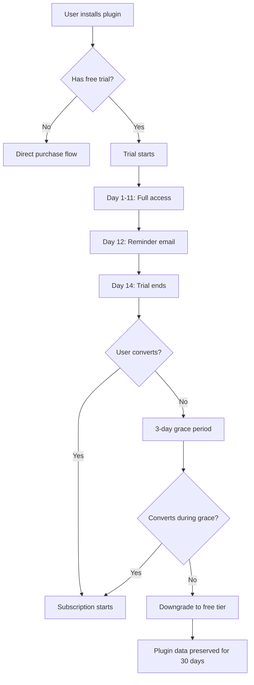

# Marketplace Monetization — {{PROJECT_NAME}}

> Defines the pricing models, revenue share structure, payment integration via Stripe Connect, refund policies, trial management, promoted placement, and developer payout mechanics for the {{PROJECT_NAME}} marketplace.

---

<!-- IF {{MARKETPLACE_MONETIZATION}} == "free" -->
**Note:** This project uses a free marketplace model. Most sections below are informational for future reference. Skip to the checklist at the bottom for free marketplace requirements.
<!-- ENDIF -->

## 1. Pricing Models

### 1.1 Supported Pricing Models

| Model | Description | Best For | Platform Complexity |
|---|---|---|---|
| **Free** | No charge. Developer builds for ecosystem growth or lead generation. | Open-source tools, basic integrations, developer tools | Low |
| **One-Time Purchase** | Single payment for lifetime access to current major version. | Simple utilities, themes, templates | Medium |
| **Subscription (Monthly)** | Recurring monthly charge. Access revoked on cancellation. | SaaS-style plugins with ongoing value | High |
| **Subscription (Annual)** | Recurring annual charge, typically 15–20% discount vs. monthly. | Enterprise plugins, budget-conscious buyers | High |
| **Per-Seat** | Price scales with number of users in the organization. | Team collaboration plugins | High |
| **Usage-Based** | Metered billing based on consumption (API calls, data processed). | AI/ML plugins, data processing, infrastructure | Very High |
| **Freemium** | Free tier with paid upgrades. Core features free, premium locked. | Maximum adoption with monetization path | High |
| **Pay-What-You-Want** | User chooses price above optional minimum. | Community/indie plugins, donations | Medium |

### 1.2 Pricing Configuration in Manifest

```json
{
  "pricing": {
    "model": "freemium",
    "currency": "USD",
    "plans": [
      {
        "id": "free",
        "name": "Free",
        "price": 0,
        "limits": {
          "dashboards": 3,
          "dataPoints": 1000,
          "exportFormats": ["csv"]
        },
        "features": [
          "Basic analytics dashboard",
          "CSV export",
          "7-day data retention"
        ]
      },
      {
        "id": "pro",
        "name": "Pro",
        "price": {
          "monthly": 9.99,
          "annual": 99.99
        },
        "limits": {
          "dashboards": -1,
          "dataPoints": 100000,
          "exportFormats": ["csv", "xlsx", "pdf", "json"]
        },
        "features": [
          "Unlimited dashboards",
          "All export formats",
          "90-day data retention",
          "Custom themes",
          "Priority support"
        ],
        "trialDays": 14
      },
      {
        "id": "enterprise",
        "name": "Enterprise",
        "price": "contact-sales",
        "limits": {
          "dashboards": -1,
          "dataPoints": -1,
          "exportFormats": ["csv", "xlsx", "pdf", "json", "api"]
        },
        "features": [
          "Everything in Pro",
          "Unlimited data retention",
          "SSO integration",
          "Dedicated support",
          "Custom SLA",
          "Audit logs"
        ]
      }
    ]
  }
}
```

### 1.3 License Enforcement

```typescript
// src/marketplace/license.ts

interface LicenseCheckResult {
  valid: boolean;
  plan: string;
  features: string[];
  limits: Record<string, number>;
  expiresAt: string | null;
  trialActive: boolean;
  trialEndsAt: string | null;
}

/**
 * Check the current organization's license for this plugin.
 * Called at plugin activation and periodically during use.
 */
async function checkLicense(pluginId: string, orgId: string): Promise<LicenseCheckResult> {
  const license = await fetchLicense(pluginId, orgId);

  if (!license) {
    return {
      valid: true,
      plan: 'free',
      features: getFreeFeatures(pluginId),
      limits: getFreeLimits(pluginId),
      expiresAt: null,
      trialActive: false,
      trialEndsAt: null,
    };
  }

  // Check expiration
  if (license.expiresAt && new Date(license.expiresAt) < new Date()) {
    return {
      valid: false,
      plan: license.plan,
      features: [],
      limits: {},
      expiresAt: license.expiresAt,
      trialActive: false,
      trialEndsAt: null,
    };
  }

  return {
    valid: true,
    plan: license.plan,
    features: license.features,
    limits: license.limits,
    expiresAt: license.expiresAt,
    trialActive: license.trialActive,
    trialEndsAt: license.trialEndsAt,
  };
}
```

---

## 2. Revenue Share

### 2.1 Revenue Split

| Party | Percentage | Rationale |
|---|---|---|
| **Developer** | {{100 - PLATFORM_REVENUE_CUT}}% | Primary incentive for ecosystem development |
| **Platform** | {{PLATFORM_REVENUE_CUT}}% | Infrastructure, distribution, review, support |

### 2.2 Revenue Share Tiers

Progressive revenue share that rewards high-performing developers:

| Annual Revenue Bracket | Platform Cut | Developer Cut | Precedent |
|---|---|---|---|
| $0 – $10,000 | {{PLATFORM_REVENUE_CUT}}% | {{100 - PLATFORM_REVENUE_CUT}}% | Standard rate |
| $10,001 – $100,000 | {{PLATFORM_REVENUE_CUT - 5}}% | {{105 - PLATFORM_REVENUE_CUT}}% | Reduced rate |
| $100,001 – $1,000,000 | {{PLATFORM_REVENUE_CUT - 10}}% | {{110 - PLATFORM_REVENUE_CUT}}% | Top developer rate |
| $1,000,001+ | {{PLATFORM_REVENUE_CUT - 15}}% | {{115 - PLATFORM_REVENUE_CUT}}% | Enterprise partner rate |

### 2.3 Revenue Share Calculation

```typescript
// src/marketplace/revenue.ts

interface RevenueCalculation {
  grossRevenue: number;       // Total charged to customer
  paymentProcessingFee: number; // Stripe fee (2.9% + $0.30)
  netRevenue: number;         // After payment processing
  platformCut: number;        // Platform's share
  developerPayout: number;    // Developer's share
  taxWithholding: number;     // Tax withholding (if applicable)
  finalPayout: number;        // Amount sent to developer
}

function calculateRevenue(
  grossRevenue: number,
  annualTotalRevenue: number,
): RevenueCalculation {
  // Payment processing fee (Stripe)
  const processingFee = grossRevenue * 0.029 + 0.30;
  const netRevenue = grossRevenue - processingFee;

  // Determine tier-based platform cut
  const platformCutPercent = getTierRate(annualTotalRevenue);
  const platformCut = netRevenue * (platformCutPercent / 100);
  const developerPayout = netRevenue - platformCut;

  return {
    grossRevenue,
    paymentProcessingFee: processingFee,
    netRevenue,
    platformCut,
    developerPayout,
    taxWithholding: 0, // calculated separately based on W-8/W-9
    finalPayout: developerPayout,
  };
}
```

---

## 3. Payment Integration (Stripe Connect)

### 3.1 Stripe Connect Architecture

```mermaid
graph LR
    A[Customer] -->|Pays| B[{{PROJECT_NAME}} Stripe Account]
    B -->|Platform fee| C[Platform Revenue]
    B -->|Developer share| D[Developer Stripe Connect Account]
    D -->|Payout| E[Developer Bank Account]
```

### 3.2 Developer Onboarding to Stripe Connect

```typescript
// src/marketplace/payments/stripe-connect.ts

import Stripe from 'stripe';

const stripe = new Stripe(process.env.STRIPE_SECRET_KEY!);

/**
 * Create a Stripe Connect account for a developer.
 * Called when developer first sets up monetization.
 */
async function createConnectAccount(developer: {
  id: string;
  email: string;
  country: string;
  businessType: 'individual' | 'company';
}): Promise<{ accountId: string; onboardingUrl: string }> {
  // Create Connected Account
  const account = await stripe.accounts.create({
    type: 'express', // Express for simplified onboarding
    email: developer.email,
    country: developer.country,
    business_type: developer.businessType,
    capabilities: {
      transfers: { requested: true },
    },
    metadata: {
      developerId: developer.id,
      platform: '{{PROJECT_NAME}}',
    },
  });

  // Generate onboarding link
  const accountLink = await stripe.accountLinks.create({
    account: account.id,
    refresh_url: `{{DEVELOPER_PORTAL_URL}}/payments/onboarding/refresh`,
    return_url: `{{DEVELOPER_PORTAL_URL}}/payments/onboarding/complete`,
    type: 'account_onboarding',
  });

  return {
    accountId: account.id,
    onboardingUrl: accountLink.url,
  };
}
```

### 3.3 Payment Processing

```typescript
// src/marketplace/payments/checkout.ts

/**
 * Create a checkout session for a paid plugin.
 * Handles one-time purchases and subscriptions.
 */
async function createCheckoutSession(params: {
  pluginId: string;
  planId: string;
  customerId: string;
  developerStripeAccountId: string;
}): Promise<{ checkoutUrl: string }> {
  const plugin = await getPlugin(params.pluginId);
  const plan = plugin.pricing.plans.find(p => p.id === params.planId);

  if (!plan || plan.price === 0) {
    throw new Error('Cannot create checkout for free plan');
  }

  const platformFeePercent = getPlatformFeePercent(params.developerStripeAccountId);

  if (typeof plan.price === 'object' && plan.price.monthly) {
    // Subscription checkout
    const session = await stripe.checkout.sessions.create({
      mode: 'subscription',
      customer: params.customerId,
      line_items: [{
        price_data: {
          currency: 'usd',
          product_data: {
            name: `${plugin.name} — ${plan.name}`,
            description: plan.features.join(', '),
          },
          unit_amount: Math.round(plan.price.monthly * 100),
          recurring: { interval: 'month' },
        },
        quantity: 1,
      }],
      subscription_data: {
        application_fee_percent: platformFeePercent,
        transfer_data: {
          destination: params.developerStripeAccountId,
        },
        trial_period_days: plan.trialDays ?? undefined,
      },
      success_url: `{{DEVELOPER_PORTAL_URL}}/install/${params.pluginId}/success`,
      cancel_url: `{{DEVELOPER_PORTAL_URL}}/install/${params.pluginId}/cancel`,
    });

    return { checkoutUrl: session.url! };
  }

  // One-time purchase checkout
  const session = await stripe.checkout.sessions.create({
    mode: 'payment',
    customer: params.customerId,
    line_items: [{
      price_data: {
        currency: 'usd',
        product_data: {
          name: `${plugin.name} — ${plan.name}`,
          description: plan.features.join(', '),
        },
        unit_amount: Math.round((plan.price as number) * 100),
      },
      quantity: 1,
    }],
    payment_intent_data: {
      application_fee_amount: Math.round((plan.price as number) * 100 * platformFeePercent / 100),
      transfer_data: {
        destination: params.developerStripeAccountId,
      },
    },
    success_url: `{{DEVELOPER_PORTAL_URL}}/install/${params.pluginId}/success`,
    cancel_url: `{{DEVELOPER_PORTAL_URL}}/install/${params.pluginId}/cancel`,
  });

  return { checkoutUrl: session.url! };
}
```

### 3.4 Webhook Handling

```typescript
// src/marketplace/payments/webhooks.ts

/**
 * Handle Stripe webhooks for payment lifecycle events.
 */
async function handleStripeWebhook(event: Stripe.Event): Promise<void> {
  switch (event.type) {
    case 'checkout.session.completed':
      await handleCheckoutComplete(event.data.object as Stripe.Checkout.Session);
      break;

    case 'customer.subscription.updated':
      await handleSubscriptionUpdate(event.data.object as Stripe.Subscription);
      break;

    case 'customer.subscription.deleted':
      await handleSubscriptionCancelled(event.data.object as Stripe.Subscription);
      break;

    case 'invoice.payment_failed':
      await handlePaymentFailed(event.data.object as Stripe.Invoice);
      break;

    case 'charge.refunded':
      await handleRefund(event.data.object as Stripe.Charge);
      break;

    case 'account.updated':
      await handleConnectAccountUpdate(event.data.object as Stripe.Account);
      break;

    case 'transfer.created':
      await handleTransferCreated(event.data.object as Stripe.Transfer);
      break;

    default:
      console.log(`Unhandled Stripe event type: ${event.type}`);
  }
}
```

---

## 4. Refunds

### 4.1 Refund Policy

| Scenario | Refund Type | Window | Process |
|---|---|---|---|
| Plugin does not work as described | Full refund | 30 days from purchase | User-initiated, auto-approved |
| Plugin removed from marketplace | Full refund | Automatic | Platform-initiated |
| Accidental purchase | Full refund | 48 hours | User-initiated, auto-approved |
| Partial period (subscription cancellation) | Pro-rata credit | End of billing period | Automatic |
| Dispute/chargeback | Handled by Stripe | — | Stripe dispute flow |
| Developer fraud | Full refund to all customers | — | Platform-initiated |

### 4.2 Refund Processing

```typescript
// src/marketplace/payments/refunds.ts

interface RefundRequest {
  purchaseId: string;
  reason: 'not-as-described' | 'accidental' | 'plugin-removed' | 'other';
  description?: string;
}

async function processRefund(request: RefundRequest): Promise<RefundResult> {
  const purchase = await getPurchase(request.purchaseId);

  // Check refund eligibility
  const eligibility = checkRefundEligibility(purchase, request.reason);
  if (!eligibility.eligible) {
    return { success: false, reason: eligibility.reason };
  }

  // Process refund through Stripe
  const refund = await stripe.refunds.create({
    payment_intent: purchase.stripePaymentIntentId,
    reason: mapReasonToStripe(request.reason),
    reverse_transfer: true, // Reverse the developer transfer
    refund_application_fee: true, // Refund the platform fee
  });

  // Revoke plugin access
  await revokePluginAccess(purchase.orgId, purchase.pluginId);

  // Update purchase record
  await updatePurchaseStatus(purchase.id, 'refunded', {
    refundId: refund.id,
    refundAmount: refund.amount,
    refundedAt: new Date().toISOString(),
  });

  // Notify developer
  await notifyDeveloper(purchase.pluginId, 'refund', {
    amount: refund.amount / 100,
    reason: request.reason,
  });

  return { success: true, refundId: refund.id };
}
```

### 4.3 Refund Impact on Developer

| Metric | Impact |
|---|---|
| Revenue | Refunded amount deducted from next payout |
| Refund rate displayed | Yes — shown on developer dashboard |
| High refund rate penalty | Warning at 5%, review at 10%, suspension at 15% |
| Chargebacks | Developer responsible for chargeback fees ($15 per dispute) |

---

## 5. Trials

### 5.1 Trial Configuration

| Setting | Default | Configurable By |
|---|---|---|
| Trial duration | 14 days | Developer (7–30 days) |
| Credit card required | No | Developer choice |
| Feature restrictions during trial | None (full access) | Developer choice |
| Trial extension | 1x, 7 days | Platform support |
| Trial-to-paid conversion notification | 3 days before expiry | Automatic |
| Grace period after trial | 3 days (read-only access) | Platform policy |

### 5.2 Trial Lifecycle



### 5.3 Trial Metrics

| Metric | Target | Description |
|---|---|---|
| Trial start rate | > 30% of listing views | How many visitors start a trial |
| Trial activation rate | > 70% of trial starts | How many trial users actually use the plugin |
| Trial-to-paid conversion | > 15% | How many trials convert to paid |
| Time to first value | < 1 day | How quickly trial users get value |
| Trial churn reasons | Tracked | Why users do not convert |

---

## 6. Promoted Placement

### 6.1 Promotion Types

| Placement | Location | Pricing Model | Visibility |
|---|---|---|---|
| **Featured Banner** | Homepage hero section | Flat fee / week | Maximum — seen by all visitors |
| **Category Spotlight** | Top of category page | CPC (cost per click) | Category browsers |
| **Search Boost** | Higher ranking in search results | CPC | Active searchers |
| **Recommended** | "Recommended for you" section | CPC | Personalized |
| **New & Noteworthy** | Editorial curated section | Free (editorial) | Homepage visitors |
| **Collection Feature** | Included in themed collection | Free (editorial) | Collection browsers |

### 6.2 Promotion Eligibility

| Requirement | Threshold |
|---|---|
| Minimum rating | >= 4.0 stars |
| Minimum reviews | >= 10 reviews |
| No policy violations | Clean record in last 12 months |
| Verified developer | Identity verified |
| Active maintenance | Updated within last 90 days |
| Refund rate | < 5% |

### 6.3 Promotion Pricing

| Placement | Pricing | Minimum Spend | Billing |
|---|---|---|---|
| Featured Banner | $500–$2,000 / week | $500 | Prepaid |
| Category Spotlight | $0.50–$2.00 CPC | $50 / day | Post-paid |
| Search Boost | $0.25–$1.50 CPC | $25 / day | Post-paid |
| Recommended | $0.10–$0.50 CPC | $10 / day | Post-paid |

---

## 7. Developer Payouts

### 7.1 Payout Schedule

| Payout Frequency | Threshold | Processing Time | Method |
|---|---|---|---|
| **Monthly** (default) | $50 minimum balance | 5 business days | Stripe Connect (bank transfer) |
| **Weekly** (opt-in) | $100 minimum balance | 3 business days | Stripe Connect (bank transfer) |
| **On-demand** (enterprise) | $500 minimum | 2 business days | Wire transfer |

### 7.2 Payout Statement

```
┌─────────────────────────────────────────────────────────────┐
│  Payout Statement — March 2024                              │
│  Developer: Acme Tools (acme-tools)                         │
├─────────────────────────────────────────────────────────────┤
│                                                             │
│  REVENUE SUMMARY                                            │
│  ┌──────────────────────────────────────────────────────┐  │
│  │ Gross Revenue              │  $4,250.00              │  │
│  │ Stripe Processing Fees     │  -$127.55               │  │
│  │ Net Revenue                │  $4,122.45              │  │
│  │ Platform Fee (20%)         │  -$824.49               │  │
│  │ Refunds                    │  -$29.97                │  │
│  │ Chargeback Fees            │  $0.00                  │  │
│  │ Tax Withholding            │  $0.00                  │  │
│  │                            │                         │  │
│  │ DEVELOPER PAYOUT           │  $3,267.99              │  │
│  └──────────────────────────────────────────────────────┘  │
│                                                             │
│  BY PLUGIN                                                  │
│  ┌──────────────────────────────────────────────────────┐  │
│  │ Analytics Pro     │ 312 sales │ $3,120.00  │ 73.4%   │  │
│  │ Dashboard Widget  │ 113 sales │ $1,130.00  │ 26.6%   │  │
│  └──────────────────────────────────────────────────────┘  │
│                                                             │
│  PAYOUT DETAILS                                             │
│  Method: Bank Transfer (****4832)                           │
│  Scheduled: April 5, 2024                                   │
│  Currency: USD                                              │
│                                                             │
│  [Download CSV]  [Download PDF]  [View Tax Documents]       │
└─────────────────────────────────────────────────────────────┘
```

### 7.3 Tax Compliance

| Requirement | When | Documentation |
|---|---|---|
| W-9 (US developers) | Before first payout | Collected via Stripe Connect |
| W-8BEN (non-US individuals) | Before first payout | Collected via Stripe Connect |
| W-8BEN-E (non-US entities) | Before first payout | Collected via Stripe Connect |
| 1099-K (US, > $600/year) | January, annually | Generated by Stripe |
| VAT/GST collection | At purchase (EU, AU, etc.) | Handled by Stripe Tax |
| Sales tax collection | At purchase (US states) | Handled by Stripe Tax |

---

## Marketplace Monetization Checklist

- [ ] Pricing models defined and configurable per plugin
- [ ] Revenue share tiers documented with progressive rates
- [ ] Stripe Connect integration implemented for developer payouts
- [ ] Checkout flow handles one-time, subscription, and freemium models
- [ ] Stripe webhook handler covers all payment lifecycle events
- [ ] Refund policy documented with eligibility windows and auto-approval rules
- [ ] Trial management supports configurable durations with conversion tracking
- [ ] Promoted placement options defined with eligibility criteria
- [ ] Developer payout schedule and threshold configured
- [ ] Payout statements generated with per-plugin revenue breakdown
- [ ] Tax compliance implemented (W-9, W-8BEN, 1099-K, VAT/GST)
- [ ] License enforcement checks plan validity at activation and periodically
- [ ] High refund rate monitoring with warning/suspension thresholds
- [ ] Revenue analytics dashboard available for developers and platform admins
