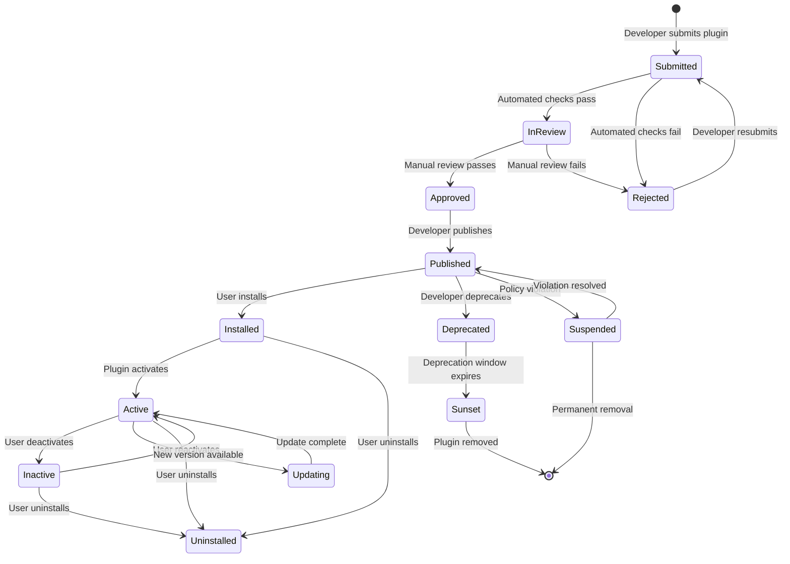
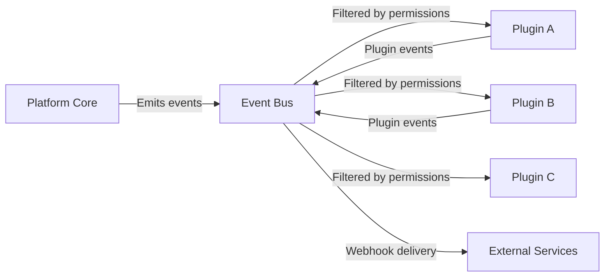

# Plugin Architecture — {{PROJECT_NAME}}

> Defines the extension point system, plugin API surface, manifest schema, lifecycle management, state isolation, event system, UI extension patterns, and background processing model for the {{PROJECT_NAME}} plugin ecosystem.

---

## 1. Extension Points

Extension points are the seams in your application where third-party code can hook in. Each extension point must be explicitly designed, documented, and versioned.

### 1.1 Extension Point Registry

| ID | Name | Type | Description | API Version | Stability |
|---|---|---|---|---|---|
| `ext-001` | `ui.panel` | UI Surface | Render a panel in the main workspace | `{{PLUGIN_API_VERSION}}` | Stable |
| `ext-002` | `ui.toolbar-action` | UI Action | Add a button to the toolbar | `{{PLUGIN_API_VERSION}}` | Stable |
| `ext-003` | `ui.settings-page` | UI Surface | Add a settings page under plugin preferences | `{{PLUGIN_API_VERSION}}` | Stable |
| `ext-004` | `ui.context-menu` | UI Action | Add items to right-click context menus | `{{PLUGIN_API_VERSION}}` | Stable |
| `ext-005` | `data.transformer` | Data Pipeline | Transform data before it enters a workflow | `{{PLUGIN_API_VERSION}}` | Beta |
| `ext-006` | `data.export-format` | Data Pipeline | Register a new export format | `{{PLUGIN_API_VERSION}}` | Stable |
| `ext-007` | `event.webhook` | Event Handler | Subscribe to platform events via webhook | `{{PLUGIN_API_VERSION}}` | Stable |
| `ext-008` | `event.realtime` | Event Handler | Subscribe to real-time event streams | `{{PLUGIN_API_VERSION}}` | Beta |
| `ext-009` | `auth.provider` | Auth | Register an external auth provider | `{{PLUGIN_API_VERSION}}` | Stable |
| `ext-010` | `workflow.action` | Workflow | Add a custom action to workflow builder | `{{PLUGIN_API_VERSION}}` | Beta |
| <!-- Add extension points as needed --> | | | | | |

**Total extension points:** `{{EXTENSION_POINT_COUNT}}`

### 1.2 Extension Point Design Principles

1. **Explicit over implicit** — Every hook point is declared, not discovered via monkey-patching
2. **Versioned independently** — Extension points can evolve at different rates
3. **Fail-safe defaults** — If a plugin fails at an extension point, the host continues without it
4. **Permission-gated** — Each extension point requires a declared permission in the manifest
5. **Observable** — Every extension point call is instrumented with timing and error metrics

### 1.3 Extension Point Interface

```typescript
// src/marketplace/extension-point.ts

interface ExtensionPoint<TInput, TOutput> {
  /** Unique identifier for this extension point */
  id: string;

  /** Human-readable name */
  name: string;

  /** Semantic version of this extension point */
  version: string;

  /** Stability level */
  stability: 'stable' | 'beta' | 'experimental' | 'deprecated';

  /** Permission required to use this extension point */
  requiredPermission: string;

  /** Input schema (JSON Schema) for validation */
  inputSchema: JSONSchema;

  /** Output schema (JSON Schema) for validation */
  outputSchema: JSONSchema;

  /** Timeout for plugin execution at this extension point */
  timeoutMs: number;

  /** Maximum number of plugins that can hook into this point */
  maxHooks: number;

  /** Execution order when multiple plugins hook the same point */
  executionOrder: 'parallel' | 'sequential' | 'priority';
}
```

---

## 2. Plugin API

### 2.1 API Surface

The Plugin API is the set of platform capabilities exposed to plugins. It is a strict subset of the internal platform API, designed for stability and security.

```typescript
// src/marketplace/plugin-api.ts

interface PluginAPI {
  /** Current API version */
  readonly version: string; // {{PLUGIN_API_VERSION}}

  /** Plugin identity and metadata */
  readonly plugin: {
    id: string;
    version: string;
    manifest: PluginManifest;
  };

  /** UI APIs — render surfaces, show modals, add menu items */
  ui: {
    registerPanel(config: PanelConfig): void;
    registerToolbarAction(config: ToolbarActionConfig): void;
    registerSettingsPage(config: SettingsPageConfig): void;
    registerContextMenuItem(config: ContextMenuConfig): void;
    showModal(config: ModalConfig): Promise<ModalResult>;
    showNotification(config: NotificationConfig): void;
    getTheme(): ThemeConfig;
  };

  /** Data APIs — read/write platform data within permission scope */
  data: {
    query<T>(collection: string, query: QueryParams): Promise<PaginatedResult<T>>;
    get<T>(collection: string, id: string): Promise<T | null>;
    create<T>(collection: string, data: Partial<T>): Promise<T>;
    update<T>(collection: string, id: string, data: Partial<T>): Promise<T>;
    delete(collection: string, id: string): Promise<void>;
  };

  /** Storage APIs — plugin-scoped key-value storage */
  storage: {
    get<T>(key: string): Promise<T | null>;
    set<T>(key: string, value: T): Promise<void>;
    delete(key: string): Promise<void>;
    list(prefix?: string): Promise<string[]>;
  };

  /** Event APIs — subscribe to and emit events */
  events: {
    on(event: string, handler: EventHandler): Unsubscribe;
    emit(event: string, payload: unknown): Promise<void>;
  };

  /** HTTP APIs — make authenticated requests to external services */
  http: {
    fetch(url: string, options?: FetchOptions): Promise<Response>;
  };

  /** Auth APIs — access current user context */
  auth: {
    getCurrentUser(): Promise<UserContext>;
    getPermissions(): Promise<string[]>;
    getOAuthToken(provider: string): Promise<string>;
  };

  /** Analytics APIs — track plugin usage */
  analytics: {
    track(event: string, properties?: Record<string, unknown>): void;
  };
}
```

### 2.2 API Versioning Strategy

<!-- IF {{PLUGIN_API_VERSION}} == "v1" -->
The plugin API uses major version prefixes (`v1`, `v2`). Breaking changes require a new major version with a 12-month deprecation window.
<!-- ENDIF -->

<!-- IF {{PLUGIN_API_VERSION}} == "2024-01" -->
The plugin API uses date-based versions (`2024-01`, `2024-06`). Each version is immutable. Plugins pin to a version and opt into upgrades.
<!-- ENDIF -->

```typescript
// src/marketplace/api-version.ts

interface APIVersionPolicy {
  /** Current stable version */
  current: string; // {{PLUGIN_API_VERSION}}

  /** Supported versions (still receiving security patches) */
  supported: string[];

  /** Deprecated versions (working but sunset scheduled) */
  deprecated: string[];

  /** Sunset versions (no longer functional) */
  sunset: string[];

  /** Minimum deprecation window before sunset */
  deprecationWindowMonths: number; // 12

  /** Version negotiation: how the plugin declares its target version */
  negotiation: 'manifest-field' | 'header' | 'url-prefix';
}
```

---

## 3. Manifest Schema

Every plugin must include a `plugin.json` manifest file that declares its identity, permissions, extension points, and configuration.

### 3.1 Full Manifest Schema

```json
{
  "$schema": "https://{{DEVELOPER_PORTAL_URL}}/schemas/plugin-manifest.json",
  "id": "com.developer.plugin-name",
  "name": "Plugin Display Name",
  "version": "1.0.0",
  "apiVersion": "{{PLUGIN_API_VERSION}}",
  "description": "A concise description of what this plugin does.",
  "longDescription": "A detailed description with feature highlights.",
  "author": {
    "name": "Developer Name",
    "email": "dev@example.com",
    "url": "https://developer-website.com"
  },
  "license": "MIT",
  "homepage": "https://plugin-website.com",
  "repository": "https://github.com/org/plugin-name",
  "bugs": "https://github.com/org/plugin-name/issues",
  "icon": "./assets/icon-512.png",
  "screenshots": [
    "./assets/screenshot-1.png",
    "./assets/screenshot-2.png"
  ],
  "categories": ["productivity", "analytics"],
  "tags": ["reporting", "dashboard", "charts"],
  "pricing": {
    "model": "freemium",
    "plans": [
      {
        "id": "free",
        "name": "Free",
        "price": 0,
        "features": ["Basic charts", "5 dashboards"]
      },
      {
        "id": "pro",
        "name": "Pro",
        "price": 9.99,
        "interval": "month",
        "features": ["Unlimited charts", "Unlimited dashboards", "Custom themes"]
      }
    ]
  },
  "permissions": [
    "data:read:projects",
    "data:write:projects",
    "ui:panel",
    "ui:toolbar-action",
    "events:subscribe:project.updated",
    "storage:read-write"
  ],
  "extensionPoints": {
    "ui.panel": {
      "entrypoint": "./dist/panel.js",
      "config": {
        "defaultWidth": 400,
        "position": "right"
      }
    },
    "ui.toolbar-action": {
      "entrypoint": "./dist/toolbar.js",
      "config": {
        "label": "Open Dashboard",
        "icon": "./assets/toolbar-icon.svg"
      }
    }
  },
  "settings": {
    "schema": {
      "type": "object",
      "properties": {
        "apiKey": {
          "type": "string",
          "title": "API Key",
          "description": "Your service API key",
          "format": "password"
        },
        "refreshInterval": {
          "type": "number",
          "title": "Refresh Interval (seconds)",
          "default": 60,
          "minimum": 10,
          "maximum": 3600
        }
      },
      "required": ["apiKey"]
    }
  },
  "lifecycle": {
    "install": "./dist/lifecycle/install.js",
    "activate": "./dist/lifecycle/activate.js",
    "deactivate": "./dist/lifecycle/deactivate.js",
    "uninstall": "./dist/lifecycle/uninstall.js",
    "upgrade": "./dist/lifecycle/upgrade.js"
  },
  "resources": {
    "memory": "128MB",
    "cpu": "0.5",
    "storage": "50MB",
    "network": true
  },
  "compatibility": {
    "platform": ">=2.0.0",
    "apiVersion": ">=v1",
    "browsers": ["chrome>=90", "firefox>=88", "safari>=15", "edge>=90"]
  },
  "privacy": {
    "dataCollection": ["usage-analytics"],
    "dataSharing": "none",
    "privacyPolicyUrl": "https://plugin-website.com/privacy"
  }
}
```

### 3.2 Manifest Validation

```typescript
// src/marketplace/manifest-validator.ts

import Ajv from 'ajv';

interface ManifestValidationResult {
  valid: boolean;
  errors: ManifestValidationError[];
  warnings: ManifestValidationWarning[];
}

interface ManifestValidationError {
  field: string;
  message: string;
  code: 'MISSING_REQUIRED' | 'INVALID_FORMAT' | 'PERMISSION_INVALID' | 'VERSION_MISMATCH';
}

function validateManifest(manifest: unknown): ManifestValidationResult {
  const ajv = new Ajv({ allErrors: true });
  const schema = loadManifestSchema(); // loads from {{DEVELOPER_PORTAL_URL}}/schemas/

  const valid = ajv.validate(schema, manifest);

  if (!valid) {
    return {
      valid: false,
      errors: ajv.errors!.map(e => ({
        field: e.instancePath,
        message: e.message ?? 'Unknown error',
        code: mapAjvErrorToCode(e),
      })),
      warnings: [],
    };
  }

  // Additional semantic validation beyond JSON Schema
  const warnings = performSemanticValidation(manifest as PluginManifest);

  return { valid: true, errors: [], warnings };
}
```

---

## 4. Plugin Lifecycle

### 4.1 Lifecycle State Machine



### 4.2 Lifecycle Hooks

```typescript
// src/marketplace/lifecycle.ts

interface PluginLifecycleHooks {
  /**
   * Called when the plugin is first installed.
   * Use for initial data setup, welcome messages, default configuration.
   */
  onInstall(context: InstallContext): Promise<void>;

  /**
   * Called when the plugin is activated (after install or re-enable).
   * Use for registering extension points, starting background tasks.
   */
  onActivate(context: ActivateContext): Promise<void>;

  /**
   * Called when the plugin is deactivated (user disables, not uninstall).
   * Use for pausing background tasks, unregistering UI elements.
   */
  onDeactivate(context: DeactivateContext): Promise<void>;

  /**
   * Called when the plugin is uninstalled.
   * Use for data cleanup, revoking tokens, removing webhooks.
   * Must complete within 30 seconds.
   */
  onUninstall(context: UninstallContext): Promise<void>;

  /**
   * Called when the plugin is upgraded to a new version.
   * Receives both old and new versions for migration logic.
   */
  onUpgrade(context: UpgradeContext): Promise<void>;
}

interface InstallContext {
  pluginId: string;
  version: string;
  installedBy: UserContext;
  organization: OrganizationContext;
  api: PluginAPI;
}

interface UpgradeContext extends InstallContext {
  previousVersion: string;
  currentVersion: string;
  migrationRequired: boolean;
}
```

### 4.3 Lifecycle Error Handling

| Lifecycle Event | Timeout | Retry Policy | Failure Behavior |
|---|---|---|---|
| `onInstall` | 30s | 3 retries, exponential backoff | Installation fails, user notified |
| `onActivate` | 10s | 2 retries | Plugin marked as "error" state |
| `onDeactivate` | 10s | 1 retry | Force deactivate, log warning |
| `onUninstall` | 30s | 3 retries | Force cleanup after retries exhausted |
| `onUpgrade` | 60s | 3 retries | Rollback to previous version |

---

## 5. State Management

### 5.1 State Isolation Model

Each plugin gets isolated storage scoped to the plugin ID and the organization context. Plugins cannot access each other's state.

```typescript
// src/marketplace/state.ts

interface PluginStateManager {
  /**
   * Plugin-scoped storage. Isolated per plugin × organization.
   * Max storage: 50MB per plugin per org.
   */
  readonly storage: {
    get<T>(key: string): Promise<T | null>;
    set<T>(key: string, value: T, options?: StorageOptions): Promise<void>;
    delete(key: string): Promise<void>;
    list(prefix?: string): Promise<StorageEntry[]>;
    getUsage(): Promise<StorageUsage>;
  };

  /**
   * Session-scoped storage. Cleared when user session ends.
   * For temporary UI state that should not persist.
   */
  readonly session: {
    get<T>(key: string): T | null;
    set<T>(key: string, value: T): void;
    delete(key: string): void;
  };

  /**
   * User-scoped preferences. Isolated per plugin × user.
   * For per-user settings within a plugin.
   */
  readonly preferences: {
    get<T>(key: string): Promise<T | null>;
    set<T>(key: string, value: T): Promise<void>;
    reset(key: string): Promise<void>;
  };
}

interface StorageOptions {
  /** TTL in seconds. Null = no expiry */
  ttl?: number | null;
  /** Encrypt at rest */
  encrypted?: boolean;
}

interface StorageUsage {
  usedBytes: number;
  maxBytes: number;
  entryCount: number;
}
```

### 5.2 State Cleanup on Uninstall

When a plugin is uninstalled, all associated state is removed:

- [ ] Plugin storage entries deleted
- [ ] User preferences for this plugin deleted
- [ ] Session state cleared
- [ ] Cached data evicted
- [ ] Webhook subscriptions removed
- [ ] OAuth tokens revoked
- [ ] Background jobs cancelled

---

## 6. Event System

### 6.1 Event Bus Architecture



### 6.2 Platform Events

| Event | Payload | Permission Required |
|---|---|---|
| `project.created` | `{ projectId, name, createdBy }` | `events:subscribe:project.*` |
| `project.updated` | `{ projectId, changes, updatedBy }` | `events:subscribe:project.*` |
| `project.deleted` | `{ projectId, deletedBy }` | `events:subscribe:project.*` |
| `user.joined` | `{ userId, orgId }` | `events:subscribe:user.*` |
| `user.left` | `{ userId, orgId }` | `events:subscribe:user.*` |
| `workflow.completed` | `{ workflowId, result }` | `events:subscribe:workflow.*` |
| `payment.received` | `{ amount, currency, invoiceId }` | `events:subscribe:payment.*` |
| `plugin.installed` | `{ pluginId, orgId }` | `events:subscribe:plugin.*` |
| `plugin.uninstalled` | `{ pluginId, orgId }` | `events:subscribe:plugin.*` |

### 6.3 Event Handler Interface

```typescript
// src/marketplace/events.ts

interface EventSubscription {
  /** Event name or pattern (supports wildcards: 'project.*') */
  event: string;

  /** Handler function */
  handler: (payload: EventPayload) => Promise<void>;

  /** Filter to reduce noise */
  filter?: EventFilter;

  /** Maximum handler execution time */
  timeoutMs?: number; // default: 5000
}

interface EventPayload {
  /** Unique event ID for deduplication */
  id: string;

  /** Event name */
  event: string;

  /** ISO 8601 timestamp */
  timestamp: string;

  /** Event data */
  data: unknown;

  /** Source of the event */
  source: {
    type: 'platform' | 'plugin';
    id: string;
  };
}

interface EventFilter {
  /** Only receive events matching these field values */
  match?: Record<string, unknown>;

  /** Debounce rapid-fire events (ms) */
  debounceMs?: number;

  /** Batch events and deliver in groups */
  batchSize?: number;
  batchWindowMs?: number;
}
```

---

## 7. UI Extensions

### 7.1 UI Extension Model

<!-- IF {{PLUGIN_ARCHITECTURE}} == "iframe-sandbox" -->
Plugins render UI in sandboxed iframes. The host provides a design-system bridge for consistent styling.

```typescript
// src/marketplace/ui-bridge.ts

interface UIBridge {
  /** Get current theme tokens for consistent styling */
  getTheme(): Promise<ThemeTokens>;

  /** Request the host to resize the plugin iframe */
  requestResize(width: number, height: number): Promise<void>;

  /** Navigate the host application */
  navigate(path: string): Promise<void>;

  /** Show a modal rendered by the host (not inside iframe) */
  showHostModal(config: HostModalConfig): Promise<ModalResult>;

  /** Access host design system components (rendered via postMessage) */
  renderHostComponent(component: string, props: Record<string, unknown>): Promise<void>;
}
```
<!-- ENDIF -->

<!-- IF {{PLUGIN_ARCHITECTURE}} == "web-worker" -->
Plugins declare UI via a component descriptor language. The host renders the actual DOM elements.

```typescript
// src/marketplace/ui-descriptor.ts

interface UIDescriptor {
  type: 'panel' | 'modal' | 'toolbar-action' | 'settings-page';
  components: ComponentDescriptor[];
}

interface ComponentDescriptor {
  component: 'text' | 'button' | 'input' | 'select' | 'table' | 'chart' | 'image' | 'form';
  props: Record<string, unknown>;
  children?: ComponentDescriptor[];
  events?: Record<string, string>; // event name -> handler function name in worker
}
```
<!-- ENDIF -->

### 7.2 UI Extension Points

| Extension Point | Rendering Model | Max Instances | Size Constraints |
|---|---|---|---|
| `ui.panel` | Full render (iframe or descriptor) | 1 per plugin | Width: 300–600px, Height: auto |
| `ui.toolbar-action` | Icon + label (host-rendered) | 3 per plugin | 32x32 icon, 20-char label |
| `ui.settings-page` | Full render | 1 per plugin | Full page width |
| `ui.context-menu` | Menu items (host-rendered) | 5 items per plugin | 40-char label |
| `ui.modal` | Full render | 1 at a time | Max 800x600px |

### 7.3 Theming Integration

```typescript
// src/marketplace/theme.ts

interface ThemeTokens {
  colors: {
    primary: string;
    secondary: string;
    background: string;
    surface: string;
    text: string;
    textSecondary: string;
    border: string;
    error: string;
    warning: string;
    success: string;
    info: string;
  };
  typography: {
    fontFamily: string;
    fontSize: Record<'xs' | 'sm' | 'md' | 'lg' | 'xl', string>;
    fontWeight: Record<'normal' | 'medium' | 'semibold' | 'bold', number>;
    lineHeight: Record<'tight' | 'normal' | 'relaxed', number>;
  };
  spacing: Record<'xs' | 'sm' | 'md' | 'lg' | 'xl' | '2xl', string>;
  borderRadius: Record<'sm' | 'md' | 'lg' | 'full', string>;
  shadows: Record<'sm' | 'md' | 'lg', string>;
  darkMode: boolean;
}
```

---

## 8. Background Processing

### 8.1 Background Task Model

Plugins can register background tasks that run outside of user interactions. These are subject to resource limits and monitoring.

```typescript
// src/marketplace/background.ts

interface BackgroundTaskConfig {
  /** Unique task identifier */
  id: string;

  /** Task type */
  type: 'cron' | 'webhook' | 'queue' | 'long-running';

  /** Cron schedule (for type: 'cron') */
  schedule?: string; // e.g., '0 */6 * * *' (every 6 hours)

  /** Webhook URL path (for type: 'webhook') */
  webhookPath?: string;

  /** Maximum execution time */
  timeoutMs: number;

  /** Retry configuration */
  retry: {
    maxAttempts: number;
    backoffMs: number;
    backoffMultiplier: number;
  };

  /** Resource limits */
  resources: {
    memoryMB: number;
    cpuShares: number;
    networkAllowed: boolean;
  };

  /** Handler function */
  handler: (context: BackgroundTaskContext) => Promise<void>;
}

interface BackgroundTaskContext {
  taskId: string;
  runId: string;
  attempt: number;
  scheduledAt: Date;
  startedAt: Date;
  deadline: Date;
  api: PluginAPI;
  logger: PluginLogger;
  signal: AbortSignal; // Cancellation signal
}
```

### 8.2 Background Task Limits

| Plugin Tier | Max Cron Jobs | Min Cron Interval | Max Concurrent Tasks | Max Execution Time |
|---|---|---|---|---|
| Free | 2 | 1 hour | 1 | 30 seconds |
| Standard | 5 | 15 minutes | 3 | 5 minutes |
| Premium | 20 | 1 minute | 10 | 30 minutes |

### 8.3 Task Monitoring

- [ ] All background tasks emit start/complete/fail events
- [ ] Execution time tracked per task per plugin
- [ ] Failed tasks trigger alerting after retry exhaustion
- [ ] Long-running tasks can be cancelled via admin dashboard
- [ ] Task logs available in developer dashboard for debugging
- [ ] Resource usage (CPU, memory, network) tracked per task

---

## Architecture Checklist

- [ ] Extension points documented with stability levels and permissions
- [ ] Plugin API surface defined and versioned
- [ ] Manifest schema validated with JSON Schema + semantic checks
- [ ] Lifecycle state machine implemented with hooks and error handling
- [ ] State isolation enforced — plugins cannot access each other's data
- [ ] Event system designed with filtering, batching, and permission checks
- [ ] UI extension model matches chosen architecture (`{{PLUGIN_ARCHITECTURE}}`)
- [ ] Background processing limits defined per plugin tier
- [ ] All interfaces have TypeScript definitions
- [ ] API versioning strategy documented with deprecation windows
