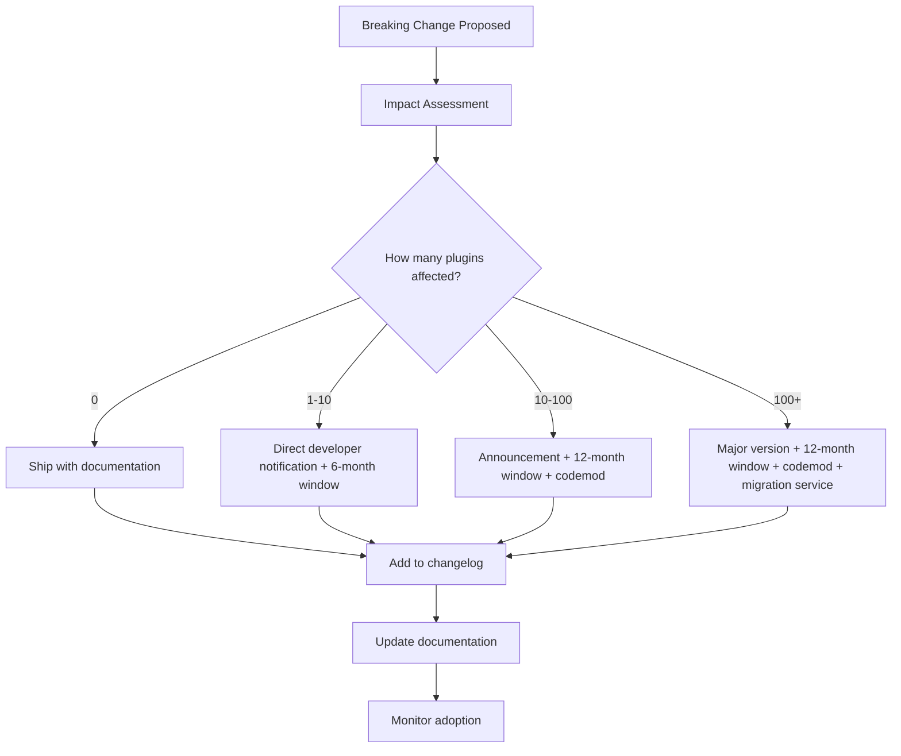
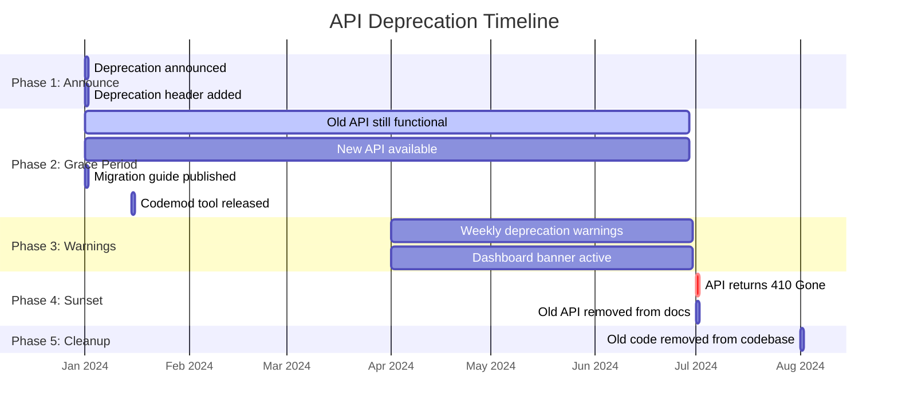

# Plugin Lifecycle Management — {{PROJECT_NAME}}

> Defines the versioning strategy, breaking change policy, deprecation timeline, migration guide framework, sunset notifications, compatibility windows, and health scoring system for the {{PROJECT_NAME}} plugin ecosystem.

---

## 1. Versioning Strategy

### 1.1 Plugin Versioning

All plugins must follow Semantic Versioning (semver) with these conventions:

| Version Component | When to Bump | Examples |
|---|---|---|
| **Major (X.0.0)** | Breaking changes, major feature overhauls | `2.0.0` — new UI framework, removed features |
| **Minor (0.X.0)** | New features, non-breaking enhancements | `1.3.0` — new panel type, additional settings |
| **Patch (0.0.X)** | Bug fixes, security patches, minor improvements | `1.3.1` — fix crash on empty data |

### 1.2 API Version Pinning

Each plugin pins to a specific API version in its manifest. The platform maintains backward compatibility within an API version.

```json
{
  "apiVersion": "{{PLUGIN_API_VERSION}}",
  "compatibility": {
    "platform": ">=2.0.0 <3.0.0"
  }
}
```

### 1.3 Version Resolution

When a user installs a plugin, the platform resolves the version using these rules:

| Scenario | Resolution |
|---|---|
| User has compatible platform version | Install latest plugin version |
| User's platform is too old | Show "Platform update required" message |
| Plugin pins to deprecated API version | Show deprecation warning + install |
| Plugin pins to sunset API version | Block installation |
| Multiple major versions available | Show latest compatible, link to others |

### 1.4 Version History Display

```
Plugin: Analytics Pro

VERSION HISTORY
┌─────────┬────────────┬──────────────────────────────────────┐
│ Version │ Date       │ Changes                              │
├─────────┼────────────┼──────────────────────────────────────┤
│ 2.4.0   │ Mar 15     │ New: Real-time dashboard updates    │
│ 2.3.2   │ Mar 01     │ Fix: Memory leak in chart rendering │
│ 2.3.1   │ Feb 20     │ Fix: Timezone handling in reports   │
│ 2.3.0   │ Feb 10     │ New: PDF export, dark mode support  │
│ 2.2.0   │ Jan 15     │ New: Custom chart themes            │
│ 2.1.0   │ Dec 20     │ New: Webhook notifications          │
│ 2.0.0   │ Dec 01     │ MAJOR: New charting engine, UI      │
│         │            │ redesign. See migration guide.       │
│ 1.x.x   │ Archived   │ [View 1.x version history]         │
└─────────┴────────────┴──────────────────────────────────────┘
```

---

## 2. Breaking Changes

### 2.1 What Constitutes a Breaking Change

| Change | Breaking? | Reason |
|---|---|---|
| Remove an API endpoint | Yes | Existing plugins will fail |
| Remove a method parameter | Yes | Existing calls may break |
| Change a return type | Yes | Consumers expect specific types |
| Add a required parameter | Yes | Existing calls missing the parameter |
| Change error codes | Yes | Error handling logic breaks |
| Rename a field in response | Yes | Consumers reference old name |
| Add a new optional parameter | No | Existing calls still work |
| Add a new endpoint | No | No existing code affected |
| Add a new field to response | No | Existing code ignores extra fields |
| Fix a bug (behavior change) | Maybe | Depends on if users rely on buggy behavior |
| Performance improvement | No | Same contract, faster |
| Add a new event type | No | Existing subscriptions unaffected |

### 2.2 Breaking Change Process



### 2.3 Breaking Change Communication

| Timeline | Action | Channel |
|---|---|---|
| **Announcement** | Publish breaking change notice | Blog + email + dashboard banner |
| **T-6 months** | Deprecation warnings in API responses | `Deprecation` header + logs |
| **T-3 months** | Reminder email to all affected developers | Email |
| **T-1 month** | Final warning with sunset date | Email + dashboard + in-app notification |
| **T-1 week** | Last call notification | Email + dashboard |
| **Sunset day** | Feature removed / API endpoint returns 410 Gone | — |
| **Post-sunset** | Monitor for issues, provide support | Support channels |

### 2.4 Codemod Tool

For breaking changes affecting many plugins, provide automated migration tools:

```typescript
// src/marketplace/lifecycle/codemod.ts

interface Codemod {
  /** Unique ID for this codemod */
  id: string;

  /** Description of what this codemod does */
  description: string;

  /** API version transition */
  from: string; // e.g., 'v1'
  to: string;   // e.g., 'v2'

  /** Transformation rules */
  transforms: Transform[];
}

interface Transform {
  type: 'rename-method' | 'rename-field' | 'add-parameter' | 'change-import' | 'custom';
  description: string;
  pattern: string;    // AST pattern to match
  replacement: string; // Replacement pattern
}

// CLI usage
// npx @{{PROJECT_NAME}}/plugin-cli migrate --from v1 --to v2 ./src
```

---

## 3. Deprecation Timeline

### 3.1 Standard Deprecation Process



### 3.2 Deprecation Severity Levels

| Level | Window | Use Case |
|---|---|---|
| **Standard** | 12 months | Normal feature deprecation |
| **Accelerated** | 6 months | Security-driven deprecation |
| **Emergency** | 30 days | Critical security vulnerability |
| **Extended** | 18 months | Major architectural change affecting many plugins |

### 3.3 Deprecation Headers

When a deprecated feature is used, the API response includes deprecation headers:

```http
HTTP/1.1 200 OK
Deprecation: @1711929600
Sunset: @1719792000
Link: <{{DEVELOPER_PORTAL_URL}}/guides/migration/v1-to-v2>; rel="deprecation"
X-Deprecated-Feature: "GET /data/{collection}/all"
X-Replacement: "GET /data/{collection}?pageSize=100"
```

| Header | Description | Format |
|---|---|---|
| `Deprecation` | When the feature was deprecated | Unix timestamp |
| `Sunset` | When the feature will be removed | Unix timestamp |
| `Link` | Migration guide URL | RFC 8288 link relation |
| `X-Deprecated-Feature` | Which feature is deprecated | String |
| `X-Replacement` | What to use instead | String |

---

## 4. Migration Guide Framework

### 4.1 Migration Guide Template

Every deprecation must include a migration guide. The guide follows this structure:

```markdown
# Migration Guide: {{FROM_VERSION}} to {{TO_VERSION}}

## Overview
Brief description of what changed and why.

## Timeline
- **Deprecated:** {{DATE}}
- **Sunset:** {{DATE}}
- **Migration deadline:** {{DATE}}

## Breaking Changes

### 1. [Change Title]

**What changed:** Description of the change.

**Before ({{FROM_VERSION}}):**
```typescript
// Old code
const result = await api.data.fetchAll('projects');
```

**After ({{TO_VERSION}}):**
```typescript
// New code
const result = await api.data.query('projects', { pageSize: 100 });
```

**Why:** Reason for the change (performance, security, consistency).

**Automated migration:** Run `npx @{{PROJECT_NAME}}/plugin-cli migrate --from {{FROM_VERSION}} --to {{TO_VERSION}}`

## Step-by-Step Migration

1. Update your SDK dependency: `npm install @{{PROJECT_NAME}}/plugin-sdk@{{TO_VERSION}}`
2. Run the codemod: `npx @{{PROJECT_NAME}}/plugin-cli migrate`
3. Review and test the changes
4. Update `apiVersion` in `plugin.json`
5. Run your test suite
6. Submit the updated plugin for review

## FAQ
Common questions about this migration.

## Support
If you need help migrating, contact {{DEVELOPER_PORTAL_URL}}/support.
```

### 4.2 Migration Testing

| Test | Description | When |
|---|---|---|
| **Codemod test** | Run codemod on example plugins, verify output | Before codemod release |
| **Compatibility test** | Run old plugins against new API version | Before deprecation announcement |
| **Regression test** | Run migrated plugins through full test suite | During migration |
| **Canary deploy** | Deploy migrated version to 1% of installs | Before full rollout |

---

## 5. Sunset Notifications

### 5.1 Notification Schedule

| Timing | Notification Type | Channel | Audience |
|---|---|---|---|
| **Day 0** | Deprecation announcement | Blog, email, changelog | All developers |
| **Monthly** | Progress reminder | Email digest | Affected developers |
| **T-90 days** | Urgency increase | Email + dashboard banner | Affected developers |
| **T-30 days** | Final warning | Email + dashboard + in-app | Affected developers + their users |
| **T-7 days** | Last call | Email (urgent) + dashboard | Affected developers |
| **T-1 day** | Sunset imminent | Email (urgent) | Affected developers |
| **Day 0** | Sunset complete | Blog, email | All developers |
| **T+7 days** | Post-sunset follow-up | Email | Developers who did not migrate |

### 5.2 Notification Templates

**T-90 Days:**
```
Subject: Action Required: {{FEATURE}} sunset in 90 days

Your plugin "{{PLUGIN_NAME}}" uses {{FEATURE}}, which will be
removed on {{SUNSET_DATE}}.

What to do:
1. Review the migration guide: {{MIGRATION_GUIDE_URL}}
2. Update your plugin code
3. Submit the updated version for review

Plugins that have not migrated by {{SUNSET_DATE}} will
experience errors when the feature is removed.

Time remaining: 90 days
Migration difficulty: {{DIFFICULTY}} (estimated {{TIME}})
```

**Post-Sunset:**
```
Subject: {{FEATURE}} has been sunset — your plugin may be affected

{{FEATURE}} was removed on {{SUNSET_DATE}} as previously communicated.

Your plugin "{{PLUGIN_NAME}}" has not been migrated and may be
experiencing errors.

Impact on your users:
- {{IMPACT_DESCRIPTION}}
- Users may see error messages or degraded functionality

Immediate action required:
1. Migrate using: {{MIGRATION_GUIDE_URL}}
2. Submit the updated version (fast-track review available)

If you need assistance, our team is available at {{SUPPORT_URL}}.
```

### 5.3 User-Facing Sunset Notifications

When a plugin uses a sunset feature, affected end-users see:

```
┌─────────────────────────────────────────────┐
│  ⚠ "Analytics Pro" needs an update          │
│                                              │
│  This plugin uses features that have been    │
│  updated. The developer has been notified.   │
│                                              │
│  You can:                                    │
│  • Continue using (may experience issues)    │
│  • Contact the developer: [Support Link]     │
│  • Uninstall and find alternatives           │
│                                              │
│  [Dismiss]  [Contact Developer]              │
└─────────────────────────────────────────────┘
```

---

## 6. Compatibility Windows

### 6.1 API Version Support Matrix

| API Version | Status | Released | Deprecated | Sunset | Support Level |
|---|---|---|---|---|---|
| `{{PLUGIN_API_VERSION}}` | **Current** | — | — | — | Full support, active development |
| `v(N-1)` | Maintained | — | — | — | Security patches, critical bug fixes |
| `v(N-2)` | Deprecated | — | — | +12 months | Security patches only |
| `v(N-3)` | Sunset | — | — | Sunset | No support |

### 6.2 Platform Version Compatibility

```typescript
// src/marketplace/lifecycle/compatibility.ts

interface CompatibilityWindow {
  /** API version */
  apiVersion: string;

  /** Minimum platform version required */
  minPlatformVersion: string;

  /** Maximum platform version (undefined = no upper bound) */
  maxPlatformVersion?: string;

  /** Support level */
  support: 'full' | 'maintenance' | 'deprecated' | 'sunset';

  /** Key dates */
  releasedAt: string;
  deprecatedAt?: string;
  sunsetAt?: string;

  /** Breaking changes introduced in this version */
  breakingChanges: BreakingChangeEntry[];
}

interface BreakingChangeEntry {
  id: string;
  description: string;
  affectedEndpoints: string[];
  migrationGuideUrl: string;
  codemodAvailable: boolean;
}
```

### 6.3 Compatibility Check at Install Time

```typescript
// src/marketplace/lifecycle/compat-check.ts

interface InstallCompatibilityResult {
  compatible: boolean;
  warnings: CompatWarning[];
  blockers: CompatBlocker[];
}

interface CompatWarning {
  type: 'deprecated-api' | 'outdated-sdk' | 'platform-update-recommended';
  message: string;
  actionUrl: string;
}

interface CompatBlocker {
  type: 'sunset-api' | 'platform-too-old' | 'platform-too-new' | 'missing-feature';
  message: string;
  resolution: string;
}

async function checkInstallCompatibility(
  pluginManifest: PluginManifest,
  platformVersion: string,
): Promise<InstallCompatibilityResult> {
  const result: InstallCompatibilityResult = {
    compatible: true,
    warnings: [],
    blockers: [],
  };

  // Check API version status
  const apiStatus = getAPIVersionStatus(pluginManifest.apiVersion);
  if (apiStatus === 'sunset') {
    result.compatible = false;
    result.blockers.push({
      type: 'sunset-api',
      message: `This plugin uses API ${pluginManifest.apiVersion}, which has been sunset.`,
      resolution: 'Contact the developer to request an update.',
    });
  } else if (apiStatus === 'deprecated') {
    result.warnings.push({
      type: 'deprecated-api',
      message: `This plugin uses API ${pluginManifest.apiVersion}, which is deprecated.`,
      actionUrl: `{{DEVELOPER_PORTAL_URL}}/changelog`,
    });
  }

  // Check platform version
  if (!satisfiesRange(platformVersion, pluginManifest.compatibility.platform)) {
    result.compatible = false;
    result.blockers.push({
      type: 'platform-too-old',
      message: `This plugin requires platform version ${pluginManifest.compatibility.platform}.`,
      resolution: `Upgrade your platform to version ${pluginManifest.compatibility.platform}.`,
    });
  }

  return result;
}
```

---

## 7. Health Scoring

### 7.1 Health Score Components

| Component | Weight | Metrics | Scoring |
|---|---|---|---|
| **Reliability** | 25% | Error rate, uptime, crash rate | 0–100 based on thresholds |
| **Performance** | 20% | P50/P95/P99 latency, load time | 0–100 based on percentile targets |
| **Maintenance** | 20% | Last update, dependency freshness, issue response time | 0–100 based on recency |
| **User Satisfaction** | 15% | Rating, review sentiment, uninstall rate | 0–100 based on scores |
| **Security** | 10% | CVE count, permission scope, last security audit | 0–100 based on findings |
| **Compatibility** | 10% | API version currency, platform version support | 0–100 based on currency |

### 7.2 Health Score Calculation

```typescript
// src/marketplace/lifecycle/health-score.ts

interface PluginHealthScore {
  overall: number;    // 0-100
  grade: 'A' | 'B' | 'C' | 'D' | 'F';
  components: {
    reliability: ComponentScore;
    performance: ComponentScore;
    maintenance: ComponentScore;
    userSatisfaction: ComponentScore;
    security: ComponentScore;
    compatibility: ComponentScore;
  };
  trend: 'improving' | 'stable' | 'declining';
  calculatedAt: string;
  nextCalculation: string;
}

interface ComponentScore {
  score: number;      // 0-100
  weight: number;     // percentage
  metrics: MetricScore[];
  status: 'healthy' | 'warning' | 'critical';
}

interface MetricScore {
  name: string;
  value: number;
  target: number;
  unit: string;
  status: 'pass' | 'warn' | 'fail';
}

function calculateHealthScore(pluginId: string): PluginHealthScore {
  const reliability = calculateReliability(pluginId);
  const performance = calculatePerformance(pluginId);
  const maintenance = calculateMaintenance(pluginId);
  const satisfaction = calculateUserSatisfaction(pluginId);
  const security = calculateSecurity(pluginId);
  const compatibility = calculateCompatibility(pluginId);

  const overall =
    reliability.score * 0.25 +
    performance.score * 0.20 +
    maintenance.score * 0.20 +
    satisfaction.score * 0.15 +
    security.score * 0.10 +
    compatibility.score * 0.10;

  return {
    overall: Math.round(overall),
    grade: scoreToGrade(overall),
    components: { reliability, performance, maintenance, userSatisfaction: satisfaction, security, compatibility },
    trend: calculateTrend(pluginId),
    calculatedAt: new Date().toISOString(),
    nextCalculation: getNextCalculationTime(),
  };
}

function scoreToGrade(score: number): 'A' | 'B' | 'C' | 'D' | 'F' {
  if (score >= 90) return 'A';
  if (score >= 75) return 'B';
  if (score >= 60) return 'C';
  if (score >= 40) return 'D';
  return 'F';
}
```

### 7.3 Health Score Thresholds and Actions

| Grade | Score | Badge | Platform Action |
|---|---|---|---|
| **A** | 90–100 | Green "Excellent" badge | Featured placement eligible |
| **B** | 75–89 | No badge | Standard listing |
| **C** | 60–74 | Yellow "Needs Attention" | Developer notified, improvement suggestions |
| **D** | 40–59 | Orange "At Risk" | Warning banner on listing, developer contacted |
| **F** | 0–39 | Red "Critical" | Listing deprioritized, suspension review triggered |

### 7.4 Health Score Dashboard

```
┌─────────────────────────────────────────────────────────────┐
│  Plugin Health — Analytics Pro              Score: 87 (B)  │
│  Trend: Improving ↑                                        │
├─────────────────────────────────────────────────────────────┤
│                                                             │
│  COMPONENT SCORES                                           │
│  Reliability    ████████████████████░░░░  92 (A)           │
│  Performance    █████████████████░░░░░░░  78 (B)           │
│  Maintenance    ████████████████████░░░░  95 (A)           │
│  Satisfaction   ████████████████████░░░░  88 (B)           │
│  Security       ████████████████░░░░░░░░  75 (B)           │
│  Compatibility  ████████████████████████  100 (A)          │
│                                                             │
│  ISSUES TO ADDRESS                                          │
│  ⚠ P95 latency at 350ms (target: <200ms) — Performance    │
│  ⚠ 2 medium-severity CVEs in dependencies — Security       │
│                                                             │
│  IMPROVEMENT SUGGESTIONS                                    │
│  • Add caching for repeated data queries (perf)             │
│  • Update lodash to 4.17.21 (security)                      │
│  • Add error boundary for chart rendering (reliability)     │
│                                                             │
└─────────────────────────────────────────────────────────────┘
```

### 7.5 Health Score History

Health scores are calculated daily and trended over time:

| Period | Frequency | Retention |
|---|---|---|
| Last 30 days | Daily | Full detail |
| Last 12 months | Weekly average | Aggregated |
| Lifetime | Monthly average | Aggregated |

---

## Plugin Lifecycle Checklist

- [ ] Semantic versioning enforced in manifest validation
- [ ] API version pinning implemented — plugins pin to a specific API version
- [ ] Version resolution logic handles platform compatibility at install time
- [ ] Breaking change policy documented with impact assessment process
- [ ] Codemod tool available for automated migration between API versions
- [ ] Deprecation timeline follows standard windows (12 months standard)
- [ ] Deprecation headers added to API responses (`Deprecation`, `Sunset`, `Link`)
- [ ] Migration guide framework with template, before/after examples, and step-by-step instructions
- [ ] Sunset notifications scheduled at -90d, -30d, -7d, -1d, and post-sunset
- [ ] User-facing sunset notifications shown when installed plugins use deprecated features
- [ ] Compatibility windows documented in API version support matrix
- [ ] Install-time compatibility check blocks sunset API versions, warns on deprecated
- [ ] Health score calculated daily from reliability, performance, maintenance, satisfaction, security, compatibility
- [ ] Health score actions defined — badges, notifications, listing prioritization, suspension triggers
- [ ] Health score dashboard available for developers with improvement suggestions
