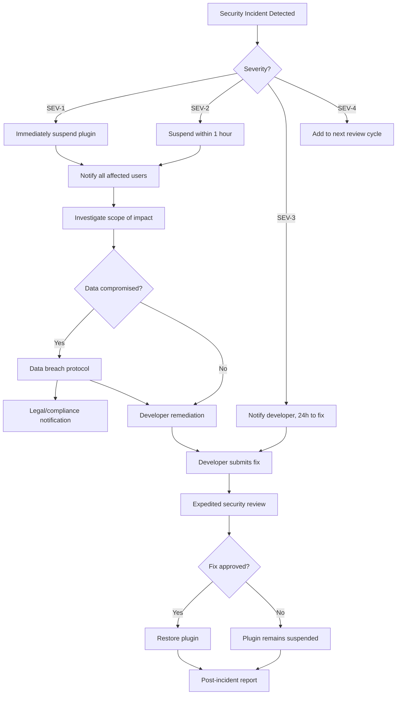

# Plugin Security Model — {{PROJECT_NAME}}

> Defines the permission system, data access controls, sandboxing architecture, credential management, security review process, incident response procedures, and audit logging for the {{PROJECT_NAME}} plugin ecosystem.

---

## 1. Permission System

### 1.1 Permission Architecture

Permissions follow a hierarchical, resource-scoped model. Every API call from a plugin is checked against its declared permissions before execution.

```
<action>:<resource>:<scope>

Examples:
  data:read:projects        — Read project data
  data:write:projects       — Write project data
  data:read:users.email     — Read user email addresses
  ui:panel                  — Render a panel in the workspace
  events:subscribe:project.*— Subscribe to project events
  storage:read-write        — Read and write plugin storage
  http:external             — Make external HTTP requests
```

### 1.2 Permission Registry

| Permission | Sensitivity | Description | User-Facing Label |
|---|---|---|---|
| `data:read:projects` | Low | Read project names, descriptions, metadata | "View your projects" |
| `data:write:projects` | Medium | Create, update, delete project data | "Modify your projects" |
| `data:read:users` | Low | Read user names, avatars | "View team member names" |
| `data:read:users.email` | Medium | Read user email addresses | "View team member emails" |
| `data:read:users.all` | High | Read all user profile fields | "View full team member profiles" |
| `data:write:users` | High | Modify user profiles | "Modify team member profiles" |
| `data:read:billing` | High | Read billing and subscription data | "View billing information" |
| `ui:panel` | Low | Render a panel in the workspace | "Display a panel in your workspace" |
| `ui:toolbar-action` | Low | Add toolbar buttons | "Add toolbar buttons" |
| `ui:settings-page` | Low | Add a settings page | "Add a settings page" |
| `ui:context-menu` | Low | Add context menu items | "Add right-click menu items" |
| `ui:modal` | Low | Show modal dialogs | "Show dialog windows" |
| `ui:notification` | Low | Show notifications | "Show notifications" |
| `events:subscribe:*` | Medium | Subscribe to all platform events | "Receive all platform notifications" |
| `events:subscribe:project.*` | Low | Subscribe to project events | "Receive project update notifications" |
| `events:emit` | Medium | Emit custom events | "Send custom notifications" |
| `storage:read-write` | Low | Plugin-scoped storage access | "Store plugin settings and data" |
| `http:external` | Medium | Make HTTP requests to external services | "Connect to external services" |
| `auth:user-context` | Low | Access current user identity | "Know who is using the plugin" |
| `auth:oauth-token` | High | Request OAuth tokens for external services | "Connect your accounts to external services" |
| `background:cron` | Medium | Run scheduled background tasks | "Run tasks on a schedule" |
| `background:webhook` | Medium | Receive external webhooks | "Receive data from external services" |

### 1.3 Permission Limits

| Constraint | Limit |
|---|---|
| Maximum permissions per plugin | `{{MAX_PLUGIN_PERMISSIONS}}` |
| Maximum High-sensitivity permissions | 3 |
| Permission justification required | Yes, for Medium and High |
| Runtime permission requests | Not supported (must be declared in manifest) |
| Permission downgrade on update | Automatic (no re-consent needed) |
| Permission upgrade on update | Requires user re-consent |

### 1.4 Permission Enforcement

```typescript
// src/marketplace/security/permission-guard.ts

class PermissionGuard {
  private grantedPermissions: Set<string>;

  constructor(manifest: PluginManifest) {
    this.grantedPermissions = new Set(manifest.permissions);
  }

  /**
   * Check if a permission is granted. Supports wildcard matching.
   * Throws SDKError if permission is not granted.
   */
  assertPermission(required: string): void {
    if (!this.hasPermission(required)) {
      throw new SDKError(
        'PERMISSION_DENIED',
        `Plugin "${this.pluginId}" does not have permission "${required}". ` +
        `Add it to the "permissions" array in plugin.json.`,
        { required, granted: Array.from(this.grantedPermissions) }
      );
    }
  }

  /**
   * Check if a permission is granted without throwing.
   */
  hasPermission(required: string): boolean {
    // Direct match
    if (this.grantedPermissions.has(required)) return true;

    // Wildcard match: 'data:read:*' matches 'data:read:projects'
    for (const granted of this.grantedPermissions) {
      if (granted.endsWith('*')) {
        const prefix = granted.slice(0, -1);
        if (required.startsWith(prefix)) return true;
      }
    }

    return false;
  }

  /**
   * Filter a data object to only include fields the plugin can access.
   * Used for partial-read permissions like 'data:read:users' (no email).
   */
  filterFields<T extends Record<string, unknown>>(
    resource: string,
    data: T,
  ): Partial<T> {
    const fieldPermissions = getFieldPermissions(resource);
    const filtered: Partial<T> = {};

    for (const [field, permission] of Object.entries(fieldPermissions)) {
      if (this.hasPermission(permission) && field in data) {
        (filtered as any)[field] = data[field];
      }
    }

    return filtered;
  }
}
```

---

## 2. Data Access Controls

### 2.1 Data Access Matrix

| Data Resource | Read Permission | Write Permission | Sensitive Fields |
|---|---|---|---|
| Projects | `data:read:projects` | `data:write:projects` | None |
| Tasks | `data:read:tasks` | `data:write:tasks` | `assignee.email` |
| Users | `data:read:users` | `data:write:users` | `email`, `phone`, `address` |
| Comments | `data:read:comments` | `data:write:comments` | None |
| Files | `data:read:files` | `data:write:files` | File contents |
| Billing | `data:read:billing` | — (never writable) | All fields |
| Audit logs | `data:read:audit` | — (never writable) | User identifiers |
| API keys | — (never readable) | — (never writable) | All fields |

### 2.2 Data Isolation Rules

| Rule | Description | Enforcement |
|---|---|---|
| **Org-scoped access** | Plugins can only access data within the installing org | Query filter injection |
| **User-scoped access** | Some permissions can be narrowed to current user's data | Permission scope qualifier |
| **No cross-plugin access** | Plugins cannot read another plugin's storage or state | Namespace isolation |
| **No platform internals** | Plugins cannot access platform system tables | API surface restriction |
| **Field-level filtering** | Sensitive fields stripped unless specifically permitted | Response interceptor |
| **Rate-limited queries** | Data queries subject to per-plugin rate limits | Rate limiter |

### 2.3 Data Access Logging

Every data access from a plugin is logged for audit purposes:

```typescript
// src/marketplace/security/data-access-log.ts

interface DataAccessLogEntry {
  timestamp: string;
  pluginId: string;
  pluginVersion: string;
  userId: string;       // user who triggered the action
  orgId: string;
  action: 'read' | 'write' | 'delete';
  resource: string;     // e.g., 'projects'
  resourceId?: string;  // specific record ID
  permission: string;   // permission used
  fieldsAccessed: string[]; // which fields were returned
  resultCount: number;  // how many records returned
  durationMs: number;
  ipAddress: string;
  userAgent: string;
}
```

---

## 3. Sandboxing

### 3.1 Sandbox Architecture

<!-- IF {{PLUGIN_SANDBOX_TYPE}} == "iframe" -->
**iframe Sandbox Model**

Plugins execute in sandboxed iframes with restricted capabilities:

```html
<iframe
  src="plugin-origin/index.html"
  sandbox="allow-scripts allow-forms allow-popups"
  allow="clipboard-write"
  referrerpolicy="no-referrer"
  csp="default-src 'self'; script-src 'self'; connect-src https://api.{{PROJECT_NAME}}.com"
></iframe>
```

| Sandbox Attribute | Allowed | Blocked |
|---|---|---|
| `allow-scripts` | Yes | — |
| `allow-same-origin` | No | Prevents access to host cookies/storage |
| `allow-top-navigation` | No | Prevents redirect of host page |
| `allow-popups` | Yes (for OAuth flows) | — |
| `allow-forms` | Yes | — |
| `allow-modals` | No | Use platform modal API instead |
<!-- ENDIF -->

<!-- IF {{PLUGIN_SANDBOX_TYPE}} == "web-worker" -->
**Web Worker Sandbox Model**

Plugin logic executes in a dedicated Web Worker. No DOM access. UI is declarative.

```typescript
// src/marketplace/security/worker-sandbox.ts

class WorkerSandbox {
  private worker: Worker;
  private messageChannel: MessageChannel;

  constructor(pluginUrl: string, permissions: string[]) {
    // Create worker with restricted scope
    this.worker = new Worker(pluginUrl, {
      type: 'module',
      name: `plugin-${pluginId}`,
    });

    // Proxy only permitted API calls
    this.messageChannel = new MessageChannel();
    this.worker.postMessage({ type: 'init', permissions }, [this.messageChannel.port2]);
  }

  terminate(): void {
    this.worker.terminate();
  }
}
```
<!-- ENDIF -->

<!-- IF {{PLUGIN_SANDBOX_TYPE}} == "container" -->
**Container Sandbox Model**

Plugins run in isolated containers with resource limits and network policies.

```yaml
# Container resource limits
resources:
  limits:
    cpu: "500m"
    memory: "256Mi"
    ephemeral-storage: "100Mi"
  requests:
    cpu: "100m"
    memory: "64Mi"

# Network policy
networkPolicy:
  egress:
    - to:
        - podSelector:
            matchLabels:
              app: plugin-api-gateway
      ports:
        - port: 443
    - to: # Allow declared external domains
        - ipBlock:
            cidr: 0.0.0.0/0
      ports:
        - port: 443
  ingress:
    - from:
        - podSelector:
            matchLabels:
              app: plugin-api-gateway
```
<!-- ENDIF -->

<!-- IF {{PLUGIN_SANDBOX_TYPE}} == "wasm" -->
**WebAssembly Sandbox Model**

Plugins compile to WASM and run in a sandboxed runtime with capability-based security.

```typescript
// src/marketplace/security/wasm-sandbox.ts

interface WasmSandboxConfig {
  wasmModule: ArrayBuffer;
  permissions: string[];
  memoryLimit: number; // bytes
  cpuTimeLimit: number; // milliseconds
  importedFunctions: Record<string, Function>; // host functions exposed to WASM
}
```
<!-- ENDIF -->

### 3.2 Sandbox Security Properties

| Property | Guarantee |
|---|---|
| **Memory isolation** | Plugin memory is separate from host and other plugins |
| **CPU isolation** | Plugin CPU usage is bounded and cannot starve the host |
| **Network isolation** | Plugin can only reach declared external domains |
| **DOM isolation** | Plugin cannot access host DOM (iframe/worker models) |
| **Storage isolation** | Plugin storage is namespaced and size-limited |
| **Error isolation** | Plugin crashes do not crash the host application |
| **Timing isolation** | Plugin cannot use timing attacks against the host |

---

## 4. Credential Management

### 4.1 Credential Storage

| Credential Type | Storage Location | Encryption | Access Pattern |
|---|---|---|---|
| Plugin API keys | Platform secret store | AES-256-GCM | Server-side only |
| OAuth tokens (platform) | Platform token store | AES-256-GCM | Server-side, auto-refreshed |
| OAuth tokens (external) | Plugin encrypted storage | AES-256-GCM | Plugin-requested |
| User-provided secrets (API keys for external services) | Plugin encrypted storage | AES-256-GCM | Plugin-requested, never logged |
| Webhook signing secrets | Platform secret store | AES-256-GCM | Server-side only |

### 4.2 Credential Handling Rules

| Rule | Enforcement |
|---|---|
| Secrets never appear in client-side code | Static analysis during review |
| Secrets never appear in logs | Log scrubbing middleware |
| Secrets never appear in error messages | Error sanitization |
| Secrets are rotatable without plugin update | Managed credential store |
| Secrets are revoked on plugin uninstall | Lifecycle hook |
| Secrets have maximum TTL | Automatic rotation reminders |

### 4.3 Credential API

```typescript
// src/marketplace/security/credentials.ts

interface CredentialManager {
  /**
   * Store a secret value. Encrypted at rest.
   * Never returned in API responses or logs.
   */
  setSecret(key: string, value: string): Promise<void>;

  /**
   * Retrieve a secret value. Only accessible server-side.
   * Returns null if the secret does not exist.
   */
  getSecret(key: string): Promise<string | null>;

  /**
   * Delete a secret.
   */
  deleteSecret(key: string): Promise<void>;

  /**
   * Rotate a secret. Stores new value and marks old value
   * for deletion after a grace period.
   */
  rotateSecret(key: string, newValue: string, gracePeriodMs?: number): Promise<void>;

  /**
   * List secret keys (not values) for management UI.
   */
  listSecretKeys(): Promise<SecretKeyInfo[]>;
}

interface SecretKeyInfo {
  key: string;
  createdAt: string;
  lastAccessedAt: string;
  rotatedAt?: string;
  expiresAt?: string;
}
```

---

## 5. Security Review

### 5.1 Security Review Checklist

Applied to every plugin submission (automated + manual):

#### Automated Security Checks
- [ ] No `eval()`, `Function()`, or `new Function()` usage
- [ ] No dynamic script injection (`createElement('script')`)
- [ ] No hardcoded secrets or API keys in source code
- [ ] No cryptocurrency mining patterns
- [ ] No known vulnerable dependencies (CVE database check)
- [ ] No GPL-incompatible license mixing (if applicable)
- [ ] Content Security Policy compatible
- [ ] No data exfiltration to undeclared domains
- [ ] No prototype pollution patterns
- [ ] No SQL injection patterns (if applicable)
- [ ] No XSS vectors in user-facing output
- [ ] No SSRF patterns in server-side code

#### Manual Security Review
- [ ] Permissions requested are justified and minimal
- [ ] Data access patterns match stated plugin purpose
- [ ] External API calls serve legitimate plugin functionality
- [ ] Authentication flow follows best practices
- [ ] Error handling does not leak sensitive information
- [ ] Rate limit behavior is appropriate
- [ ] Uninstall cleanup is complete
- [ ] No hidden functionality beyond described features

### 5.2 Security Scoring

| Dimension | Weight | Scoring Criteria |
|---|---|---|
| Permission minimality | 25% | Fewer permissions = higher score |
| Dependency health | 20% | No known CVEs, maintained dependencies |
| Code quality | 20% | No dangerous patterns, proper error handling |
| Data handling | 20% | Minimal data access, proper encryption |
| External surface | 15% | Fewer external calls, declared domains only |

**Security score thresholds:**
- 90–100: Excellent — fast-track eligible
- 70–89: Good — standard review
- 50–69: Acceptable — additional manual review required
- Below 50: Fail — rejected with specific remediation requirements

---

## 6. Incident Response

### 6.1 Incident Severity Levels

| Level | Description | Example | Response Time |
|---|---|---|---|
| **SEV-1 Critical** | Active exploitation, data breach | Plugin exfiltrating user data | 15 minutes |
| **SEV-2 High** | Vulnerability with exploit potential | XSS in plugin UI, token leakage | 1 hour |
| **SEV-3 Medium** | Vulnerability without known exploit | Unused dependency with CVE | 24 hours |
| **SEV-4 Low** | Security improvement opportunity | Missing CSP header, verbose errors | 7 days |

### 6.2 Incident Response Playbook



### 6.3 Suspension Procedure

| Step | Action | Duration |
|---|---|---|
| 1 | Plugin marked as suspended in marketplace | Immediate |
| 2 | Plugin deactivated for all installed users | < 5 minutes |
| 3 | Plugin API access revoked | Immediate |
| 4 | Developer notified with incident details | < 15 minutes |
| 5 | Affected users notified (if data impacted) | < 1 hour |
| 6 | Public disclosure (if warranted) | Within 72 hours |

---

## 7. Audit Logging

### 7.1 Audit Events

| Event Category | Events Logged | Retention |
|---|---|---|
| **Authentication** | Plugin API key usage, OAuth token grants/revocations | 1 year |
| **Data Access** | All reads and writes through plugin API | 90 days |
| **Permission Changes** | Permission grants, revocations, upgrades | 1 year |
| **Plugin Lifecycle** | Install, activate, deactivate, uninstall, update | 1 year |
| **Security Events** | Permission denials, rate limit hits, suspicious patterns | 1 year |
| **Admin Actions** | Plugin suspension, developer ban, policy override | 2 years |
| **Financial** | Purchases, refunds, payouts | 7 years |

### 7.2 Audit Log Schema

```typescript
// src/marketplace/security/audit-log.ts

interface AuditLogEntry {
  /** Unique log entry ID */
  id: string;

  /** ISO 8601 timestamp */
  timestamp: string;

  /** Event category */
  category: 'auth' | 'data' | 'permission' | 'lifecycle' | 'security' | 'admin' | 'financial';

  /** Specific event type */
  event: string;

  /** Severity level */
  severity: 'info' | 'warning' | 'error' | 'critical';

  /** Actor who triggered the event */
  actor: {
    type: 'user' | 'plugin' | 'system' | 'admin';
    id: string;
    name: string;
  };

  /** Target of the action */
  target: {
    type: 'plugin' | 'user' | 'org' | 'data' | 'setting';
    id: string;
    name?: string;
  };

  /** Event-specific details */
  details: Record<string, unknown>;

  /** Request metadata */
  request: {
    ipAddress: string;
    userAgent: string;
    requestId: string;
    apiVersion: string;
  };

  /** Organization context */
  orgId: string;

  /** Whether this entry has been flagged for review */
  flagged: boolean;
}
```

### 7.3 Audit Log Access

| Role | Access Level | Features |
|---|---|---|
| Platform Admin | Full access to all audit logs | Search, filter, export, alert configuration |
| Organization Admin | Org-scoped audit logs | View plugin activity within their org |
| Developer | Own plugin audit logs | View API calls, errors, security events for their plugins |
| End User | No direct access | Can request audit report from org admin |

### 7.4 Anomaly Detection

| Pattern | Detection Method | Action |
|---|---|---|
| Unusual data access volume | Baseline + standard deviation | Alert security team |
| Data access outside business hours | Time-based rules | Flag for review |
| Permission denial spikes | Count threshold | Investigate plugin behavior |
| Rapid API key rotation | Velocity check | Alert developer + security team |
| Access from new IP ranges | GeoIP comparison | Flag for review |
| Bulk data export | Volume threshold | Alert org admin |

---

## Plugin Security Checklist

- [ ] Permission system implemented with hierarchical, resource-scoped model
- [ ] Permission limits enforced — max `{{MAX_PLUGIN_PERMISSIONS}}` per plugin
- [ ] Permission enforcement at API gateway level (not just SDK)
- [ ] Data access controls enforce org-scoped isolation
- [ ] Field-level filtering strips sensitive fields unless specifically permitted
- [ ] Sandbox isolation verified for memory, CPU, network, DOM, and storage
- [ ] Credential manager supports encrypted storage, rotation, and revocation
- [ ] Secrets never appear in logs, errors, or client-side code
- [ ] Security review covers automated scanning and manual checklist
- [ ] Incident response playbook documented with severity levels and SLAs
- [ ] Plugin suspension can be executed in under 5 minutes
- [ ] Audit logging captures all data access, security events, and admin actions
- [ ] Anomaly detection monitors for unusual access patterns
- [ ] Audit log retention meets compliance requirements (GDPR, SOC 2)
- [ ] Security documentation published for developers at {{DEVELOPER_PORTAL_URL}}/guides/security
