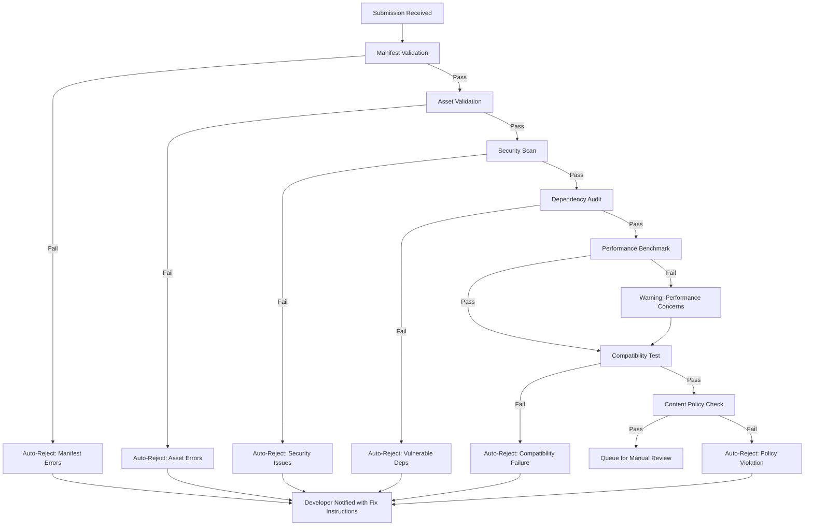
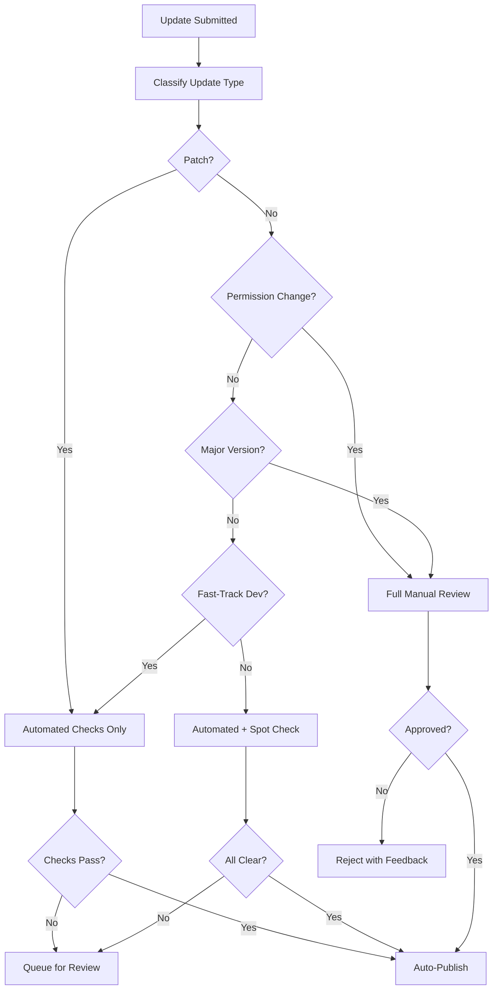
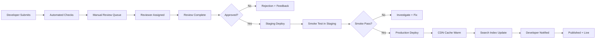

# Review & Approval Workflow — {{PROJECT_NAME}}

> Defines the submission requirements, automated check pipeline, manual review process, rejection handling, fast-track criteria, update review policy, and publishing pipeline for the {{PROJECT_NAME}} marketplace with a target SLA of {{PLUGIN_REVIEW_SLA_DAYS}} days.

---

## 1. Submission Requirements

### 1.1 Pre-Submission Checklist

Before a plugin can be submitted for review, the developer must satisfy all requirements:

| # | Requirement | Validation | Automated? |
|---|---|---|---|
| 1 | Valid `plugin.json` manifest | JSON Schema validation | Yes |
| 2 | Plugin ID follows naming convention (`com.developer.name`) | Regex check | Yes |
| 3 | Version follows semver (`X.Y.Z`) | Semver parse | Yes |
| 4 | Icon provided (512x512 PNG, < 500 KB) | Dimension + size check | Yes |
| 5 | At least 2 screenshots (1280x800, < 2 MB each) | Dimension + size check | Yes |
| 6 | Short description (20–120 characters) | Length check | Yes |
| 7 | Long description (100–10,000 characters) | Length check | Yes |
| 8 | Privacy policy URL valid and accessible | HTTP HEAD check | Yes |
| 9 | Support URL valid and accessible | HTTP HEAD check | Yes |
| 10 | Permissions limited to `{{MAX_PLUGIN_PERMISSIONS}}` max | Count check | Yes |
| 11 | All declared permissions have justification text | Field presence check | Yes |
| 12 | Build compiles without errors | CI build | Yes |
| 13 | Test suite passes with > 80% coverage | CI test runner | Yes |
| 14 | No known vulnerable dependencies | `npm audit` / Snyk | Yes |
| 15 | Bundle size under limit (5 MB compressed) | Size check | Yes |
| 16 | Developer agreement accepted | Account flag | Yes |
| 17 | Developer profile complete (name, email, avatar) | Field presence check | Yes |
| 18 | Category selected from allowed list | Enum check | Yes |

### 1.2 Submission Package Structure

```
submission/
├── plugin.json              # Manifest (required)
├── dist/                    # Compiled plugin bundle (required)
│   ├── index.js
│   ├── index.js.map
│   └── styles.css
├── assets/                  # Marketing assets (required)
│   ├── icon-512.png
│   ├── screenshot-1.png
│   ├── screenshot-2.png
│   └── video-demo.mp4      # Optional
├── docs/                    # Plugin documentation (required)
│   ├── README.md
│   ├── CHANGELOG.md
│   └── PRIVACY.md
├── test-results/            # Test artifacts (required)
│   ├── coverage-report.html
│   └── test-results.xml
└── review-notes.md          # Notes to reviewer (optional)
```

---

## 2. Automated Checks

### 2.1 Automated Check Pipeline



### 2.2 Check Details

| Check | Tool | Duration | Auto-Reject Threshold |
|---|---|---|---|
| **Manifest validation** | Custom JSON Schema validator | < 5s | Any schema error |
| **Asset validation** | ImageMagick + ffprobe | < 10s | Wrong dimensions, oversized |
| **Static analysis** | ESLint + custom rules | < 30s | Critical rule violations |
| **Security scan** | Semgrep + custom rules | < 60s | Any HIGH/CRITICAL finding |
| **Dependency audit** | npm audit + Snyk | < 30s | Any HIGH/CRITICAL CVE |
| **Malware scan** | ClamAV + VirusTotal API | < 120s | Any detection |
| **Performance benchmark** | Lighthouse + custom metrics | < 180s | Warning if LCP > 3s |
| **Compatibility test** | E2E test suite against sandbox | < 300s | Any test failure |
| **Content policy** | ML classifier + keyword scan | < 30s | Hate speech, adult content, spam |
| **License check** | license-checker | < 10s | Incompatible licenses (GPL in proprietary) |

### 2.3 Security Scan Rules

```typescript
// src/marketplace/security-scan.ts

interface SecurityScanConfig {
  rules: SecurityRule[];
  severity_threshold: 'low' | 'medium' | 'high' | 'critical';
}

const MARKETPLACE_SECURITY_RULES: SecurityRule[] = [
  {
    id: 'SEC-001',
    name: 'no-eval',
    description: 'Plugin must not use eval() or Function() constructor',
    pattern: /\b(eval|Function)\s*\(/,
    severity: 'critical',
    autoReject: true,
  },
  {
    id: 'SEC-002',
    name: 'no-dynamic-script',
    description: 'Plugin must not dynamically inject script tags',
    pattern: /document\.createElement\s*\(\s*['"]script['"]\s*\)/,
    severity: 'high',
    autoReject: true,
  },
  {
    id: 'SEC-003',
    name: 'no-raw-innerhtml',
    description: 'Plugin must sanitize HTML before using innerHTML',
    pattern: /\.innerHTML\s*=/,
    severity: 'medium',
    autoReject: false,
  },
  {
    id: 'SEC-004',
    name: 'no-hardcoded-secrets',
    description: 'Plugin must not contain hardcoded API keys or secrets',
    pattern: /['"](?:sk|pk|api[_-]?key)[_-][a-zA-Z0-9]{20,}['"]/i,
    severity: 'critical',
    autoReject: true,
  },
  {
    id: 'SEC-005',
    name: 'no-crypto-mining',
    description: 'Plugin must not contain cryptocurrency mining code',
    pattern: /\b(CoinHive|coinhive|cryptonight|minero)\b/i,
    severity: 'critical',
    autoReject: true,
  },
  {
    id: 'SEC-006',
    name: 'no-external-data-exfil',
    description: 'Plugin must not send platform data to undeclared external domains',
    severity: 'high',
    autoReject: true,
    customCheck: true,
  },
];
```

---

## 3. Manual Review

### 3.1 Review Queue Management

| Priority | Criteria | Target SLA |
|---|---|---|
| **P0 — Critical** | Security hotfix for published plugin | 4 hours |
| **P1 — High** | Fast-tracked developer (see Section 5) | 1 business day |
| **P2 — Standard** | Normal submission | {{PLUGIN_REVIEW_SLA_DAYS}} business days |
| **P3 — Low** | Resubmission after minor rejection | {{PLUGIN_REVIEW_SLA_DAYS}} business days |
| **P4 — Backlog** | Non-urgent updates, cosmetic changes | 2x {{PLUGIN_REVIEW_SLA_DAYS}} business days |

### 3.2 Manual Review Checklist

Reviewers complete this checklist for every submission:

#### Functionality Review
- [ ] Plugin installs successfully in sandbox
- [ ] All declared features work as described
- [ ] Plugin handles edge cases (empty data, large datasets, offline state)
- [ ] Error states show helpful messages (not raw errors)
- [ ] Plugin does not break when other plugins are installed
- [ ] Uninstall cleanly removes all plugin traces

#### UX Review
- [ ] UI follows platform design guidelines
- [ ] Plugin is responsive across breakpoints
- [ ] Loading states are present for async operations
- [ ] No layout shifts after plugin loads
- [ ] Keyboard navigation works for all interactive elements
- [ ] Screen reader compatibility verified

#### Security Review
- [ ] Permissions requested are justified and minimal
- [ ] No unnecessary data access beyond stated purpose
- [ ] External API calls go only to declared domains
- [ ] User data is handled per privacy policy
- [ ] Authentication tokens are stored securely
- [ ] No client-side secret exposure

#### Content Review
- [ ] Description accurately represents functionality
- [ ] Screenshots reflect current version
- [ ] No misleading claims or fake testimonials
- [ ] Pricing is clear and transparent
- [ ] No trademark or copyright violations
- [ ] No offensive or discriminatory content

#### Performance Review
- [ ] Plugin loads within 2 seconds
- [ ] No memory leaks detected in 30-minute test
- [ ] No excessive network requests (< 50 per page load)
- [ ] Bundle size is reasonable for functionality provided
- [ ] Background tasks complete within timeout limits

### 3.3 Review Scoring

| Dimension | Weight | Score Range |
|---|---|---|
| Functionality | 30% | 1–5 |
| UX / Design | 20% | 1–5 |
| Security | 25% | Pass / Fail |
| Content Quality | 10% | 1–5 |
| Performance | 15% | 1–5 |

**Approval threshold:** Security must pass. Weighted score >= 3.5.

---

## 4. Rejection Handling

### 4.1 Rejection Categories

| Category | Description | Resubmission Allowed |
|---|---|---|
| **Manifest Error** | Invalid or incomplete manifest | Yes — fix and resubmit |
| **Security Violation** | Dangerous code patterns, data exfiltration | Yes — fix and resubmit |
| **Policy Violation** | Content policy, trademark, misleading claims | Conditional — depends on severity |
| **Quality Below Bar** | Functionality works but UX/performance is poor | Yes — improve and resubmit |
| **Duplicate Plugin** | Substantially duplicates existing plugin | No — unless significantly differentiated |
| **Permanent Ban** | Malware, fraud, repeated policy violations | No |

### 4.2 Rejection Notification Template

```
Subject: [{{PROJECT_NAME}} Marketplace] Plugin Review: {{PLUGIN_NAME}} v{{VERSION}} — Action Required

Hi {{DEVELOPER_NAME}},

Your plugin submission has been reviewed, and we were unable to approve it at this time.

**Rejection Reason:** {{REJECTION_CATEGORY}}

**Details:**
{{DETAILED_REJECTION_REASONS}}

**How to fix:**
{{REMEDIATION_STEPS}}

**Helpful Resources:**
- Plugin Guidelines: {{DEVELOPER_PORTAL_URL}}/guidelines
- Security Best Practices: {{DEVELOPER_PORTAL_URL}}/guides/security
- UX Guidelines: {{DEVELOPER_PORTAL_URL}}/guides/design

You can resubmit after addressing the issues above.
If you believe this rejection is incorrect, you can appeal within 14 days at {{DEVELOPER_PORTAL_URL}}/support/appeal.

— {{PROJECT_NAME}} Marketplace Team
```

### 4.3 Appeal Process

| Step | Action | SLA |
|---|---|---|
| 1 | Developer submits appeal with justification | — |
| 2 | Appeal assigned to senior reviewer (not original reviewer) | 1 business day |
| 3 | Senior reviewer evaluates | 3 business days |
| 4 | Decision communicated to developer | — |
| 5 | If upheld: developer fixes and resubmits. If overturned: plugin proceeds to publish. | — |

---

## 5. Fast-Track Criteria

### 5.1 Fast-Track Eligibility

| Criterion | Requirement |
|---|---|
| **Verified Developer** | Developer has been verified (identity + business) |
| **Track Record** | 3+ published plugins with no policy violations |
| **Average Rating** | >= 4.0 across all published plugins |
| **Response Time** | Responds to support tickets within 48 hours |
| **Certified Partner** | Member of certified partner program |

### 5.2 Fast-Track Benefits

| Benefit | Standard | Fast-Track |
|---|---|---|
| Review SLA | {{PLUGIN_REVIEW_SLA_DAYS}} days | 1 business day |
| Update reviews | Full review | Automated checks only (if minor) |
| Beta API access | No | Yes |
| Direct reviewer contact | No | Yes — dedicated reviewer |
| Featured placement eligibility | After 6 months | Immediate |

### 5.3 Fast-Track Revocation

Fast-track status is revoked if:
- [ ] Any security incident involving the developer's plugins
- [ ] Two consecutive quality rejections
- [ ] Policy violation of any severity
- [ ] Average rating drops below 3.5
- [ ] Support response time exceeds 7 days consistently

---

## 6. Update Review

### 6.1 Update Classification

| Update Type | Detection | Review Level |
|---|---|---|
| **Patch** (bug fix, no new permissions) | Semver patch bump, no manifest changes | Automated only |
| **Minor** (new features, no new permissions) | Semver minor bump, no permission changes | Automated + spot check |
| **Permission Change** (new permissions requested) | Manifest permission diff | Full manual review |
| **Major** (breaking changes, major version) | Semver major bump | Full manual review |
| **Hotfix** (security/critical fix) | Developer flags as hotfix | Expedited review (4h SLA) |

### 6.2 Update Review Flow



### 6.3 Rollback Policy

| Scenario | Action |
|---|---|
| Update causes widespread errors (> 5% error rate) | Auto-rollback to previous version |
| Update causes performance regression (> 2x latency) | Alert developer, manual rollback option |
| Security vulnerability discovered post-publish | Immediate suspension, developer notified |
| User complaints spike (> 10 reports in 24h) | Flag for emergency review |

---

## 7. Publishing Pipeline

### 7.1 End-to-End Pipeline



### 7.2 Publishing Steps

| Step | Action | Duration | Automated? |
|---|---|---|---|
| 1 | Upload package to artifact storage | < 30s | Yes |
| 2 | Deploy to staging environment | < 60s | Yes |
| 3 | Run smoke tests in staging | < 180s | Yes |
| 4 | Deploy to production CDN | < 60s | Yes |
| 5 | Update marketplace search index | < 30s | Yes |
| 6 | Warm CDN edge caches | < 120s | Yes |
| 7 | Update marketplace listing | < 10s | Yes |
| 8 | Send developer notification | < 5s | Yes |
| 9 | Post to marketplace changelog | < 5s | Yes |
| 10 | Trigger "new plugin" platform events | < 5s | Yes |

### 7.3 Staged Rollout

For major updates, support staged rollout:

| Stage | Percentage | Duration | Rollback Trigger |
|---|---|---|---|
| Canary | 1% of installs | 2 hours | Error rate > 1% |
| Limited | 10% of installs | 24 hours | Error rate > 0.5% |
| Broad | 50% of installs | 48 hours | Error rate > 0.1% |
| Full | 100% of installs | — | — |

---

## Review & Approval Checklist

- [ ] Submission requirements documented and enforced by CLI tooling
- [ ] Automated check pipeline runs all checks in under 10 minutes
- [ ] Security scan covers eval, dynamic scripts, hardcoded secrets, crypto mining, data exfiltration
- [ ] Manual review checklist covers functionality, UX, security, content, and performance
- [ ] Rejection notifications include specific fix instructions and appeal process
- [ ] Fast-track program defined with clear eligibility and revocation criteria
- [ ] Update classification system routes updates to appropriate review level
- [ ] Publishing pipeline deploys to staging before production
- [ ] Staged rollout supported for major updates
- [ ] Rollback policy defined for error rate spikes and security issues
- [ ] Review SLA of {{PLUGIN_REVIEW_SLA_DAYS}} days tracked and reported
- [ ] Appeal process available with senior reviewer escalation
