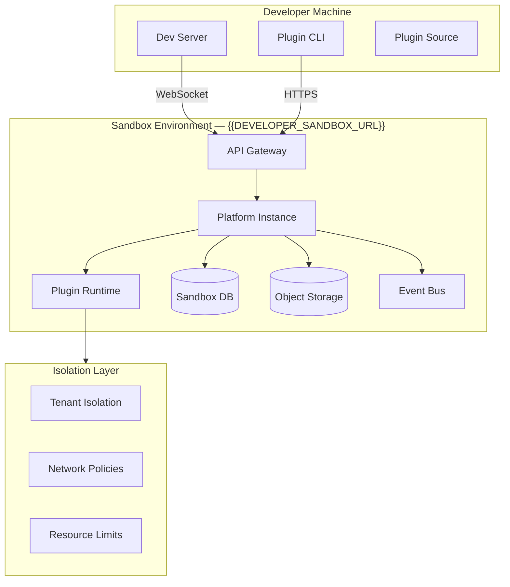
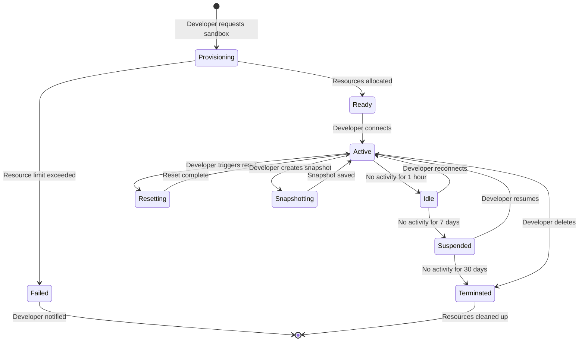

# Sandbox & Testing Environment — {{PROJECT_NAME}}

> Defines the sandbox architecture, test data provisioning, debug tools, environment lifecycle, CI/CD integration, performance testing, and production parity guarantees for the {{PROJECT_NAME}} developer sandbox at {{DEVELOPER_SANDBOX_URL}}.

---

## 1. Sandbox Architecture

### 1.1 Architecture Overview



### 1.2 Sandbox Types

| Type | Purpose | Provisioning | Lifecycle |
|---|---|---|---|
| **Personal Sandbox** | Individual developer testing | Auto-provisioned on signup | Persists until developer deletes |
| **Team Sandbox** | Shared development environment | Created by team admin | Persists per team |
| **CI Sandbox** | Automated testing in CI/CD | Ephemeral, created per test run | Destroyed after test run |
| **Review Sandbox** | Used by marketplace reviewers | Created per review | Destroyed after review |
| **Demo Sandbox** | Public demo of marketplace features | Shared, read-only | Always running |

### 1.3 Sandbox Isolation

<!-- IF {{PLUGIN_SANDBOX_TYPE}} == "container" -->
Each sandbox runs in an isolated container with dedicated database, storage, and network namespace.

```typescript
// src/marketplace/sandbox-provisioner.ts

interface SandboxProvisionConfig {
  type: 'personal' | 'team' | 'ci' | 'review' | 'demo';
  developerId: string;
  region: string; // closest to developer

  resources: {
    cpu: string;      // '0.5' (500m)
    memory: string;   // '512Mi'
    storage: string;  // '1Gi'
    dbSize: string;   // '256Mi'
  };

  network: {
    ingressAllowed: boolean;
    egressAllowed: boolean;
    allowedDomains: string[]; // external API domains the plugin needs
  };

  ttl: number; // seconds until auto-cleanup (0 = no TTL)
}
```
<!-- ENDIF -->

<!-- IF {{PLUGIN_SANDBOX_TYPE}} == "iframe" -->
Sandbox plugins run in browser iframes with Content Security Policy restrictions and postMessage communication.
<!-- ENDIF -->

<!-- IF {{PLUGIN_SANDBOX_TYPE}} == "vm" -->
Sandbox plugins run in isolated V8 VM contexts with restricted API access and memory limits.
<!-- ENDIF -->

### 1.4 Resource Limits Per Sandbox

| Resource | Personal | Team | CI |
|---|---|---|---|
| CPU | 0.5 cores | 1 core | 0.25 cores |
| Memory | 512 MB | 1 GB | 256 MB |
| Storage | 1 GB | 5 GB | 500 MB |
| Database | 256 MB | 1 GB | 128 MB |
| API rate limit | 100 req/min | 500 req/min | 200 req/min |
| Concurrent connections | 5 | 20 | 10 |
| Background tasks | 2 | 10 | 5 |
| Max lifetime | 30 days idle | 90 days idle | 1 hour |

---

## 2. Test Data

### 2.1 Seed Data Sets

| Dataset | Description | Records | Use Case |
|---|---|---|---|
| **minimal** | Bare minimum for plugin to load | 5 users, 3 projects | Quick iteration |
| **standard** | Realistic small-team data | 25 users, 50 projects, 500 tasks | Feature development |
| **enterprise** | Large-scale enterprise data | 500 users, 1000 projects, 50K tasks | Performance testing |
| **edge-cases** | Unusual data patterns | Unicode names, empty fields, max-length strings | Robustness testing |
| **empty** | No data at all | 0 records | Empty-state UX testing |

### 2.2 Seed Data Generation

```typescript
// src/marketplace/test-data.ts

interface SeedDataConfig {
  dataset: 'minimal' | 'standard' | 'enterprise' | 'edge-cases' | 'empty';
  locale?: string; // 'en', 'ja', 'ar' — for i18n testing
  customSeed?: CustomSeedData;
}

interface CustomSeedData {
  users?: Partial<User>[];
  projects?: Partial<Project>[];
  tasks?: Partial<Task>[];
  permissions?: PermissionGrant[];
}

async function seedSandbox(sandboxId: string, config: SeedDataConfig): Promise<SeedResult> {
  const dataset = loadDataset(config.dataset);

  // Apply locale-specific transformations
  if (config.locale) {
    applyLocaleTransforms(dataset, config.locale);
  }

  // Merge custom seed data
  if (config.customSeed) {
    mergeCustomData(dataset, config.customSeed);
  }

  // Insert data with referential integrity
  const result = await insertWithDependencies(sandboxId, dataset);

  return {
    usersCreated: result.counts.users,
    projectsCreated: result.counts.projects,
    tasksCreated: result.counts.tasks,
    adminUser: result.adminCredentials,
    apiKey: result.apiKey,
  };
}
```

### 2.3 Data Reset

| Reset Mode | Description | Duration |
|---|---|---|
| **Full reset** | Drop all data, re-seed from scratch | ~30s |
| **Partial reset** | Keep user accounts, reset project data | ~10s |
| **Snapshot restore** | Restore to a named snapshot | ~5s |
| **Plugin-only reset** | Clear only this plugin's storage/state | ~2s |

```typescript
// src/marketplace/sandbox-reset.ts

interface SandboxResetConfig {
  mode: 'full' | 'partial' | 'snapshot' | 'plugin-only';
  snapshotId?: string; // for 'snapshot' mode
  pluginId?: string;   // for 'plugin-only' mode
  reseedDataset?: string; // for 'full' and 'partial' modes
}

async function resetSandbox(sandboxId: string, config: SandboxResetConfig): Promise<void> {
  switch (config.mode) {
    case 'full':
      await dropAllData(sandboxId);
      if (config.reseedDataset) {
        await seedSandbox(sandboxId, { dataset: config.reseedDataset as any });
      }
      break;
    case 'partial':
      await dropProjectData(sandboxId);
      break;
    case 'snapshot':
      await restoreSnapshot(sandboxId, config.snapshotId!);
      break;
    case 'plugin-only':
      await clearPluginState(sandboxId, config.pluginId!);
      break;
  }
}
```

---

## 3. Debug Tools

### 3.1 Developer Console

An in-browser developer console embedded in the sandbox UI for real-time debugging.

| Feature | Description |
|---|---|
| **API Logger** | Shows all API calls from the plugin with request/response payloads |
| **Event Inspector** | Live feed of all events emitted and received by the plugin |
| **Storage Viewer** | Browse and edit plugin storage key-value pairs |
| **Permission Debugger** | Shows which permissions are granted and which calls were blocked |
| **Performance Profiler** | CPU/memory usage timeline, network waterfall |
| **Error Aggregator** | Grouped errors with stack traces and occurrence count |
| **State Snapshot** | Export/import complete plugin state for bug reproduction |

### 3.2 CLI Debug Commands

```bash
# Connect to running sandbox for live debugging
npx @{{PROJECT_NAME}}/plugin-cli debug --sandbox {{DEVELOPER_SANDBOX_URL}}

# Stream plugin logs in real-time
npx @{{PROJECT_NAME}}/plugin-cli logs --follow

# Inspect plugin state
npx @{{PROJECT_NAME}}/plugin-cli storage list
npx @{{PROJECT_NAME}}/plugin-cli storage get <key>
npx @{{PROJECT_NAME}}/plugin-cli storage set <key> <value>

# Trigger events manually
npx @{{PROJECT_NAME}}/plugin-cli event emit project.created '{"projectId":"test-1"}'

# Profile plugin performance
npx @{{PROJECT_NAME}}/plugin-cli profile --duration 60s --output profile.json

# Validate manifest
npx @{{PROJECT_NAME}}/plugin-cli validate ./plugin.json

# Run automated checks locally (same as marketplace review)
npx @{{PROJECT_NAME}}/plugin-cli check --all
```

### 3.3 Source Maps

| Build Mode | Source Maps | Stack Traces |
|---|---|---|
| Development | Inline source maps | Full file paths + line numbers |
| Staging | External source maps (uploaded separately) | Mapped via source map URL |
| Production | Source maps stored in artifact registry | Mapped on error reporting service |

### 3.4 Hot Reload

```typescript
// src/marketplace/dev-server.ts

interface DevServerConfig {
  /** Plugin source directory */
  src: string;

  /** Sandbox URL to connect to */
  sandboxUrl: string; // {{DEVELOPER_SANDBOX_URL}}

  /** Watch for file changes and hot-reload */
  hotReload: boolean; // default: true

  /** Open browser on start */
  openBrowser: boolean; // default: true

  /** Port for local dev server */
  port: number; // default: 3100

  /** File patterns to watch */
  watchPatterns: string[]; // default: ['src/**/*.{ts,tsx,js,jsx,css}']

  /** File patterns to ignore */
  ignorePatterns: string[]; // default: ['node_modules', 'dist', '.git']
}
```

Hot reload behavior:

| Change Type | Reload Strategy | Downtime |
|---|---|---|
| TypeScript/JavaScript | Re-compile + inject via WebSocket | ~200ms |
| CSS | Style-only hot update | ~50ms |
| `plugin.json` manifest | Full plugin restart | ~2s |
| Assets (icons, images) | File replacement | ~100ms |

---

## 4. Sandbox Lifecycle

### 4.1 Lifecycle State Machine



### 4.2 Sandbox Operations

| Operation | API Endpoint | Auth Required |
|---|---|---|
| Create sandbox | `POST /api/sandboxes` | Developer API key |
| Get sandbox status | `GET /api/sandboxes/:id` | Developer API key |
| Reset sandbox | `POST /api/sandboxes/:id/reset` | Developer API key |
| Create snapshot | `POST /api/sandboxes/:id/snapshots` | Developer API key |
| Restore snapshot | `POST /api/sandboxes/:id/snapshots/:snapshotId/restore` | Developer API key |
| Delete sandbox | `DELETE /api/sandboxes/:id` | Developer API key |
| List sandboxes | `GET /api/sandboxes` | Developer API key |

### 4.3 Auto-Cleanup Policy

| Sandbox Type | Idle Timeout | Suspended Timeout | Data Retention |
|---|---|---|---|
| Personal | 7 days → suspend | 30 days → terminate | 90 days after termination |
| Team | 14 days → suspend | 60 days → terminate | 90 days after termination |
| CI | 1 hour → terminate | — | 24 hours |
| Review | 48 hours → terminate | — | 7 days |

---

## 5. CI/CD Integration

### 5.1 GitHub Actions Example

```yaml
# .github/workflows/plugin-test.yml
name: Plugin Tests

on:
  push:
    branches: [main]
  pull_request:
    branches: [main]

jobs:
  test:
    runs-on: ubuntu-latest
    steps:
      - uses: actions/checkout@v4

      - uses: actions/setup-node@v4
        with:
          node-version: '20'

      - run: npm ci

      - name: Run unit tests
        run: npm test -- --coverage

      - name: Validate manifest
        run: npx @{{PROJECT_NAME}}/plugin-cli validate ./plugin.json

      - name: Run marketplace checks locally
        run: npx @{{PROJECT_NAME}}/plugin-cli check --all

      - name: Integration tests against sandbox
        env:
          SANDBOX_API_KEY: ${{ secrets.SANDBOX_API_KEY }}
        run: |
          npx @{{PROJECT_NAME}}/plugin-cli sandbox create --type ci --dataset standard
          npm run test:integration
          npx @{{PROJECT_NAME}}/plugin-cli sandbox destroy

      - name: Upload coverage
        uses: codecov/codecov-action@v4
        with:
          files: ./coverage/lcov.info
```

### 5.2 GitLab CI Example

```yaml
# .gitlab-ci.yml
stages:
  - test
  - validate
  - integration

unit-tests:
  stage: test
  image: node:20
  script:
    - npm ci
    - npm test -- --coverage
  artifacts:
    reports:
      coverage_report:
        coverage_format: cobertura
        path: coverage/cobertura-coverage.xml

manifest-validation:
  stage: validate
  image: node:20
  script:
    - npm ci
    - npx @{{PROJECT_NAME}}/plugin-cli validate ./plugin.json
    - npx @{{PROJECT_NAME}}/plugin-cli check --all

integration-tests:
  stage: integration
  image: node:20
  variables:
    SANDBOX_API_KEY: $SANDBOX_API_KEY
  script:
    - npm ci
    - npx @{{PROJECT_NAME}}/plugin-cli sandbox create --type ci --dataset standard
    - npm run test:integration
  after_script:
    - npx @{{PROJECT_NAME}}/plugin-cli sandbox destroy
```

### 5.3 CI/CD Best Practices

| Practice | Description |
|---|---|
| Ephemeral sandboxes | Create a fresh sandbox for each CI run, destroy after |
| Deterministic seed data | Use fixed datasets for reproducible tests |
| Parallel test execution | Run unit and integration tests in parallel stages |
| Manifest validation | Validate manifest before running expensive tests |
| Coverage enforcement | Require > 80% coverage for submission |
| Snapshot testing | Compare UI snapshots between versions |
| Dependency scanning | Run `npm audit` in CI pipeline |

---

## 6. Performance Testing

### 6.1 Performance Test Suite

| Test | Metric | Threshold | Tool |
|---|---|---|---|
| **Plugin load time** | Time from install to first render | < 2s | Custom timer |
| **API response time** | P95 latency for plugin API calls | < 200ms | k6 |
| **Memory usage** | Heap size after 30-min active session | < 50 MB | Chrome DevTools Protocol |
| **Event throughput** | Events processed per second | > 100/s | Custom benchmark |
| **Storage operations** | IOPS for plugin storage | > 50 ops/s | Custom benchmark |
| **Concurrent users** | Plugin performance under N users | Stable at 100 users | k6 |
| **Background task duration** | Avg task completion time | < 30s for standard tier | Custom timer |

### 6.2 Load Testing Configuration

```typescript
// src/marketplace/perf-test.ts

interface PerformanceTestConfig {
  /** Sandbox to test against */
  sandboxUrl: string; // {{DEVELOPER_SANDBOX_URL}}

  /** Test scenarios */
  scenarios: {
    /** Ramp-up: gradually increase virtual users */
    rampUp: {
      startVUs: 1;
      endVUs: 100;
      duration: '5m';
    };

    /** Steady state: constant load */
    steady: {
      vus: 50;
      duration: '10m';
    };

    /** Spike: sudden load increase */
    spike: {
      baseVUs: 10;
      spikeVUs: 200;
      spikeDuration: '1m';
    };
  };

  /** Thresholds */
  thresholds: {
    'http_req_duration': ['p(95)<200'],
    'http_req_failed': ['rate<0.01'],
    'plugin_load_time': ['p(95)<2000'],
    'memory_usage': ['max<52428800'], // 50 MB
  };
}
```

### 6.3 Performance Budget

| Category | Budget | Enforcement |
|---|---|---|
| Total bundle size | < 5 MB compressed | CI check |
| JavaScript bundle | < 2 MB compressed | CI check |
| CSS bundle | < 500 KB compressed | CI check |
| Image assets | < 2 MB total | CI check |
| First load JS | < 500 KB | Lighthouse check |
| API calls on load | < 5 requests | Network monitoring |
| DOM nodes on load | < 500 nodes | DOM counter |

---

## 7. Production Parity

### 7.1 Parity Matrix

| Dimension | Sandbox | Production | Parity |
|---|---|---|---|
| **API surface** | Full API | Full API | 100% |
| **API behavior** | Identical responses | Identical responses | 100% |
| **Auth flows** | Real OAuth, test credentials | Real OAuth, real credentials | 99% (test creds) |
| **Database** | Same schema, reduced size | Full production DB | 95% |
| **Event system** | Full event bus | Full event bus | 100% |
| **Rate limits** | Relaxed (2x production) | Production limits | ~50% |
| **CDN / Edge** | No CDN caching | Full CDN | 0% |
| **Geographic distribution** | Single region | Multi-region | 0% |
| **Third-party integrations** | Mock/test endpoints | Real endpoints | Varies |
| **Performance characteristics** | Similar (smaller infra) | Production infra | ~80% |

### 7.2 Known Divergences

| Divergence | Sandbox Behavior | Production Behavior | Mitigation |
|---|---|---|---|
| Rate limits | 2x relaxed | Enforced per `{{PLUGIN_RATE_LIMIT_DEFAULT}}` | Test with `--strict-rate-limits` flag |
| CDN caching | No caching | Aggressive caching | Test cache headers in integration tests |
| Email/SMS delivery | Intercepted, logged | Real delivery | Check intercepted messages in sandbox UI |
| Payment processing | Stripe test mode | Stripe live mode | Use Stripe test cards |
| Webhooks | Delivered to sandbox tunnels | Delivered to production URLs | Test webhook signatures |
| SSL certificates | Self-signed / Let's Encrypt staging | Production certificates | Ignore cert warnings in sandbox |

### 7.3 Parity Enforcement

- [ ] API schema tests run against both sandbox and production (weekly)
- [ ] Database migration scripts tested in sandbox before production
- [ ] Event payload schemas validated against production snapshots
- [ ] Sandbox platform version tracks production within 24 hours
- [ ] Performance baseline tests compare sandbox vs. production monthly
- [ ] Parity report generated automatically, shared with developer community

---

## Sandbox & Testing Checklist

- [ ] Sandbox architecture provisioned with tenant isolation
- [ ] Resource limits defined per sandbox type (personal, team, CI, review)
- [ ] Seed datasets available: minimal, standard, enterprise, edge-cases, empty
- [ ] Data reset supports full, partial, snapshot, and plugin-only modes
- [ ] Developer console provides API logger, event inspector, storage viewer, profiler
- [ ] CLI debug commands cover logs, storage, events, profiling, validation
- [ ] Hot reload works for code, CSS, manifest, and assets
- [ ] Sandbox lifecycle manages provisioning, idle timeout, suspension, and cleanup
- [ ] CI/CD integration documented with GitHub Actions and GitLab CI examples
- [ ] Performance test suite covers load time, API latency, memory, throughput
- [ ] Performance budgets enforced in CI pipeline
- [ ] Production parity matrix documented with known divergences
- [ ] Parity enforcement tests run automatically
