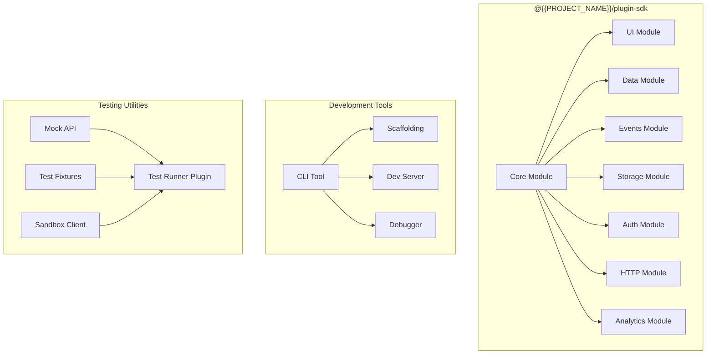

# SDK Design — {{PROJECT_NAME}}

> Defines the SDK architecture, core modules, versioning strategy, distribution channels, testing utilities, compatibility policy, and documentation standards for the {{PROJECT_NAME}} plugin SDK supporting {{SDK_LANGUAGES}}.

---

## 1. SDK Architecture

### 1.1 Design Principles

| Principle | Description |
|---|---|
| **Progressive disclosure** | Simple things are simple, complex things are possible. The API surface starts minimal and reveals depth as needed. |
| **Type-safe by default** | TypeScript-first with full type definitions. Runtime type checking in development mode. |
| **Zero-config defaults** | Sensible defaults for every option. Developers configure only what they need to change. |
| **Fail-fast with clear errors** | Invalid inputs throw immediately with actionable error messages, not silent failures. |
| **Offline-capable** | SDK initializes and validates locally. Network calls are explicit and documented. |
| **Tree-shakeable** | Modular architecture allows bundlers to eliminate unused code. |
| **Backward-compatible** | Minor versions never break existing code. Major versions come with migration tools. |

### 1.2 Architecture Diagram



### 1.3 Package Structure

```
@{{PROJECT_NAME}}/plugin-sdk          # Main SDK package
@{{PROJECT_NAME}}/plugin-sdk-react    # React bindings for UI extensions
@{{PROJECT_NAME}}/plugin-sdk-vue      # Vue bindings for UI extensions
@{{PROJECT_NAME}}/create-plugin       # Project scaffolding CLI
@{{PROJECT_NAME}}/plugin-dev-server   # Local development server
@{{PROJECT_NAME}}/plugin-testing      # Testing utilities and mocks
@{{PROJECT_NAME}}/plugin-types        # TypeScript type definitions (standalone)
```

---

## 2. Core Modules

### 2.1 SDK Skeleton

```typescript
// src/sdk/index.ts — Main SDK entry point

export { PluginSDK } from './core';
export { UIModule } from './ui';
export { DataModule } from './data';
export { EventsModule } from './events';
export { StorageModule } from './storage';
export { AuthModule } from './auth';
export { HTTPModule } from './http';
export { AnalyticsModule } from './analytics';

// Types
export type {
  PluginAPI,
  PluginManifest,
  PluginContext,
  PluginConfig,
  ExtensionPointConfig,
  PanelConfig,
  ToolbarActionConfig,
  SettingsPageConfig,
  ContextMenuConfig,
  ModalConfig,
  NotificationConfig,
  QueryParams,
  PaginatedResult,
  EventPayload,
  EventHandler,
  StorageOptions,
  ThemeTokens,
  UserContext,
} from './types';
```

### 2.2 Core Module

```typescript
// src/sdk/core.ts

import type { PluginManifest, PluginAPI, PluginContext } from './types';

/**
 * Main SDK class. Instantiated once per plugin lifecycle.
 *
 * @example
 * ```typescript
 * import { PluginSDK } from '@{{PROJECT_NAME}}/plugin-sdk';
 *
 * const sdk = new PluginSDK({
 *   manifest: require('./plugin.json'),
 * });
 *
 * sdk.onActivate(async (api) => {
 *   // Plugin activation logic
 *   api.ui.registerPanel({ ... });
 * });
 *
 * sdk.onDeactivate(async (api) => {
 *   // Cleanup logic
 * });
 * ```
 */
export class PluginSDK {
  private manifest: PluginManifest;
  private context: PluginContext | null = null;
  private activateHandler: ((api: PluginAPI) => Promise<void>) | null = null;
  private deactivateHandler: ((api: PluginAPI) => Promise<void>) | null = null;
  private upgradeHandler: ((api: PluginAPI, from: string, to: string) => Promise<void>) | null = null;

  constructor(config: { manifest: PluginManifest }) {
    this.manifest = config.manifest;
    this.validateManifest();
  }

  /** Register activation handler */
  onActivate(handler: (api: PluginAPI) => Promise<void>): void {
    this.activateHandler = handler;
  }

  /** Register deactivation handler */
  onDeactivate(handler: (api: PluginAPI) => Promise<void>): void {
    this.deactivateHandler = handler;
  }

  /** Register upgrade handler */
  onUpgrade(handler: (api: PluginAPI, from: string, to: string) => Promise<void>): void {
    this.upgradeHandler = handler;
  }

  /** Get current API version */
  get apiVersion(): string {
    return this.manifest.apiVersion; // {{PLUGIN_API_VERSION}}
  }

  /** Get plugin ID */
  get pluginId(): string {
    return this.manifest.id;
  }

  /** Get plugin version */
  get pluginVersion(): string {
    return this.manifest.version;
  }

  private validateManifest(): void {
    if (!this.manifest.id) {
      throw new SDKError('MANIFEST_INVALID', 'Plugin manifest must include an "id" field');
    }
    if (!this.manifest.apiVersion) {
      throw new SDKError('MANIFEST_INVALID', 'Plugin manifest must include an "apiVersion" field');
    }
    if (!this.manifest.version) {
      throw new SDKError('MANIFEST_INVALID', 'Plugin manifest must include a "version" field');
    }
  }
}

/**
 * Structured SDK error with error code for programmatic handling.
 */
export class SDKError extends Error {
  constructor(
    public readonly code: string,
    message: string,
    public readonly details?: Record<string, unknown>,
  ) {
    super(`[${code}] ${message}`);
    this.name = 'SDKError';
  }
}
```

### 2.3 UI Module

```typescript
// src/sdk/ui.ts

import type {
  PanelConfig,
  ToolbarActionConfig,
  SettingsPageConfig,
  ContextMenuConfig,
  ModalConfig,
  ModalResult,
  NotificationConfig,
  ThemeTokens,
} from './types';

export class UIModule {
  /**
   * Register a panel in the workspace.
   * Panel renders in the position specified by config.
   */
  registerPanel(config: PanelConfig): void {
    this.validateConfig('panel', config);
    this.bridge.send('ui.registerPanel', config);
  }

  /**
   * Register a toolbar action button.
   * Maximum {{MAX_TOOLBAR_ACTIONS}} toolbar actions per plugin.
   */
  registerToolbarAction(config: ToolbarActionConfig): void {
    this.validateConfig('toolbar', config);
    this.bridge.send('ui.registerToolbarAction', config);
  }

  /**
   * Register a settings page under plugin preferences.
   */
  registerSettingsPage(config: SettingsPageConfig): void {
    this.bridge.send('ui.registerSettingsPage', config);
  }

  /**
   * Add items to context menus.
   */
  registerContextMenuItem(config: ContextMenuConfig): void {
    this.bridge.send('ui.registerContextMenuItem', config);
  }

  /**
   * Show a modal dialog. Returns a promise that resolves
   * when the modal is closed.
   */
  async showModal(config: ModalConfig): Promise<ModalResult> {
    return this.bridge.request('ui.showModal', config);
  }

  /**
   * Show a toast notification.
   */
  showNotification(config: NotificationConfig): void {
    this.bridge.send('ui.showNotification', config);
  }

  /**
   * Get current theme tokens for consistent styling.
   * Re-emits when theme changes (dark mode toggle, etc.).
   */
  async getTheme(): Promise<ThemeTokens> {
    return this.bridge.request('ui.getTheme');
  }

  /**
   * Subscribe to theme changes.
   */
  onThemeChange(handler: (theme: ThemeTokens) => void): () => void {
    return this.bridge.on('ui.themeChanged', handler);
  }

  /**
   * Navigate the host application to a path.
   */
  async navigate(path: string): Promise<void> {
    return this.bridge.request('ui.navigate', { path });
  }

  private bridge: any; // injected by runtime
  private validateConfig(type: string, config: any): void { /* validation logic */ }
}
```

### 2.4 Data Module

```typescript
// src/sdk/data.ts

import type { QueryParams, PaginatedResult } from './types';

export class DataModule {
  /**
   * Query a data collection with filtering, sorting, and pagination.
   *
   * @example
   * ```typescript
   * const result = await api.data.query('projects', {
   *   filter: { status: 'active', owner: userId },
   *   sort: { field: 'updatedAt', order: 'desc' },
   *   page: 1,
   *   pageSize: 20,
   * });
   * ```
   */
  async query<T>(collection: string, query: QueryParams): Promise<PaginatedResult<T>> {
    this.assertPermission(`data:read:${collection}`);
    return this.bridge.request('data.query', { collection, query });
  }

  /**
   * Get a single record by ID.
   */
  async get<T>(collection: string, id: string): Promise<T | null> {
    this.assertPermission(`data:read:${collection}`);
    return this.bridge.request('data.get', { collection, id });
  }

  /**
   * Create a new record.
   */
  async create<T>(collection: string, data: Partial<T>): Promise<T> {
    this.assertPermission(`data:write:${collection}`);
    return this.bridge.request('data.create', { collection, data });
  }

  /**
   * Update an existing record.
   */
  async update<T>(collection: string, id: string, data: Partial<T>): Promise<T> {
    this.assertPermission(`data:write:${collection}`);
    return this.bridge.request('data.update', { collection, id, data });
  }

  /**
   * Delete a record.
   */
  async delete(collection: string, id: string): Promise<void> {
    this.assertPermission(`data:write:${collection}`);
    return this.bridge.request('data.delete', { collection, id });
  }

  private bridge: any;
  private assertPermission(permission: string): void {
    // Throws SDKError if plugin does not have the required permission
  }
}
```

---

## 3. Versioning

### 3.1 SDK Versioning Policy

| Version Component | Meaning | Example |
|---|---|---|
| Major (X.0.0) | Breaking API changes | `2.0.0` — method signature changes |
| Minor (0.X.0) | New features, backward-compatible | `1.3.0` — new UI component type |
| Patch (0.0.X) | Bug fixes, security patches | `1.3.1` — fix event handler leak |

### 3.2 API Version ↔ SDK Version Mapping

| API Version | SDK Version Range | Support Status |
|---|---|---|
| `{{PLUGIN_API_VERSION}}` | `^1.0.0` | Current, actively developed |
| `v0` (if applicable) | `^0.x.x` | Deprecated, security patches only |

### 3.3 Breaking Change Policy

| Change Type | Impact | Handling |
|---|---|---|
| Method removed | Breaking | Major version bump, 12-month deprecation notice |
| Method signature changed | Breaking | Major version bump, codemod provided |
| New required parameter | Breaking | Major version bump |
| New optional parameter | Non-breaking | Minor version bump |
| Return type change | Breaking | Major version bump |
| New method added | Non-breaking | Minor version bump |
| Bug fix | Non-breaking | Patch version |
| Performance improvement | Non-breaking | Patch version |

### 3.4 Deprecation Flow

```typescript
// How deprecation works in the SDK

/**
 * @deprecated Since v1.5.0. Use `api.data.query()` instead.
 * Will be removed in v2.0.0.
 */
async function fetchRecords(collection: string): Promise<any[]> {
  console.warn(
    `[{{PROJECT_NAME}} SDK] fetchRecords() is deprecated. ` +
    `Use api.data.query() instead. Will be removed in v2.0.0.`
  );
  return this.data.query(collection, {});
}
```

---

## 4. Distribution

### 4.1 Package Distribution

| Channel | Package | Usage |
|---|---|---|
| npm | `@{{PROJECT_NAME}}/plugin-sdk` | Primary distribution |
| CDN | `https://cdn.{{PROJECT_NAME}}.com/sdk/{{PLUGIN_API_VERSION}}/sdk.min.js` | Browser script tag |
| GitHub | `github:{{PROJECT_NAME}}/plugin-sdk` | Source access |
| Private registry | `npm.{{PROJECT_NAME}}.com` | Enterprise customers |

### 4.2 Bundle Sizes

| Package | Minified | Gzipped | Tree-Shaken (core only) |
|---|---|---|---|
| Full SDK | ~120 KB | ~35 KB | ~25 KB |
| Core only | ~25 KB | ~8 KB | ~8 KB |
| UI module | ~40 KB | ~12 KB | — |
| Data module | ~15 KB | ~5 KB | — |
| React bindings | ~30 KB | ~10 KB | — |

### 4.3 CDN Usage

```html
<!-- Full SDK via CDN -->
<script src="https://cdn.{{PROJECT_NAME}}.com/sdk/{{PLUGIN_API_VERSION}}/sdk.min.js"></script>

<!-- ES Module import -->
<script type="module">
  import { PluginSDK } from 'https://cdn.{{PROJECT_NAME}}.com/sdk/{{PLUGIN_API_VERSION}}/sdk.esm.js';
</script>
```

### 4.4 Installation Matrix

| Environment | Command | Notes |
|---|---|---|
| Node.js (npm) | `npm install @{{PROJECT_NAME}}/plugin-sdk` | Full SDK |
| Node.js (yarn) | `yarn add @{{PROJECT_NAME}}/plugin-sdk` | Full SDK |
| Node.js (pnpm) | `pnpm add @{{PROJECT_NAME}}/plugin-sdk` | Full SDK |
| Deno | `import sdk from "npm:@{{PROJECT_NAME}}/plugin-sdk"` | npm compat |
| Browser | `<script src="...">` | CDN |
| React project | `npm install @{{PROJECT_NAME}}/plugin-sdk-react` | React bindings |
| Vue project | `npm install @{{PROJECT_NAME}}/plugin-sdk-vue` | Vue bindings |

---

## 5. Testing Utilities

### 5.1 Test Framework

```typescript
// src/sdk/testing/index.ts

export { createMockAPI } from './mock-api';
export { createTestSandbox } from './sandbox';
export { createFixtures } from './fixtures';
export { PluginTestRunner } from './runner';
```

### 5.2 Mock API

```typescript
// src/sdk/testing/mock-api.ts

import type { PluginAPI } from '../types';

/**
 * Creates a fully-mocked PluginAPI for unit testing.
 * All methods return sensible defaults and can be spied on.
 *
 * @example
 * ```typescript
 * import { createMockAPI } from '@{{PROJECT_NAME}}/plugin-testing';
 *
 * test('panel registers on activate', async () => {
 *   const api = createMockAPI();
 *
 *   await activate(api);
 *
 *   expect(api.ui.registerPanel).toHaveBeenCalledWith(
 *     expect.objectContaining({ id: 'my-panel' })
 *   );
 * });
 * ```
 */
export function createMockAPI(overrides?: Partial<PluginAPI>): PluginAPI {
  return {
    version: '{{PLUGIN_API_VERSION}}',
    plugin: {
      id: 'test-plugin',
      version: '1.0.0',
      manifest: createDefaultManifest(),
    },
    ui: {
      registerPanel: jest.fn(),
      registerToolbarAction: jest.fn(),
      registerSettingsPage: jest.fn(),
      registerContextMenuItem: jest.fn(),
      showModal: jest.fn().mockResolvedValue({ action: 'close' }),
      showNotification: jest.fn(),
      getTheme: jest.fn().mockResolvedValue(createDefaultTheme()),
      navigate: jest.fn().mockResolvedValue(undefined),
    },
    data: {
      query: jest.fn().mockResolvedValue({ items: [], total: 0, page: 1, pageSize: 20 }),
      get: jest.fn().mockResolvedValue(null),
      create: jest.fn().mockImplementation((_, data) => ({ id: 'new-id', ...data })),
      update: jest.fn().mockImplementation((_, id, data) => ({ id, ...data })),
      delete: jest.fn().mockResolvedValue(undefined),
    },
    storage: {
      get: jest.fn().mockResolvedValue(null),
      set: jest.fn().mockResolvedValue(undefined),
      delete: jest.fn().mockResolvedValue(undefined),
      list: jest.fn().mockResolvedValue([]),
    },
    events: {
      on: jest.fn().mockReturnValue(() => {}),
      emit: jest.fn().mockResolvedValue(undefined),
    },
    http: {
      fetch: jest.fn().mockResolvedValue(new Response('{}', { status: 200 })),
    },
    auth: {
      getCurrentUser: jest.fn().mockResolvedValue({ id: 'user-1', name: 'Test User' }),
      getPermissions: jest.fn().mockResolvedValue([]),
      getOAuthToken: jest.fn().mockResolvedValue('test-token'),
    },
    analytics: {
      track: jest.fn(),
    },
    ...overrides,
  };
}
```

### 5.3 Integration Test Sandbox

```typescript
// src/sdk/testing/sandbox.ts

/**
 * Creates a connection to the development sandbox at {{DEVELOPER_SANDBOX_URL}}.
 * Provides a real platform environment with test data for integration testing.
 *
 * @example
 * ```typescript
 * import { createTestSandbox } from '@{{PROJECT_NAME}}/plugin-testing';
 *
 * const sandbox = await createTestSandbox({
 *   apiKey: process.env.SANDBOX_API_KEY,
 *   resetBetweenTests: true,
 * });
 *
 * afterEach(async () => {
 *   await sandbox.reset();
 * });
 *
 * test('creates a project via API', async () => {
 *   const api = sandbox.getAPI();
 *   const project = await api.data.create('projects', {
 *     name: 'Test Project',
 *   });
 *   expect(project.id).toBeDefined();
 * });
 * ```
 */
export async function createTestSandbox(config: SandboxConfig): Promise<TestSandbox> {
  // Implementation connects to {{DEVELOPER_SANDBOX_URL}}
  return new TestSandbox(config);
}

interface SandboxConfig {
  apiKey: string;
  sandboxUrl?: string; // defaults to {{DEVELOPER_SANDBOX_URL}}
  resetBetweenTests?: boolean;
  seedData?: SeedDataConfig;
}
```

---

## 6. Compatibility Policy

### 6.1 Platform Compatibility Matrix

| SDK Version | Min Platform Version | Max Platform Version | Node.js | Browsers |
|---|---|---|---|---|
| 1.x | 2.0 | latest | >= 18 | Chrome 90+, Firefox 88+, Safari 15+, Edge 90+ |
| 0.x (deprecated) | 1.5 | 1.x | >= 16 | Chrome 80+, Firefox 78+, Safari 14+ |

### 6.2 Runtime Compatibility Checks

```typescript
// src/sdk/compat.ts

interface CompatibilityCheck {
  /** Check SDK version against platform version */
  checkPlatformVersion(platformVersion: string): CompatResult;

  /** Check browser compatibility */
  checkBrowserSupport(): CompatResult;

  /** Check required APIs are available */
  checkRequiredAPIs(): CompatResult;

  /** Run all checks and return aggregate result */
  checkAll(): CompatResult[];
}

interface CompatResult {
  compatible: boolean;
  check: string;
  message: string;
  severity: 'error' | 'warning' | 'info';
  resolution?: string;
}

function performCompatibilityChecks(): CompatResult[] {
  const results: CompatResult[] = [];

  // Check API version compatibility
  const apiVersion = getPlatformAPIVersion();
  if (!isVersionCompatible(apiVersion, '{{PLUGIN_API_VERSION}}')) {
    results.push({
      compatible: false,
      check: 'api-version',
      message: `Plugin requires API {{PLUGIN_API_VERSION}} but platform provides ${apiVersion}`,
      severity: 'error',
      resolution: 'Update the plugin to target the current API version',
    });
  }

  // Check browser support
  if (typeof SharedArrayBuffer === 'undefined') {
    results.push({
      compatible: true,
      check: 'shared-array-buffer',
      message: 'SharedArrayBuffer not available — some features may be slower',
      severity: 'warning',
    });
  }

  return results;
}
```

### 6.3 Polyfill Strategy

| Feature | Polyfill | Size | Condition |
|---|---|---|---|
| `structuredClone` | Custom shim | 1 KB | `typeof structuredClone === 'undefined'` |
| `AbortController` | `abort-controller` | 2 KB | `typeof AbortController === 'undefined'` |
| `ReadableStream` | `web-streams-polyfill` | 15 KB | `typeof ReadableStream === 'undefined'` |
| `crypto.randomUUID` | Custom shim | 0.5 KB | `!crypto?.randomUUID` |

---

## 7. SDK Documentation

### 7.1 Documentation Structure

| Document | Audience | Generated From |
|---|---|---|
| API Reference | All developers | TypeDoc from source |
| Getting Started Guide | New developers | Hand-written markdown |
| Migration Guides | Upgrading developers | Hand-written per version |
| Cookbook / Recipes | Intermediate developers | Hand-written with tested examples |
| Architecture Guide | Advanced developers | Hand-written |
| Changelog | All developers | Conventional commits |

### 7.2 JSDoc Standards

Every public method in the SDK must include:

```typescript
/**
 * Brief description of what the method does.
 *
 * Longer description with context, edge cases, and important notes.
 * Mention any side effects, rate limits, or permission requirements.
 *
 * @param paramName - Description of the parameter
 * @returns Description of what is returned
 * @throws {SDKError} PERMISSION_DENIED — when plugin lacks required permission
 * @throws {SDKError} NOT_FOUND — when the requested resource does not exist
 *
 * @example
 * ```typescript
 * // Basic usage
 * const result = await api.data.query('projects', {
 *   filter: { status: 'active' },
 * });
 * console.log(result.items); // Project[]
 * ```
 *
 * @example
 * ```typescript
 * // With pagination
 * const page2 = await api.data.query('projects', {
 *   page: 2,
 *   pageSize: 50,
 *   sort: { field: 'name', order: 'asc' },
 * });
 * ```
 *
 * @since 1.0.0
 * @see {@link DataModule.get} for fetching a single record
 */
```

### 7.3 Changelog Format

```markdown
# Changelog

## [1.3.0] - 2024-03-15

### Added
- `api.ui.registerContextMenuItem()` — extend context menus (#142)
- `api.events.onBatch()` — subscribe to batched events (#138)

### Changed
- `api.data.query()` now supports nested field filters (#145)

### Deprecated
- `api.data.fetchAll()` — use `api.data.query()` with pagination instead. Removal in v2.0.0.

### Fixed
- Event handler memory leak when plugin deactivates without unsubscribing (#141)
- Incorrect type inference for `api.storage.get<T>()` (#139)

### Security
- Updated dependency `ws` to 8.16.0 to address CVE-2024-XXXXX
```

---

## SDK Design Checklist

- [ ] Architecture follows progressive disclosure — simple API surface, depth available when needed
- [ ] Core module handles manifest validation, lifecycle, and bridge initialization
- [ ] UI module supports panels, toolbar actions, settings pages, context menus, modals, notifications
- [ ] Data module provides type-safe CRUD with permission checks
- [ ] Events module supports subscriptions, filtering, batching, and cleanup
- [ ] Storage module provides isolated key-value storage with TTL and encryption options
- [ ] SDK versioning follows semver with clear breaking change policy
- [ ] Distribution covers npm, CDN, and private registry
- [ ] Bundle size targets met — tree-shakeable, core under 10 KB gzipped
- [ ] Testing utilities include mock API, integration sandbox, and fixtures
- [ ] Compatibility matrix documented for platform versions, Node.js, and browsers
- [ ] JSDoc on every public method with examples, @since, and @throws
- [ ] Changelog maintained in conventional commit format
- [ ] React and Vue bindings available as separate packages
