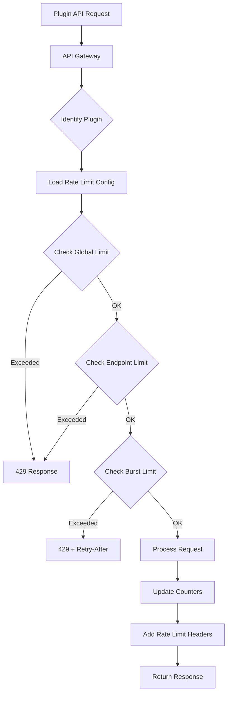
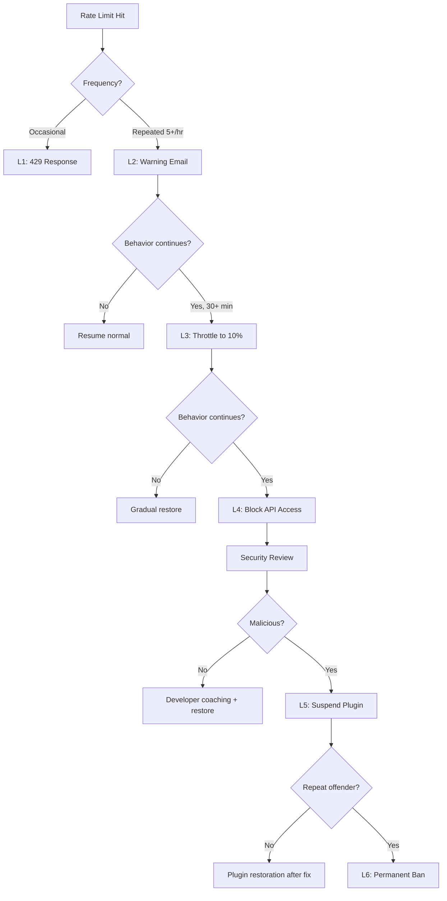

# Third-Party Rate Limiting — {{PROJECT_NAME}}

> Defines the rate limit design, quota tiers, response headers and status codes, abuse detection patterns, escalation procedures, and DDoS protection for the {{PROJECT_NAME}} plugin API with a default limit of {{PLUGIN_RATE_LIMIT_DEFAULT}}.

---

## 1. Rate Limit Design

### 1.1 Design Principles

| Principle | Description |
|---|---|
| **Fair usage** | Every plugin gets a baseline allocation. No plugin can starve others. |
| **Predictable** | Developers know their limits and can plan around them. |
| **Transparent** | Every response includes rate limit headers. |
| **Graduated** | Exceeding limits triggers throttling before hard blocking. |
| **Contextual** | Limits scale with plugin tier, endpoint sensitivity, and time of day. |
| **Recoverable** | Rate-limited requests can be retried after the reset window. |

### 1.2 Rate Limit Architecture



### 1.3 Rate Limit Algorithm

**Token Bucket with Sliding Window**

The rate limiter uses a token bucket algorithm with a sliding window for smooth request distribution:

```typescript
// src/marketplace/rate-limit/token-bucket.ts

interface TokenBucketConfig {
  /** Maximum tokens in the bucket */
  capacity: number;

  /** Tokens added per second */
  refillRate: number;

  /** Window size for sliding window calculation */
  windowMs: number;

  /** Allow brief bursts above the steady-state rate */
  burstMultiplier: number; // e.g., 1.5 = allow 50% burst
}

class TokenBucket {
  private tokens: number;
  private lastRefill: number;
  private config: TokenBucketConfig;

  constructor(config: TokenBucketConfig) {
    this.config = config;
    this.tokens = config.capacity;
    this.lastRefill = Date.now();
  }

  /**
   * Try to consume a token. Returns true if allowed, false if rate-limited.
   */
  tryConsume(cost: number = 1): RateLimitResult {
    this.refill();

    if (this.tokens >= cost) {
      this.tokens -= cost;
      return {
        allowed: true,
        remaining: Math.floor(this.tokens),
        limit: this.config.capacity,
        resetAt: this.calculateResetTime(),
        retryAfterMs: 0,
      };
    }

    return {
      allowed: false,
      remaining: 0,
      limit: this.config.capacity,
      resetAt: this.calculateResetTime(),
      retryAfterMs: this.calculateRetryAfter(cost),
    };
  }

  private refill(): void {
    const now = Date.now();
    const elapsed = (now - this.lastRefill) / 1000;
    const tokensToAdd = elapsed * this.config.refillRate;

    this.tokens = Math.min(
      this.config.capacity * this.config.burstMultiplier,
      this.tokens + tokensToAdd
    );
    this.lastRefill = now;
  }

  private calculateRetryAfter(cost: number): number {
    const deficit = cost - this.tokens;
    return Math.ceil(deficit / this.config.refillRate * 1000);
  }

  private calculateResetTime(): number {
    const deficit = this.config.capacity - this.tokens;
    return Date.now() + Math.ceil(deficit / this.config.refillRate * 1000);
  }
}

interface RateLimitResult {
  allowed: boolean;
  remaining: number;
  limit: number;
  resetAt: number; // Unix timestamp ms
  retryAfterMs: number;
}
```

### 1.4 Rate Limit Storage

| Storage Backend | Use Case | Latency | Consistency |
|---|---|---|---|
| **Redis** | Primary rate limit counters | < 1ms | Eventually consistent (multi-region) |
| **Local Memory** | L1 cache for hot paths | < 0.1ms | Node-local only |
| **DynamoDB** | Persistent quota tracking | < 5ms | Strongly consistent |

```typescript
// src/marketplace/rate-limit/redis-store.ts

interface RateLimitStore {
  /** Get current token count for a key */
  getTokens(key: string): Promise<number>;

  /** Decrement tokens atomically */
  consumeTokens(key: string, count: number, config: TokenBucketConfig): Promise<RateLimitResult>;

  /** Reset tokens to full capacity */
  resetTokens(key: string, capacity: number): Promise<void>;

  /** Get all rate limit state for a plugin (for dashboard) */
  getState(pluginId: string): Promise<RateLimitState>;
}
```

---

## 2. Quota Tiers

### 2.1 Plugin Tier Limits

| Tier | Global Rate (req/min) | Global Rate (req/day) | Burst Multiplier | Concurrent Requests | Cost |
|---|---|---|---|---|---|
| **Free** | 60 | 10,000 | 1.0x | 5 | $0 |
| **Standard** | {{PLUGIN_RATE_LIMIT_DEFAULT}} | 50,000 | 1.5x | 10 | Included with paid plugin |
| **Professional** | 500 | 250,000 | 2.0x | 25 | $49/mo add-on |
| **Enterprise** | 2,000 | 1,000,000 | 3.0x | 100 | Custom pricing |

### 2.2 Endpoint-Specific Limits

Not all endpoints are equal. Write operations, search queries, and data-intensive endpoints have lower limits:

| Endpoint Category | Free | Standard | Professional | Enterprise |
|---|---|---|---|---|
| `data:read` (simple GET) | 60/min | 200/min | 500/min | 2000/min |
| `data:read` (search/query) | 20/min | 60/min | 200/min | 800/min |
| `data:write` (create/update) | 20/min | 60/min | 200/min | 800/min |
| `data:delete` | 10/min | 30/min | 100/min | 400/min |
| `storage:read` | 60/min | 200/min | 500/min | 2000/min |
| `storage:write` | 30/min | 100/min | 300/min | 1000/min |
| `events:emit` | 10/min | 30/min | 100/min | 400/min |
| `http:external` | 30/min | 100/min | 300/min | 1000/min |
| `auth:token` | 5/min | 10/min | 20/min | 50/min |

### 2.3 Cost-Based Rate Limiting

Some operations consume more than 1 token:

| Operation | Token Cost | Rationale |
|---|---|---|
| Simple read (single record) | 1 | Baseline |
| List query (paginated) | 2 | Higher DB load |
| Search query (full-text) | 5 | Expensive computation |
| Write operation | 2 | Data integrity checks |
| Bulk write (batch) | N × 1 | Per record in batch |
| File upload | 10 | Storage + processing |
| Export (large dataset) | 20 | Expensive computation + bandwidth |
| Webhook registration | 5 | System resource reservation |

---

## 3. Response Headers & Status Codes

### 3.1 Rate Limit Headers

Every API response includes rate limit information:

```http
HTTP/1.1 200 OK
X-RateLimit-Limit: 100
X-RateLimit-Remaining: 87
X-RateLimit-Reset: 1711027200
X-RateLimit-Policy: "100;w=60"
X-RateLimit-Scope: "plugin:com.acme.analytics"
```

| Header | Description | Example |
|---|---|---|
| `X-RateLimit-Limit` | Maximum requests in current window | `100` |
| `X-RateLimit-Remaining` | Requests remaining in current window | `87` |
| `X-RateLimit-Reset` | Unix timestamp when window resets | `1711027200` |
| `X-RateLimit-Policy` | Rate limit policy description (RFC draft) | `"100;w=60"` (100 per 60s) |
| `X-RateLimit-Scope` | Scope of the rate limit | `"plugin:com.acme.analytics"` |
| `Retry-After` | Seconds to wait before retrying (on 429) | `30` |

### 3.2 Rate Limited Response

```http
HTTP/1.1 429 Too Many Requests
Content-Type: application/json
X-RateLimit-Limit: 100
X-RateLimit-Remaining: 0
X-RateLimit-Reset: 1711027200
Retry-After: 30

{
  "error": {
    "code": "RATE_LIMIT_EXCEEDED",
    "message": "Rate limit exceeded. You have made too many requests.",
    "details": {
      "limit": 100,
      "window": "60s",
      "retryAfter": 30,
      "resetAt": "2024-03-21T12:00:00Z",
      "scope": "plugin:com.acme.analytics",
      "tier": "standard",
      "upgradeUrl": "https://{{DEVELOPER_PORTAL_URL}}/settings/plan"
    }
  }
}
```

### 3.3 Status Codes

| Status Code | Meaning | When Used |
|---|---|---|
| `200 OK` | Request succeeded | Normal response |
| `429 Too Many Requests` | Rate limit exceeded | Soft limit — retry after delay |
| `503 Service Unavailable` | Server-side throttling | Platform under load, all plugins affected |
| `403 Forbidden` | Quota permanently exhausted | Daily/monthly quota fully consumed |

---

## 4. Abuse Detection

### 4.1 Abuse Patterns

| Pattern | Detection Method | Severity | Response |
|---|---|---|---|
| **Steady high volume** | Sustained requests near limit | Low | Monitor, suggest tier upgrade |
| **Burst flooding** | > 10x limit in 1 second | Medium | Temporary block (5 min) |
| **Credential stuffing** | Rapid auth failures (> 10/min) | High | Block IP + notify developer |
| **Data scraping** | Sequential ID enumeration | High | Block + review |
| **Distributed attack** | Multiple IPs, same plugin, high volume | Critical | Suspend plugin |
| **Token recycling** | Rapid API key creation/rotation | Medium | Alert security team |
| **Resource exhaustion** | Deliberately expensive queries | High | Block + review |

### 4.2 Detection Implementation

```typescript
// src/marketplace/rate-limit/abuse-detector.ts

interface AbuseDetectorConfig {
  /** Patterns to monitor */
  patterns: AbusePattern[];

  /** How often to evaluate patterns */
  evaluationIntervalMs: number; // 10000 (10s)

  /** Alert channels */
  alertChannels: ('slack' | 'pagerduty' | 'email')[];
}

interface AbusePattern {
  id: string;
  name: string;
  severity: 'low' | 'medium' | 'high' | 'critical';

  /** Detection rule */
  rule: {
    metric: 'request_count' | 'error_rate' | 'auth_failures' | 'unique_resources' | 'response_size';
    window: string; // '1m', '5m', '1h'
    threshold: number;
    operator: '>' | '>=' | '<' | '<=';
  };

  /** Automated response */
  action: {
    type: 'alert' | 'throttle' | 'block' | 'suspend';
    duration?: string; // '5m', '1h', 'permanent'
    notifyDeveloper: boolean;
    notifySecurityTeam: boolean;
  };
}

const DEFAULT_ABUSE_PATTERNS: AbusePattern[] = [
  {
    id: 'burst-flood',
    name: 'Burst Flooding',
    severity: 'medium',
    rule: {
      metric: 'request_count',
      window: '1m',
      threshold: 1000, // 10x normal limit
      operator: '>',
    },
    action: {
      type: 'block',
      duration: '5m',
      notifyDeveloper: true,
      notifySecurityTeam: false,
    },
  },
  {
    id: 'credential-stuffing',
    name: 'Credential Stuffing',
    severity: 'high',
    rule: {
      metric: 'auth_failures',
      window: '5m',
      threshold: 50,
      operator: '>',
    },
    action: {
      type: 'block',
      duration: '1h',
      notifyDeveloper: true,
      notifySecurityTeam: true,
    },
  },
  {
    id: 'data-scraping',
    name: 'Data Scraping',
    severity: 'high',
    rule: {
      metric: 'unique_resources',
      window: '5m',
      threshold: 500, // accessing 500+ unique records in 5 min
      operator: '>',
    },
    action: {
      type: 'suspend',
      duration: 'permanent',
      notifyDeveloper: true,
      notifySecurityTeam: true,
    },
  },
];
```

### 4.3 IP Reputation

| Source | Usage | Update Frequency |
|---|---|---|
| Internal blocklist | Known bad IPs from past abuse | Real-time |
| MaxMind | GeoIP + risk scoring | Daily |
| Project Honey Pot | Known spam/abuse IPs | Daily |
| Tor exit nodes | Detect Tor traffic | Hourly |
| Cloud provider IP ranges | Detect bot infrastructure | Weekly |

---

## 5. Escalation Procedures

### 5.1 Escalation Levels

| Level | Trigger | Response | Owner |
|---|---|---|---|
| **L1 — Automated** | Rate limit exceeded | 429 response + headers | System |
| **L2 — Warning** | Repeated rate limit violations (5+ in 1 hour) | Email warning to developer | System |
| **L3 — Throttle** | Sustained abuse pattern (> 30 min) | Reduce limit to 10% of normal | Security team |
| **L4 — Block** | Active abuse confirmed | Block all API access for plugin | Security team |
| **L5 — Suspend** | Malicious intent confirmed | Suspend plugin from marketplace | Platform admin |
| **L6 — Ban** | Repeated malicious behavior | Permanent developer ban | Platform admin + legal |

### 5.2 Escalation Flow



### 5.3 Developer Communication Templates

**L2 Warning:**
```
Subject: Rate Limit Warning — {{PLUGIN_NAME}}

Your plugin "{{PLUGIN_NAME}}" has exceeded its API rate limit
multiple times in the past hour.

Current limit: {{LIMIT}} requests per {{WINDOW}}
Actual usage: {{ACTUAL}} requests per {{WINDOW}}

Please review your plugin's API usage patterns. Common causes:
- Polling too frequently (use webhooks instead)
- Missing request caching
- Retry loops without exponential backoff

If you need higher limits, consider upgrading your tier:
{{DEVELOPER_PORTAL_URL}}/settings/plan
```

---

## 6. DDoS Protection

### 6.1 Defense Layers

| Layer | Protection | Tool |
|---|---|---|
| **Edge (L3/L4)** | Volumetric DDoS mitigation | Cloudflare / AWS Shield |
| **CDN (L7)** | HTTP flood protection, bot detection | Cloudflare WAF |
| **API Gateway** | Per-plugin rate limiting, request validation | Custom middleware |
| **Application** | Business logic rate limiting, abuse detection | Custom code |
| **Database** | Query timeout, connection limits | Database config |

### 6.2 DDoS Mitigation Middleware

```typescript
// src/marketplace/rate-limit/ddos-protection.ts

interface DDoSProtectionConfig {
  /** Maximum requests per IP per second across all plugins */
  globalIpRateLimit: number; // 50

  /** Maximum request body size */
  maxBodySize: string; // '1MB'

  /** Maximum URL length */
  maxUrlLength: number; // 2048

  /** Maximum header size */
  maxHeaderSize: string; // '16KB'

  /** Challenge suspicious traffic with CAPTCHA */
  challengeThreshold: number; // requests per minute before challenge

  /** Known-good IPs that bypass DDoS checks */
  allowlist: string[];

  /** Geographic blocking (optional) */
  blockedCountries?: string[];
}

function createDDoSMiddleware(config: DDoSProtectionConfig) {
  return async function ddosMiddleware(
    req: Request,
    res: Response,
    next: NextFunction
  ): Promise<void> {
    const clientIp = getClientIp(req);

    // Layer 1: IP allowlist
    if (config.allowlist.includes(clientIp)) {
      return next();
    }

    // Layer 2: Global IP rate limit
    const ipResult = await globalIpLimiter.tryConsume(clientIp);
    if (!ipResult.allowed) {
      res.status(429).json({
        error: {
          code: 'IP_RATE_LIMIT',
          message: 'Too many requests from this IP address',
          retryAfter: ipResult.retryAfterMs / 1000,
        },
      });
      return;
    }

    // Layer 3: Request size validation
    if (getContentLength(req) > parseBytes(config.maxBodySize)) {
      res.status(413).json({
        error: { code: 'PAYLOAD_TOO_LARGE', message: 'Request body exceeds maximum size' },
      });
      return;
    }

    // Layer 4: Suspicious traffic challenge
    const requestRate = await getIpRequestRate(clientIp, '1m');
    if (requestRate > config.challengeThreshold) {
      // Return challenge (CAPTCHA or proof-of-work)
      res.status(429).json({
        error: {
          code: 'CHALLENGE_REQUIRED',
          message: 'Please complete the challenge to continue',
          challengeUrl: `${config.challengeBaseUrl}?ip=${clientIp}`,
        },
      });
      return;
    }

    next();
  };
}
```

### 6.3 Circuit Breaker

When the platform is under heavy load, the circuit breaker protects backend services:

```typescript
// src/marketplace/rate-limit/circuit-breaker.ts

interface CircuitBreakerConfig {
  /** Error rate threshold to trip the circuit */
  errorThresholdPercent: number; // 50

  /** Minimum requests before evaluating error rate */
  minimumRequests: number; // 20

  /** How long to wait in open state before trying again */
  openDurationMs: number; // 30000 (30s)

  /** Requests to let through in half-open state */
  halfOpenRequests: number; // 5
}

type CircuitState = 'closed' | 'open' | 'half-open';
```

| State | Behavior | Transition |
|---|---|---|
| **Closed** | All requests pass through | → Open when error rate exceeds threshold |
| **Open** | All requests immediately fail with 503 | → Half-Open after `openDurationMs` |
| **Half-Open** | Limited requests pass through as test | → Closed if tests succeed, → Open if tests fail |

---

## Rate Limiting Checklist

- [ ] Token bucket algorithm implemented with sliding window
- [ ] Rate limit storage uses Redis with local memory L1 cache
- [ ] Quota tiers defined for Free, Standard, Professional, Enterprise
- [ ] Endpoint-specific limits account for operation cost (reads vs. writes vs. search)
- [ ] Cost-based token consumption reflects actual resource usage
- [ ] All API responses include `X-RateLimit-*` headers
- [ ] 429 responses include `Retry-After` header and upgrade URL
- [ ] Abuse detection monitors burst flooding, credential stuffing, data scraping
- [ ] IP reputation scoring integrates with external threat intelligence
- [ ] Escalation procedures defined from L1 (automated) through L6 (permanent ban)
- [ ] Developer warning emails sent on repeated violations
- [ ] DDoS protection layered across edge, CDN, API gateway, and application
- [ ] Circuit breaker protects backend services during load spikes
- [ ] Rate limit dashboard available for developers to monitor their usage
- [ ] Rate limit configuration is hot-reloadable without service restart
