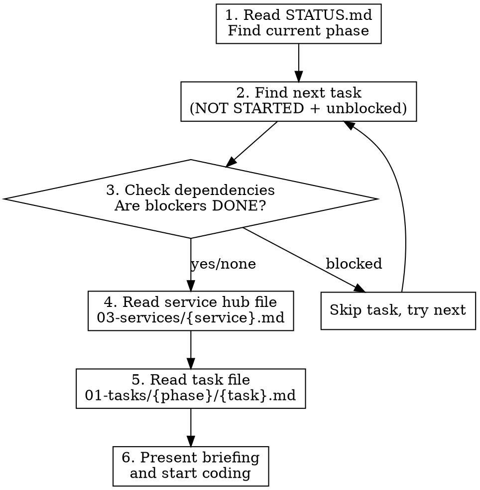

# Session Kickoff

Automated session startup. Reads the task dashboard, finds the next available task, loads context, and presents a briefing so you can start coding immediately.

> **Note:** This skill is configured for Ultra TMS (dev_docs_v2/ structure). Customize the file paths and service map below for your project.

## Workflow



### Step-by-step

1. **Read `dev_docs_v2/STATUS.md`** — find the current phase and scan for tasks with status `NOT STARTED` and no assignment (or assigned to Claude Code)

2. **Pick the next unblocked task** — first `NOT STARTED` task in the current phase. If ALL tasks in the current phase are done or in-progress, move to the next phase.

3. **Check dependencies** — read the task file's "Dependencies" section. If it says "Blocked by: X", verify X is marked `DONE` in STATUS.md. If blocked, skip to next task.

4. **Read the service hub file** — map the task prefix to its service:
   - `BUG-*` → read the relevant hub file (check task file for which service)
   - `COMP-*` → `03-services/01.1-dashboard-shell.md` (design system)
   - `PATT-*`, `CARR-*` → `03-services/05-carrier.md`
   - `TMS-*` → `03-services/04-tms-core.md`
   - `SALES-*` → `03-services/03-sales.md`
   - `LB-*` → `03-services/07-load-board.md`
   - `ACC-*` → `03-services/06-accounting.md`
   - `COM-*` → `03-services/08-commission.md`

5. **Read the task file** — located at `dev_docs_v2/01-tasks/{phase-folder}/{TASK-ID}-*.md`. Follow the Context Header if it lists additional files (max 6 files total).

6. **Present the briefing** to the user:

```
## Session Briefing

**Task:** {TASK-ID} — {Title}
**Phase:** {phase} | **Effort:** {effort estimate}
**Service:** {service name} (hub: {hub file path})

### What to do
{Objective from task file — 1-2 sentences}

### Acceptance Criteria
{Bulleted list from task file}

### Files to Touch
{File Plan table from task file}

### Dependencies
{Status of blockers — all DONE or none}

Starting now with {first action from task file}.
```

**IMPORTANT: Never ask "Ready to start?" or wait for confirmation. After presenting the briefing, immediately begin coding the task.**

## After Coding

When the task is complete:

1. Update STATUS.md — mark task `DONE` with today's date
2. Run `pnpm check-types && pnpm lint`
3. Commit with `/commit`
4. Log the session with `/log`

## Rules

- **Max 6 files** before coding (CLAUDE.md + hub + STATUS.md + task file + 2 from Context Header)
- **One task per session** — don't try multiple tasks in one context window
